> [!NOTE]
> A deadlock is a situation in which two or more processes are permanently blocked because each process is waiting for a resource that is currently held by another process in the same waiting cycle.

---

# Introduction

In a multiprogramming operating system, several processes execute concurrently and compete for limited resources such as memory, files, printers, database locks and I/O devices.

Whenever a process requires a resource that is currently unavailable, the operating system places the process into a waiting state until the resource becomes free.

Normally, the process eventually receives the resource and continues execution.

However, under certain conditions, a group of processes may wait for each other forever.

None of the waiting processes can proceed because each process is waiting for another process in the same group.

This situation is called **deadlock**.

Unlike normal waiting, a deadlocked process cannot continue unless some external action is taken.

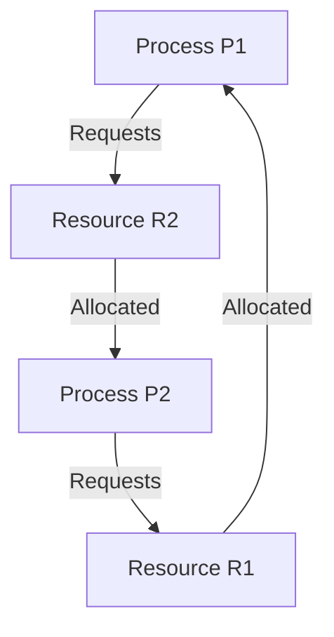

Both processes wait forever because neither process can obtain the required resource.

---

# Real-Life Analogy

Imagine two people attempting to cross a narrow bridge.

Person A refuses to move until Person B crosses.

Person B refuses to move until Person A crosses.

Neither person moves.

The bridge remains blocked.

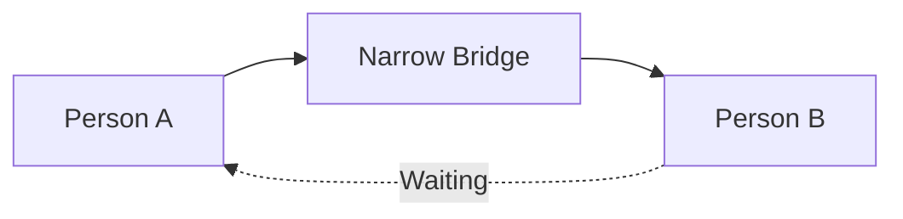

Deadlock behaves similarly.

Each process waits for another process.

No process can proceed.

---

# Why Deadlock Occurs

Deadlock occurs because resources are limited.

Suppose two processes need both a printer and a scanner.

Initially

```
P1 acquires Printer

P2 acquires Scanner
```

Now

```
P1 requests Scanner

P2 requests Printer
```

Both processes wait forever.

Neither resource can be released because both processes are blocked.

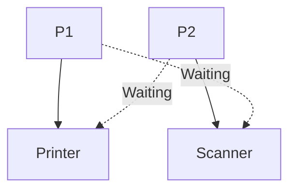

---

# System Model

To understand deadlock, the operating system models the system using two entities.

- Processes
- Resources

Processes request resources.

Resources are allocated to processes.

Later, the resources are released.

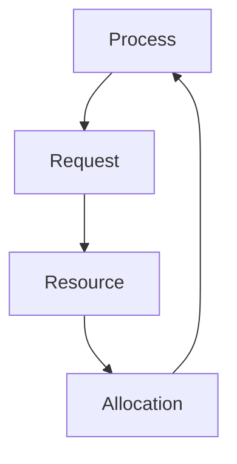

The operating system must keep track of these relationships.

---

# Resource

A resource is anything that a process requires to perform its execution.

Examples include

- CPU
- Main Memory
- Files
- Printer
- Scanner
- Keyboard
- Network Socket
- Database Lock
- Semaphore

Resources may be physical or logical.

---

## Physical Resources

Physical resources are hardware components.

Examples

- Hard Disk
- Printer
- CPU
- Scanner
- Camera

---

## Logical Resources

Logical resources are software-managed entities.

Examples

- Files
- Database Locks
- Shared Memory
- Semaphores
- Mutexes

---

# Resource Types

Resources are generally classified into two categories.

## Single Instance Resource

Only one copy of the resource exists.

Examples

- One Printer
- One Scanner
- One DVD Drive


Only one process may use the resource at a time.

---

## Multiple Instance Resource

Several identical copies exist.

Examples

- Database Connections
- Memory Pages
- CPU Cores


Multiple processes may receive different instances simultaneously.

---

# Resource Allocation

A process follows three basic steps while using a resource.

1.

Request Resource

↓

2.

Use Resource

↓

3.

Release Resource

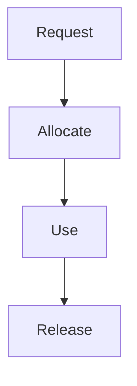

Deadlock occurs when the release step never happens because the process becomes blocked.

---

# Necessary Conditions for Deadlock

A deadlock can occur only if **all four** of the following conditions hold simultaneously.

These are known as the **Coffman Conditions**.

1. Mutual Exclusion
2. Hold and Wait
3. No Preemption
4. Circular Wait

If even one condition is removed,

deadlock cannot occur.

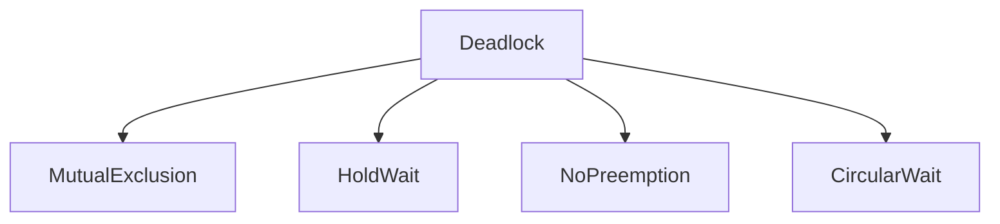

---

# Mutual Exclusion

At least one resource must be non-shareable.

Only one process can use it at a time.

Suppose a printer exists.

Two processes cannot print using the same printer simultaneously.

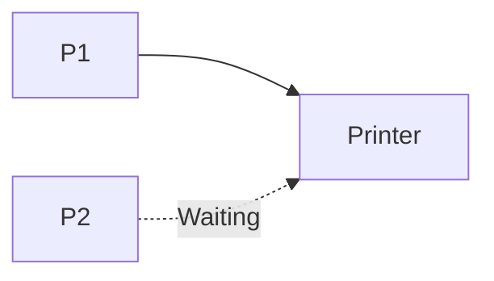

Shared resources such as read-only files usually do not satisfy this condition.

---

# Hold and Wait

A process already holding one resource requests another resource without releasing the first one.

Example

```
P1 holds Printer

↓

Requests Scanner
```

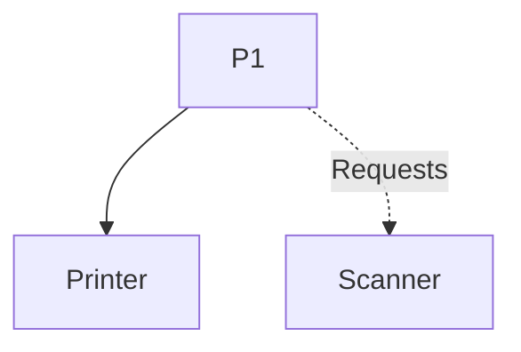

If processes always released their resources before requesting new ones,

deadlock would not occur.

---

# No Preemption

A resource cannot be forcibly taken away.

Only the owning process may release it voluntarily.

Suppose

```
P1 owns Printer
```

The operating system cannot simply remove the printer from P1 and give it to another process.

The OS must wait until P1 releases it.

---

# Circular Wait

Circular wait occurs when a circular chain of waiting processes exists.

Example

```
P1 waits for P2

↓

P2 waits for P3

↓

P3 waits for P1
```

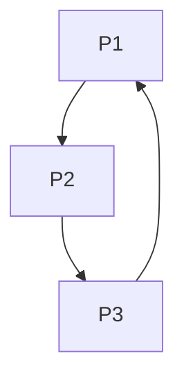

The circular dependency prevents every process from continuing.

---

# Why All Four Conditions Are Necessary

Suppose the circular wait condition does not exist.

Then every waiting chain eventually reaches a process that is not waiting.

That process completes execution.

Resources are released.

Other waiting processes continue.

Therefore,

deadlock does not occur.

Similarly,

breaking any one of the four conditions prevents deadlock.

---

# Resource Allocation Graph (RAG)

A Resource Allocation Graph is a directed graph used to represent the relationship between processes and resources.

It provides a graphical method for analyzing deadlocks.

The graph contains two kinds of nodes.

- Process Nodes
- Resource Nodes

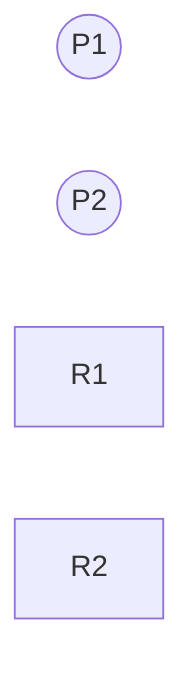

Processes are represented using circles.

Resources are represented using rectangles.

---

# Request Edge

If a process requests a resource,

a directed edge is drawn from the process to the resource.

```
P1 → R1
```

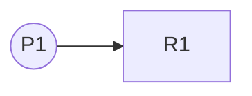

This indicates that

P1

is waiting for

R1.

---

# Assignment Edge

If a resource has been allocated,

the edge points from the resource to the process.

```
R1 → P1
```

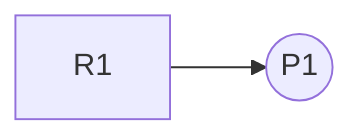

---

# Example Resource Allocation Graph

Suppose

```
P1 owns R1

P2 owns R2

P1 requests R2

P2 requests R1
```

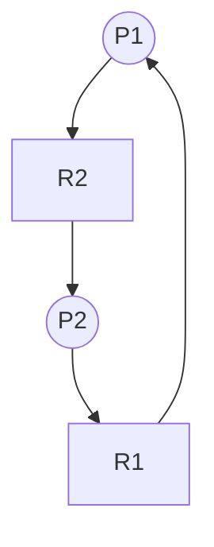

A cycle appears.

Both processes wait forever.

---

# Cycle in Resource Allocation Graph

The existence of a cycle has different meanings depending on the resource type.

## Single Instance Resources

If every resource has only one instance,

a cycle implies deadlock.

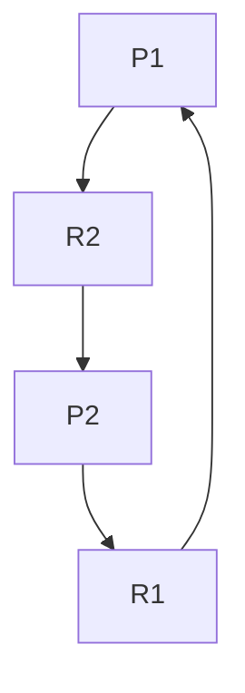

Deadlock definitely exists.

---

## Multiple Instance Resources

Suppose two printers exist.

A cycle may appear.

However,

another free printer may still satisfy one waiting process.

Therefore,

a cycle is **necessary but not sufficient**.

Further analysis is required.

---

# Deadlock Example

Suppose

```
P1

holds Printer

needs Scanner
```

```
P2

holds Scanner

needs Printer
```

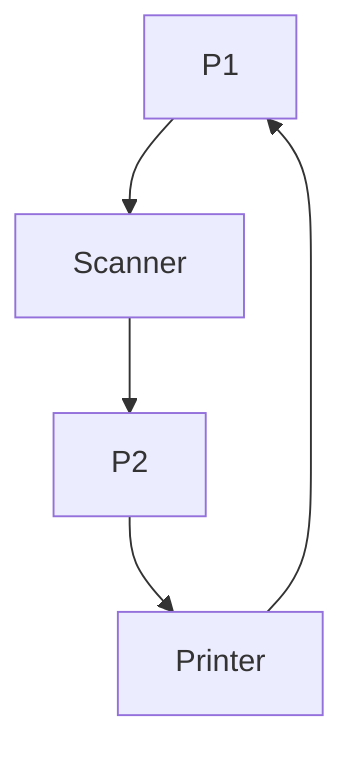

Neither process releases its current resource.

The system remains blocked forever.

---

# Safe State

A system is in a **safe state** if there exists at least one sequence in which every process can complete successfully.

The operating system can allocate resources without risking deadlock.

Safe does **not** mean that deadlock currently exists.

It simply means that deadlock can still be avoided.

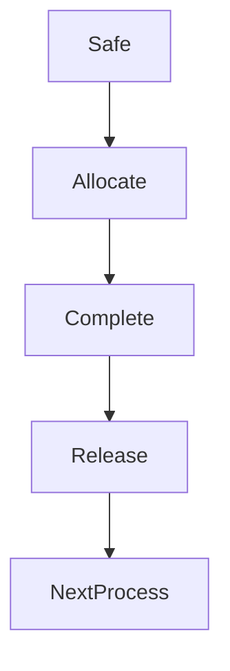

---

# Unsafe State

An unsafe state does not necessarily mean that the system is already deadlocked.

It means the operating system can no longer guarantee that every process will finish successfully.

If additional resource requests occur,

deadlock may develop.

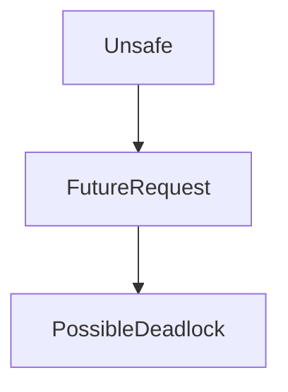

Every deadlocked system is unsafe.

However,

not every unsafe system is deadlocked.

---

# Safe State vs Unsafe State

| Safe State | Unsafe State |
|------------|--------------|
| Completion sequence exists | Completion sequence cannot be guaranteed |
| Deadlock can be avoided | Deadlock may occur |
| Resources allocated safely | Risk of deadlock exists |
| System continues normally | Further requests require caution |

---

# Deadlock Detection Using RAG

For systems containing single-instance resources,

the operating system simply searches for cycles.

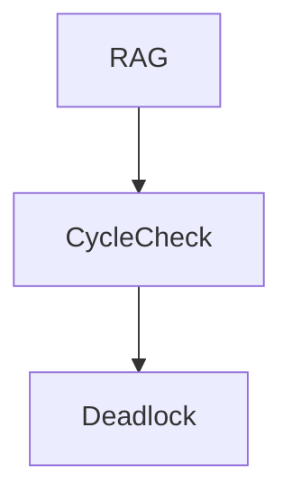

If a cycle exists,

deadlock exists.

If no cycle exists,

the system is deadlock-free.

---

# Relationship Between Deadlock Concepts

```mermaid
graph TD

Processes

--> Resources

Resources

--> Allocation

Allocation

--> CoffmanConditions

CoffmanConditions

--> ResourceAllocationGraph

ResourceAllocationGraph

--> SafeState

ResourceAllocationGraph

--> UnsafeState

UnsafeState

--> Deadlock
```

Deadlock occurs when processes compete for limited resources while all four Coffman conditions hold simultaneously. Resource Allocation Graphs provide a graphical representation of resource requests and allocations, allowing the operating system to analyze process dependencies and identify potential deadlocks. Understanding these concepts forms the foundation for deadlock prevention, avoidance, detection and recovery, which are discussed in the following chapters.
