> [!NOTE]
> Once a deadlock occurs, processes remain blocked indefinitely unless the operating system intervenes. Instead of allowing deadlocks to happen, many systems attempt to prevent or avoid them before they occur.

---

# Deadlock Handling Strategies

Operating systems generally deal with deadlocks using one of four approaches.

1. Deadlock Prevention
2. Deadlock Avoidance
3. Deadlock Detection and Recovery
4. Ignore the Problem

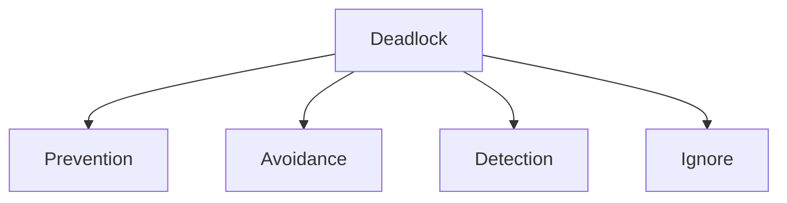

Each approach has different complexity and performance trade-offs.

---

# Deadlock Prevention

Deadlock prevention ensures that **at least one of the four Coffman conditions can never become true**.

Since deadlock requires all four conditions simultaneously, eliminating any one condition guarantees that deadlock cannot occur.

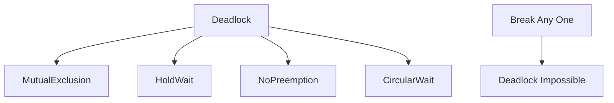

---

# Preventing Mutual Exclusion

Mutual exclusion exists because some resources cannot be shared.

One possible solution is to make resources shareable whenever possible.

For example,

multiple processes may read the same file simultaneously.

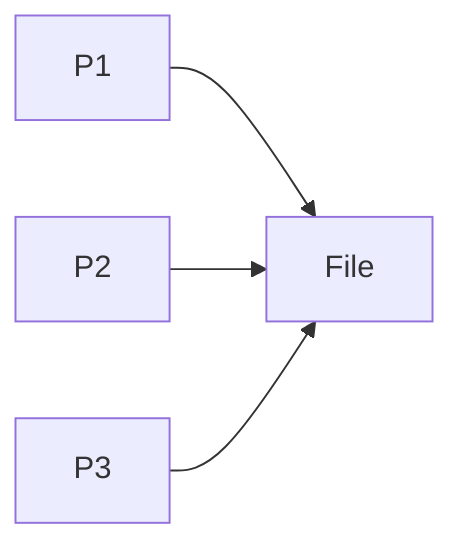

However, not every resource can be shared.

A printer cannot print two documents simultaneously.

Therefore, mutual exclusion cannot always be eliminated.

---

## Advantages

Allows maximum concurrency.

Improves resource utilization.

---

## Limitations

Many hardware resources are naturally non-shareable.

Examples include:

- Printers
- Tape drives
- Scanners

Therefore, this condition usually cannot be completely removed.

---

# Preventing Hold and Wait

Hold and Wait occurs when a process holds one resource while requesting another.

The operating system can prevent this in two common ways.

---

## Method 1

A process must request **all required resources at once** before it begins execution.

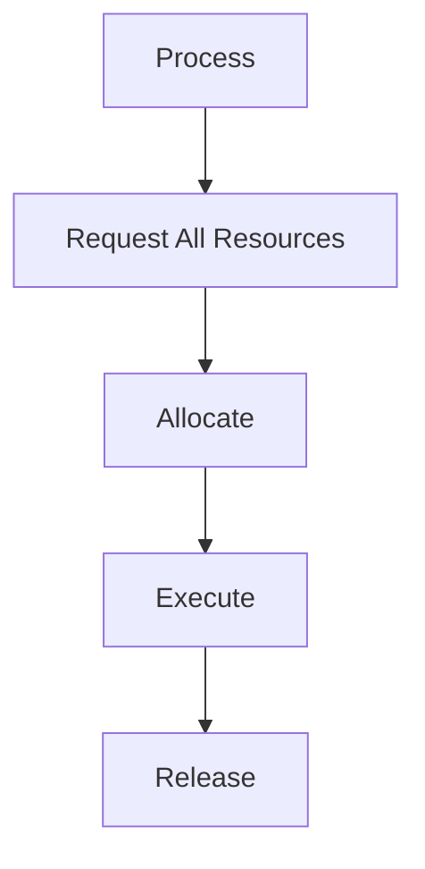

If every requested resource is available,

the process starts.

Otherwise,

it waits without holding any resource.

---

### Example

Suppose a process requires

- Printer
- Scanner

Instead of requesting

```
Printer

↓

Scanner
```

the process requests both together.

If both are unavailable,

the process waits.

No partial allocation occurs.

---

## Method 2

A process releases all currently held resources before requesting new ones.

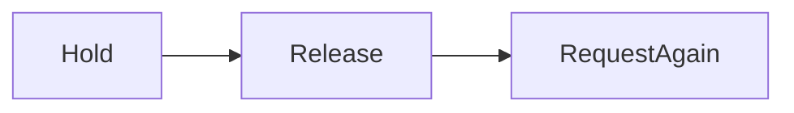

The process never holds resources while waiting.

---

## Advantages

Deadlock cannot occur through Hold and Wait.

Simple to understand.

---

## Limitations

Resources remain idle while waiting.

Resource utilization decreases.

Processes may repeatedly release and reacquire resources.

---

# Preventing No Preemption

Normally,

resources cannot be forcibly removed from a process.

Deadlock prevention changes this rule.

If a process requests an unavailable resource,

the operating system temporarily removes the resources currently held by that process.

The process waits until all required resources become available.

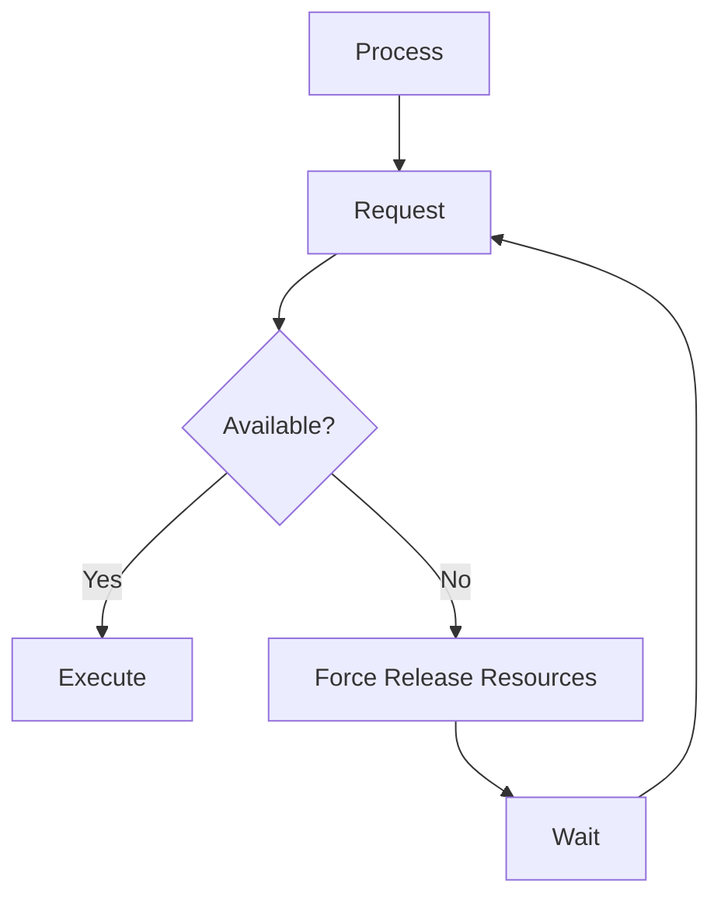

---

## Example

Suppose

```
P1

holds Printer

needs Scanner
```

Scanner is unavailable.

Instead of allowing P1 to continue holding the printer,

the operating system temporarily removes the printer.

The printer becomes available for another process.

When both resources become available,

P1 restarts.

---

## Advantages

Breaks one necessary deadlock condition.

---

## Limitations

Not suitable for many resources.

Examples include:

- Printer halfway through printing
- Network communication
- File updates

Interrupting these operations may corrupt data.

---

# Preventing Circular Wait

Circular Wait is eliminated by assigning every resource a unique number.

Processes must always request resources in increasing order.

Suppose

```
Printer

↓

Scanner

↓

DVD Drive

↓

Network Device
```

Every process must follow the same order.

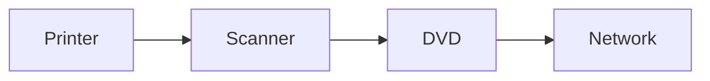

---

## Example

Correct order

```
Printer

↓

Scanner
```

Incorrect order

```
Scanner

↓

Printer
```

is not allowed.

Because every process follows the same ordering,

circular waiting becomes impossible.

---

## Advantages

Simple.

Efficient.

Widely used in operating-system kernels.

---

## Limitations

Programmers must always follow the resource ordering.

Violations may still produce deadlocks.

---

# Comparison of Prevention Techniques

| Condition Broken | Prevention Technique |
|------------------|----------------------|
| Mutual Exclusion | Make resources shareable |
| Hold and Wait | Request everything together |
| No Preemption | Force resource release |
| Circular Wait | Global resource ordering |

---

# Deadlock Avoidance

Deadlock prevention completely eliminates one deadlock condition.

Deadlock avoidance is different.

Instead of permanently restricting resource allocation,

the operating system examines every allocation request before granting it.

A request is approved only if the system remains in a **safe state**.

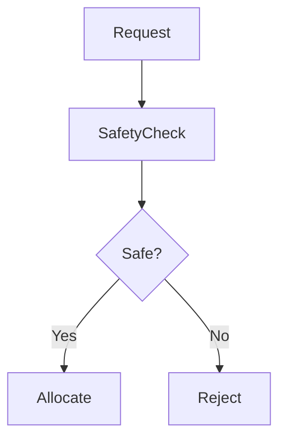

Avoidance is therefore more flexible than prevention.

---

# Basic Idea

Suppose a process requests a printer.

The operating system asks:

> "If I grant this request now, can every process still finish successfully?"

If the answer is

```
Yes
```

the request is granted.

Otherwise,

the request waits.

---

# Maximum Resource Requirement

Avoidance requires every process to declare its maximum resource requirement before execution begins.

Example

```
Maximum Printers Needed = 2
```

The operating system uses this information while making allocation decisions.

Without knowing future requirements,

avoidance algorithms cannot determine whether the system will remain safe.

---

# Safe State

A safe state is one in which there exists at least one order of execution that allows every process to complete successfully.

The order is called the **safe sequence**.

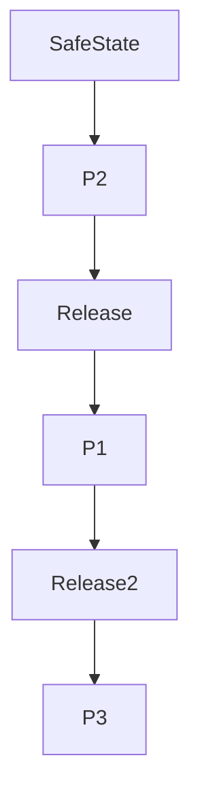

Every process eventually finishes.

Resources are continuously released.

---

## Example

Suppose

Available Memory

```
5
```

Process

```
P1

Needs 3
```

Process

```
P2

Needs 2
```

The operating system executes

```
P2
```

first.

P2 completes.

Resources return.

P1 executes.

Every process finishes.

The system is safe.

---

# Unsafe State

An unsafe state does **not** necessarily mean deadlock.

It simply means the operating system cannot guarantee that all processes will complete.

Future requests may lead to deadlock.

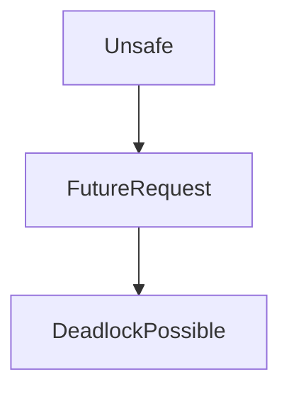

---

## Example

Suppose

```
Available Memory = 2
```

```
P1 Needs 3
```

```
P2 Needs 3
```

Neither process can complete.

The operating system cannot determine a safe execution order.

The state is unsafe.

---

# Safe State vs Unsafe State

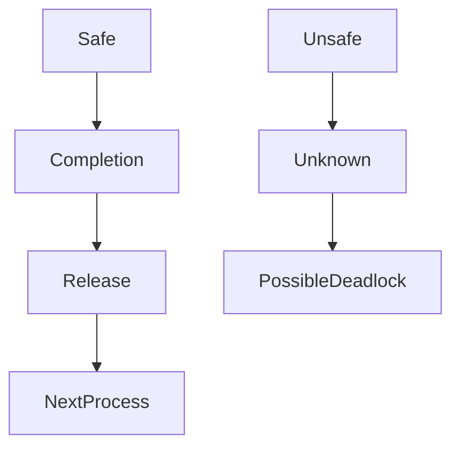

| Safe State | Unsafe State |
|-------------|--------------|
| Safe sequence exists | Safe sequence cannot be guaranteed |
| Every process can finish | Future deadlock possible |
| Allocation allowed | Allocation delayed |

---

# Resource Allocation Graph Algorithm

The Resource Allocation Graph Algorithm is a deadlock avoidance algorithm used when every resource has **exactly one instance**.

Unlike the graph studied in the previous chapter,

this graph introduces an additional edge.

---

## Claim Edge

A claim edge represents a resource that **may be requested in the future**.

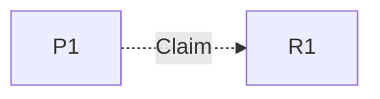

The dashed edge indicates a possible future request.

---

## Request Edge

When the process actually requests the resource,

the claim edge becomes a request edge.

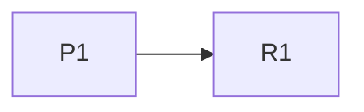

---

## Assignment Edge

When the operating system grants the request,

the request edge becomes an assignment edge.

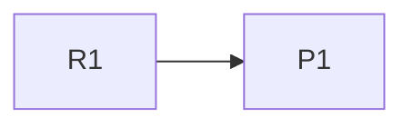

---

# Workflow

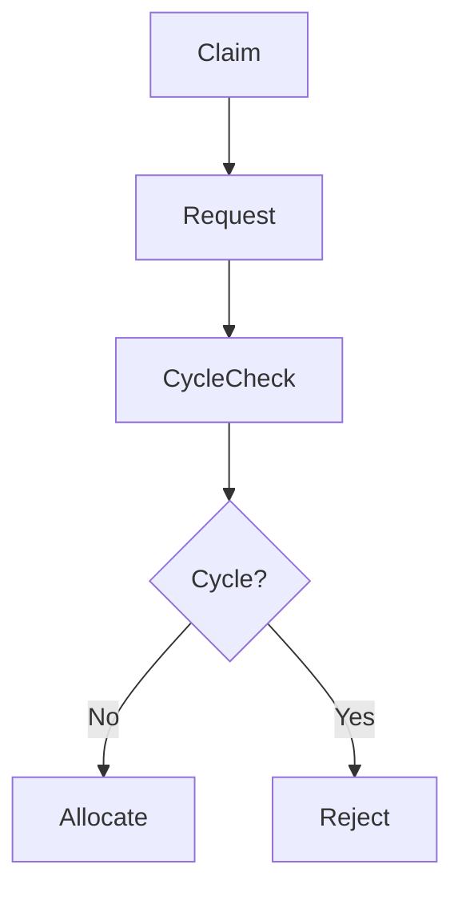

---

# Allocation Rule

Whenever a process requests a resource,

the operating system temporarily allocates it.

The Resource Allocation Graph is updated.

The operating system checks for cycles.

If no cycle appears,

allocation becomes permanent.

If a cycle appears,

the allocation is cancelled.

---

# Example

Initially

```
P1

Claims Printer
```

```
P2

Claims Scanner
```

Later

```
P1 requests Printer
```

The graph remains acyclic.

Allocation succeeds.

Suppose

later

```
P2 requests Printer
```

Granting the request would create a cycle.

The operating system rejects the request.

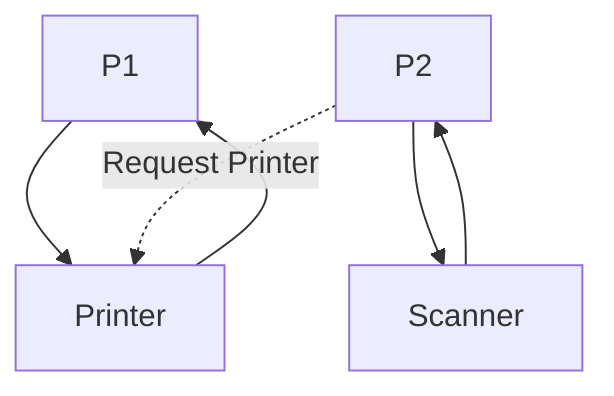

---

# Prevention vs Avoidance

| Prevention | Avoidance |
|-------------|-----------|
| Eliminates one deadlock condition | Allows conditions but checks every allocation |
| Restrictive | Flexible |
| Lower runtime overhead | Higher runtime overhead |
| Lower resource utilization | Better resource utilization |
| No future information required | Maximum resource requirement required |

---

# Relationship Between Prevention and Avoidance

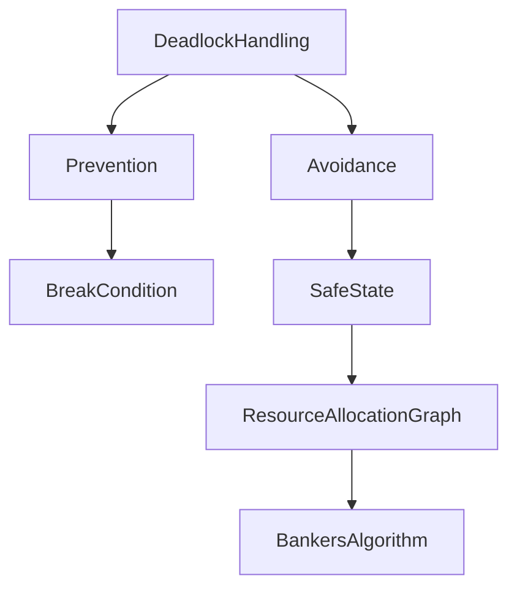

Deadlock prevention guarantees that deadlock cannot occur by permanently breaking one of the Coffman conditions. Deadlock avoidance is less restrictive. It allows the four conditions to exist but grants resource requests only when the resulting allocation keeps the system in a safe state.

The most important deadlock avoidance technique is **Banker's Algorithm**, which extends the concept of safe states to systems containing multiple instances of each resource. It is covered in the next file.
