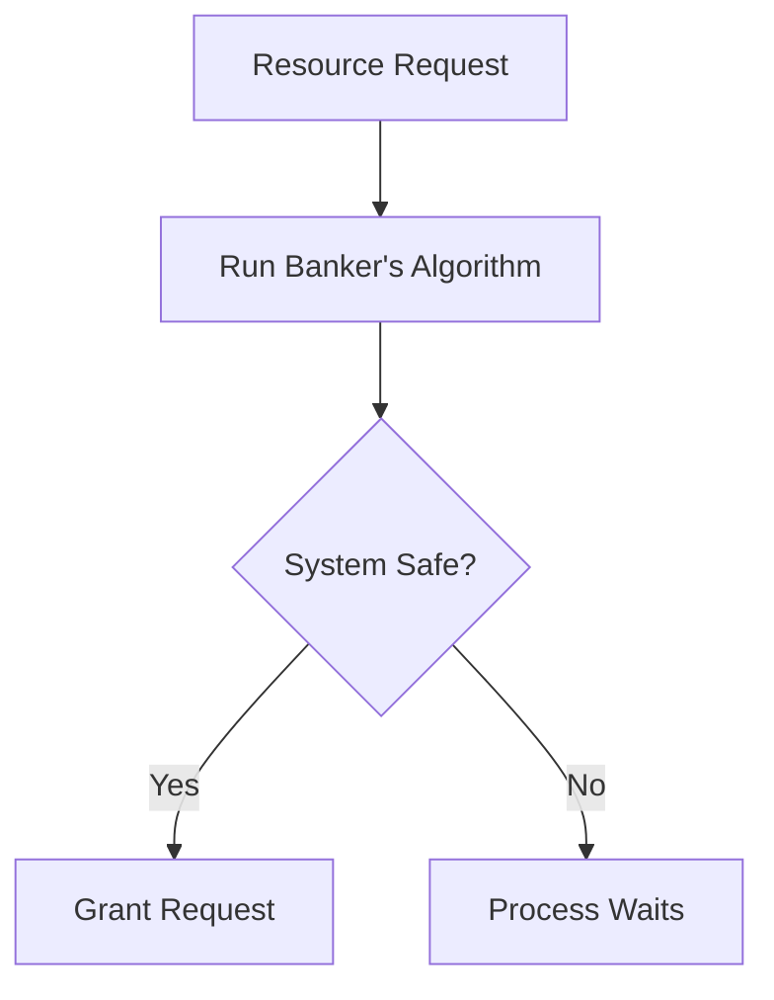
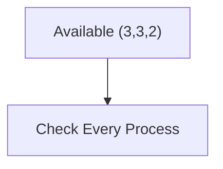
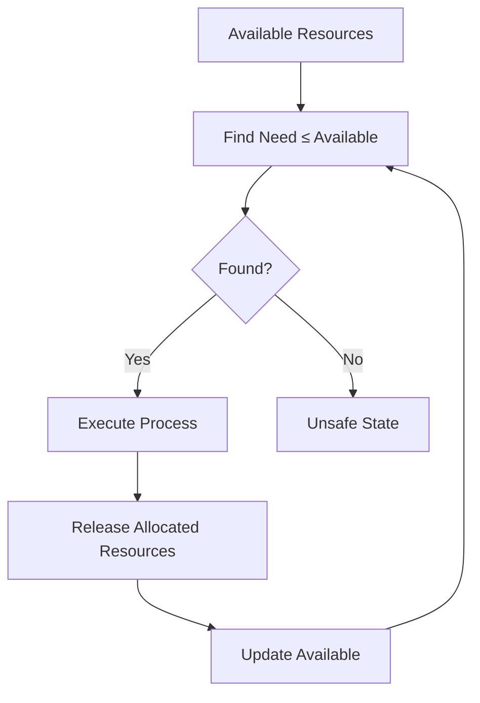
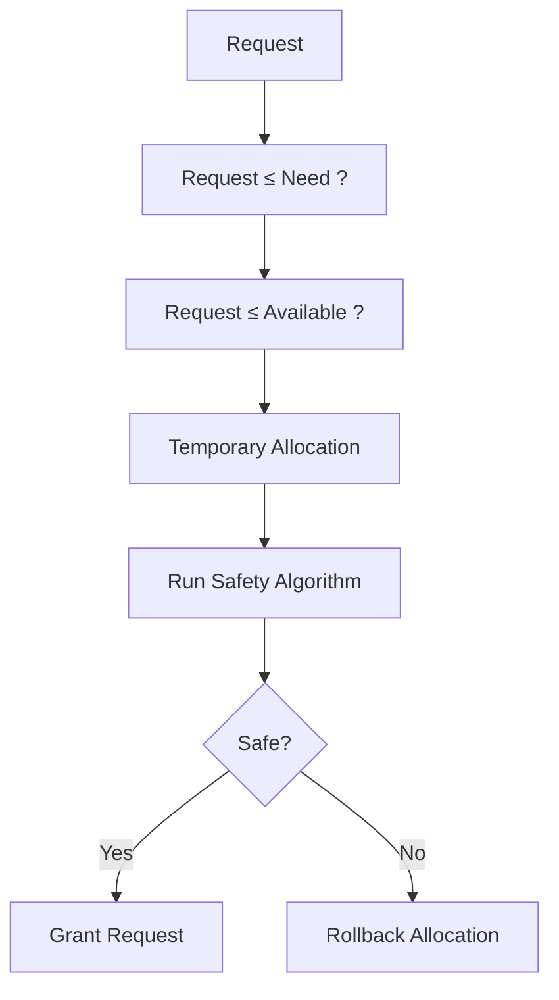

> [!NOTE]
> Banker's Algorithm is a **deadlock avoidance algorithm** developed by **Edsger W. Dijkstra**. Before granting a resource request, the operating system checks whether allocating the requested resources will keep the system in a **safe state**. If the system remains safe, the request is granted; otherwise, it is postponed.

---

# Introduction

Imagine a bank with a fixed amount of money.

Customers can request loans, but the bank never lends so much money that it becomes impossible to satisfy all customers eventually.

Similarly, an operating system has limited resources.

Before allocating resources to a process, it asks:

> **"If I grant this request now, can every process still finish?"**

If the answer is **Yes**, the request is granted.

If the answer is **No**, the process must wait.



---

# Why Is It Called Banker's Algorithm?

The algorithm is based on how a bank gives loans.

A bank never lends money if doing so could leave it unable to satisfy all customers.

Likewise, the operating system grants resources only if it can still guarantee that every process will eventually complete.

---

# Assumptions

Banker's Algorithm works under the following assumptions:

- Every process declares its **maximum resource requirement** before execution.
- The number of instances of each resource type is fixed.
- Processes eventually release all resources after completing.
- Resources cannot be shared while allocated.

---

# Data Structures

The algorithm uses four important data structures.

## Allocation Matrix

Shows how many instances of each resource are **currently allocated** to every process.

```
Allocation[i][j]
```

= Number of instances of resource **j** currently held by process **i**.

---

## Maximum Matrix

Shows the **maximum number of instances** each process may ever request.

```
Max[i][j]
```

---

## Need Matrix

Shows how many more resources a process may still request.

It is calculated as:

```text
Need = Max − Allocation
```

---

## Available Vector

Shows how many instances of each resource are currently available.

```
Available[j]
```

---

# Safety Algorithm (Overview)

The Safety Algorithm checks whether the system is currently in a safe state.

Basic steps:

1. Compute the Need matrix.
2. Find a process whose Need ≤ Available.
3. Assume that process completes.
4. Release its allocated resources.
5. Update Available.
6. Repeat until every process finishes.

If every process can finish, the system is **safe**.

Otherwise, it is **unsafe**.

---

# Resource Request Algorithm (Overview)

Whenever a process requests resources:

1. Verify the request does not exceed its Need.
2. Verify enough resources are Available.
3. Pretend to allocate the resources.
4. Run the Safety Algorithm.
5. If the system remains safe, keep the allocation.
6. Otherwise, roll back the allocation and make the process wait.

---

# Complete Worked Example

Suppose the system contains **three resource types**.

```
A = 10 instances

B = 5 instances

C = 7 instances
```

There are **five processes**.

---

## Step 1 — Allocation Matrix

| Process | A | B | C |
|---------|--:|--:|--:|
| P0 | 0 | 1 | 0 |
| P1 | 2 | 0 | 0 |
| P2 | 3 | 0 | 2 |
| P3 | 2 | 1 | 1 |
| P4 | 0 | 0 | 2 |

---

## Step 2 — Maximum Matrix

| Process | A | B | C |
|---------|--:|--:|--:|
| P0 | 7 | 5 | 3 |
| P1 | 3 | 2 | 2 |
| P2 | 9 | 0 | 2 |
| P3 | 2 | 2 | 2 |
| P4 | 4 | 3 | 3 |

---

## Step 3 — Available Vector

```
Available

A = 3

B = 3

C = 2
```

---

## Step 4 — Compute Need Matrix

Using

```text
Need = Max − Allocation
```

| Process | A | B | C |
|---------|--:|--:|--:|
| P0 | 7 | 4 | 3 |
| P1 | 1 | 2 | 2 |
| P2 | 6 | 0 | 0 |
| P3 | 0 | 1 | 1 |
| P4 | 4 | 3 | 1 |

---

# Step 5 — Initial State

```
Available = (3,3,2)
```



---

# Step 6 — First Process

Compare every Need with Available.

```
P0

Need = (7,4,3)

Cannot Execute
```

```
P1

Need = (1,2,2)

Can Execute
```

Execute **P1**.

After P1 finishes, it releases its allocated resources.

```
Allocation(P1)

=

(2,0,0)
```

Updated Available

```
(3,3,2)

+

(2,0,0)

=

(5,3,2)
```

Safe sequence so far

```
<P1>
```

---

# Step 7 — Second Process

Available

```
(5,3,2)
```

```
P3

Need = (0,1,1)

Can Execute
```

Release

```
Allocation(P3)

=

(2,1,1)
```

New Available

```
(5,3,2)

+

(2,1,1)

=

(7,4,3)
```

Safe sequence

```
<P1,P3>
```

---

# Step 8 — Third Process

Available

```
(7,4,3)
```

```
P4

Need

=

(4,3,1)

Can Execute
```

Release

```
(0,0,2)
```

Available becomes

```
(7,4,5)
```

Safe sequence

```
<P1,P3,P4>
```

---

# Step 9 — Fourth Process

```
P0

Need

=

(7,4,3)

Can Execute
```

Release

```
(0,1,0)
```

Available

```
(7,5,5)
```

Safe sequence

```
<P1,P3,P4,P0>
```

---

# Step 10 — Final Process

```
P2

Need

=

(6,0,0)

Can Execute
```

Release

```
(3,0,2)
```

Final Available

```
(10,5,7)
```

Every process completed.

Final safe sequence:

```text
<P1, P3, P4, P0, P2>
```

---

# Workflow



---

# Resource Request Example

Suppose

```
P1 requests

(1,0,2)
```

Current Need

```
(1,2,2)
```

Since

```
(1,0,2)

≤

(1,2,2)
```

the request is valid.

Available

```
(3,3,2)
```

Since

```
(1,0,2)

≤

(3,3,2)
```

resources are temporarily allocated.

The OS now reruns the Safety Algorithm.

If a safe sequence still exists, the request is granted.

Otherwise, the allocation is rolled back and P1 waits.

---

# Time Complexity

Let

- **n** = number of processes
- **m** = number of resource types

Safety Algorithm:

```text
O(n² × m)
```

---

# Advantages

- Prevents deadlocks before they occur.
- Guarantees the system remains in a safe state.
- Efficient for systems where maximum resource requirements are known.

---

# Limitations

- Every process must declare its maximum requirement in advance.
- Not suitable when resource requirements change dynamically.
- Introduces runtime overhead because every request requires a safety check.
- Rarely used in general-purpose operating systems, but widely taught because it clearly illustrates deadlock avoidance.

---

# Summary



Banker's Algorithm is a proactive deadlock avoidance technique. Instead of waiting for deadlocks to occur, it evaluates every resource request and grants it only if the resulting allocation keeps the system in a safe state. The algorithm revolves around four data structures—**Allocation**, **Maximum**, **Need**, and **Available**—and uses the Safety Algorithm to determine whether a safe sequence exists.
