> [!NOTE]
> Deadlock prevention and avoidance attempt to stop deadlocks before they occur. Deadlock detection follows a different approach. The operating system allows resource allocation freely and periodically checks whether a deadlock has occurred. If a deadlock is detected, the system performs recovery to restore normal execution.

---

# Introduction

Some operating systems choose not to prevent or avoid deadlocks because doing so reduces resource utilization and introduces runtime overhead.

Instead, they allow deadlocks to occur and periodically execute a **deadlock detection algorithm**.

If no deadlock exists, processes continue normally.

If a deadlock is detected, the operating system initiates recovery procedures.

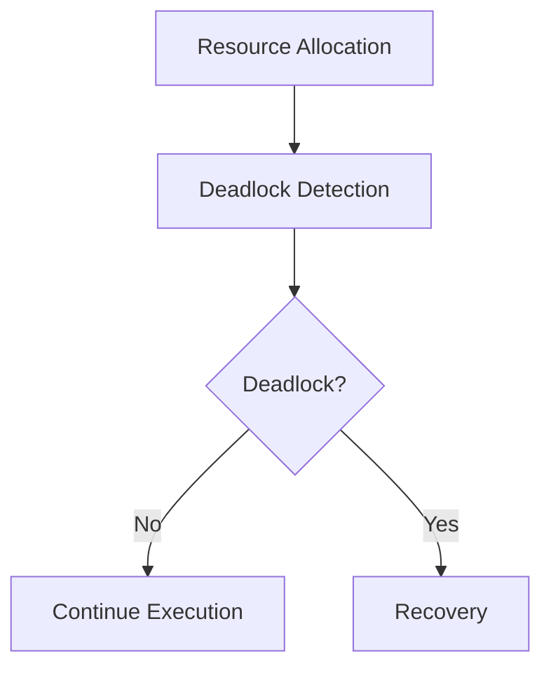

---

# Detection vs Prevention vs Avoidance

| Technique | Basic Idea |
|------------|------------|
| Prevention | Prevent one Coffman condition from occurring |
| Avoidance | Allocate resources only if the system remains safe |
| Detection | Allow deadlocks and periodically detect them |

Detection provides better resource utilization because resources are allocated more freely.

---

# When Is Detection Used?

Deadlock detection is suitable when:

- Deadlocks occur infrequently.
- Detection overhead is acceptable.
- Resource utilization is more important than strict prevention.
- Rolling back processes is possible.

Examples include:

- Database Management Systems
- Distributed Systems
- Large Transaction Systems

---

# Deadlock Detection

The operating system periodically examines resource allocation to determine whether processes are waiting in a circular dependency.

The detection algorithm depends on the type of resources.

- Single-instance resources
- Multiple-instance resources

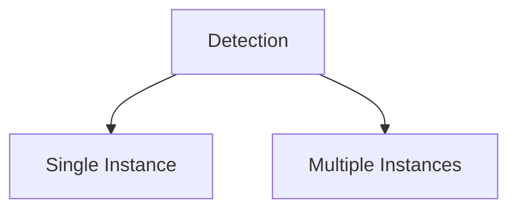

---

# Detection for Single-Instance Resources

If every resource has exactly one instance,

the operating system uses a **Wait-for Graph (WFG)**.

---

# Wait-for Graph (WFG)

A Wait-for Graph is a simplified version of the Resource Allocation Graph.

Resource nodes are removed.

Only process nodes remain.

An edge

```
P1 → P2
```

means

> **P1 is waiting for a resource currently held by P2.**

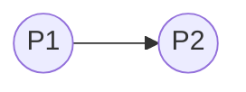

---

# Constructing the Wait-for Graph

Suppose

```
P1 waits for Printer

Printer allocated to P2
```

Instead of

```
P1 → Printer → P2
```

the Wait-for Graph becomes

```
P1 → P2
```

The resource node disappears.

---

# Example

Suppose

```
P1 waits for P2

P2 waits for P3

P3 waits for P1
```

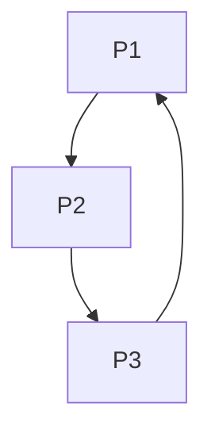

A cycle exists.

Therefore,

deadlock exists.

---

# Cycle Detection

The operating system periodically searches the Wait-for Graph for cycles.

If a cycle exists,

deadlock exists.

If no cycle exists,

the system is deadlock free.

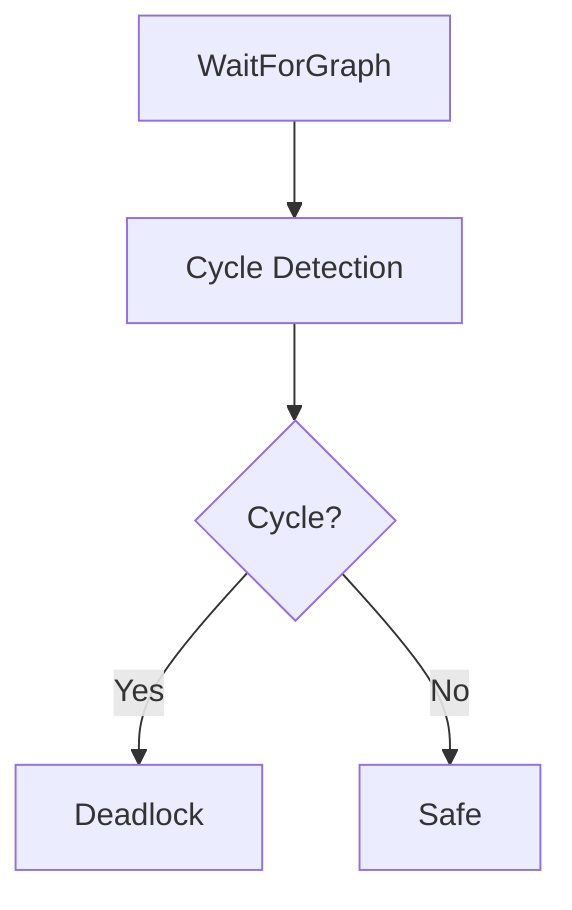

Depth First Search (DFS) or similar graph traversal algorithms are commonly used.

---

# Detection Algorithm (Single Instance)

Basic steps:

1. Construct the Wait-for Graph.
2. Perform cycle detection.
3. If a cycle exists, report deadlock.
4. Otherwise continue execution.

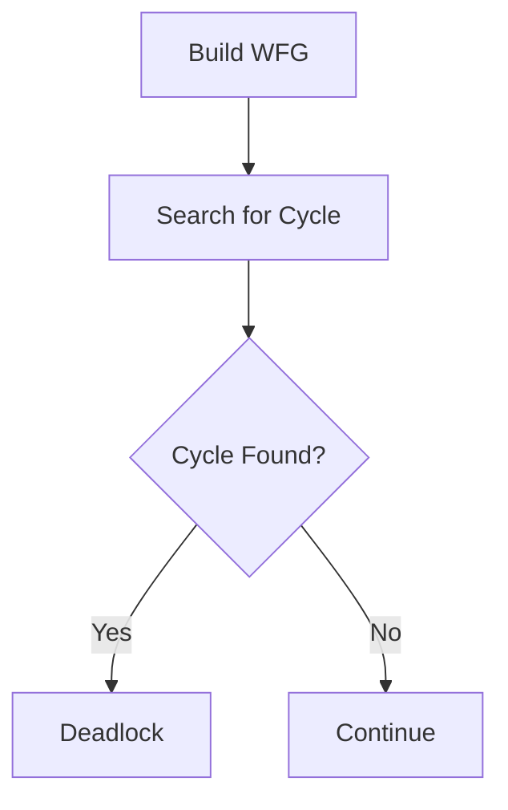

---

# Example

Suppose

```
P1 waits for P2

P2 waits for P4

P4 waits for P1
```

Cycle

```
P1

↓

P2

↓

P4

↓

P1
```

Every process inside the cycle is deadlocked.

---

# Detection for Multiple-Instance Resources

When multiple copies of a resource exist,

a Wait-for Graph is insufficient.

Instead,

the operating system uses a matrix-based detection algorithm.

The data structures resemble Banker's Algorithm.

They include:

- Allocation Matrix
- Request Matrix
- Available Vector

Unlike Banker's Algorithm,

the detection algorithm does **not** require the Maximum matrix because processes have already been executing.

---

# Detection Workflow

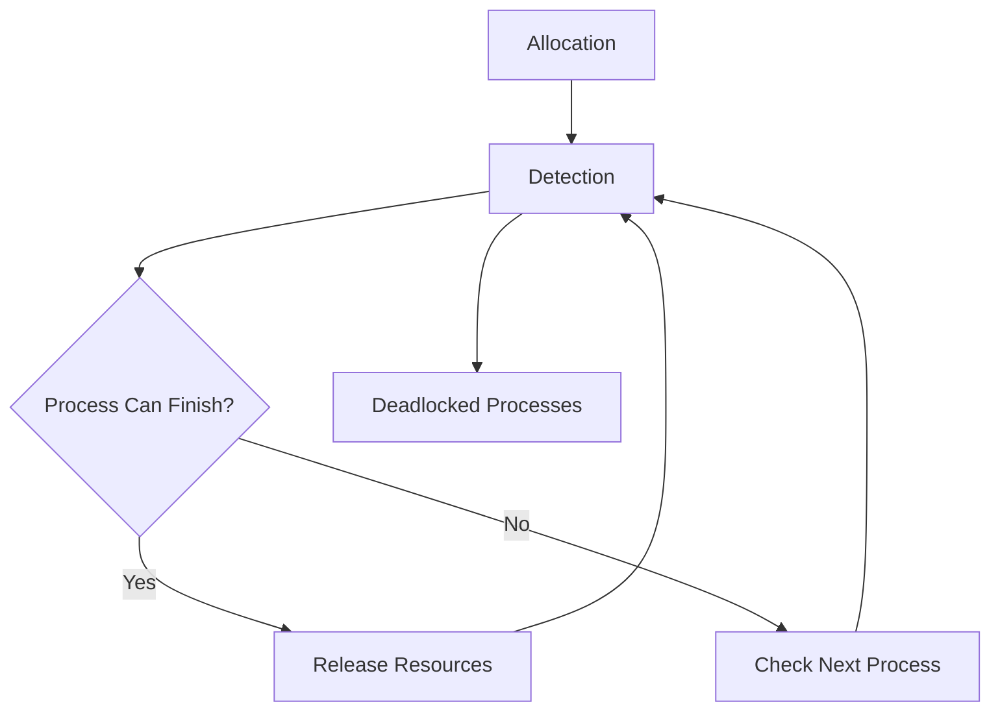

The algorithm repeatedly searches for a process that can complete with currently available resources.

If none exists while unfinished processes remain,

those processes are deadlocked.

---

# How Often Should Detection Run?

The operating system chooses an interval depending on system requirements.

Possible strategies include:

- Fixed time intervals
- After a certain number of resource requests
- When CPU utilization suddenly decreases
- When many processes remain blocked

Running the detection algorithm too frequently wastes CPU time.

Running it too rarely may leave deadlocked processes waiting for a long period.

---

# Deadlock Recovery

After detecting a deadlock,

the operating system must break it.

Two major recovery strategies exist.

1. Process Termination
2. Resource Preemption

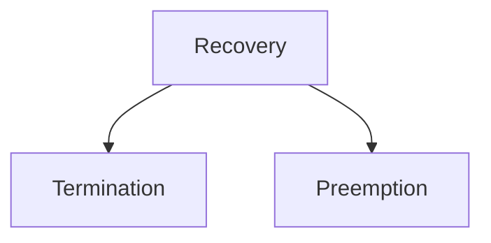

---

# Recovery by Process Termination

The operating system terminates one or more processes involved in the deadlock.

Once the process exits,

its resources become available.

Waiting processes continue execution.

---

## Method 1

Terminate every deadlocked process.

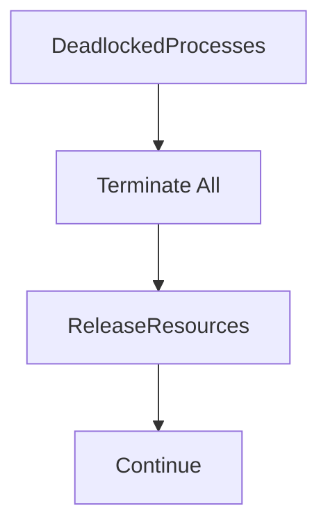

### Advantages

Simple.

Immediately removes deadlock.

### Disadvantages

Large amount of lost work.

Expensive.

---

## Method 2

Terminate one process at a time.

After each termination,

the operating system reruns the detection algorithm.

If deadlock remains,

another process is terminated.

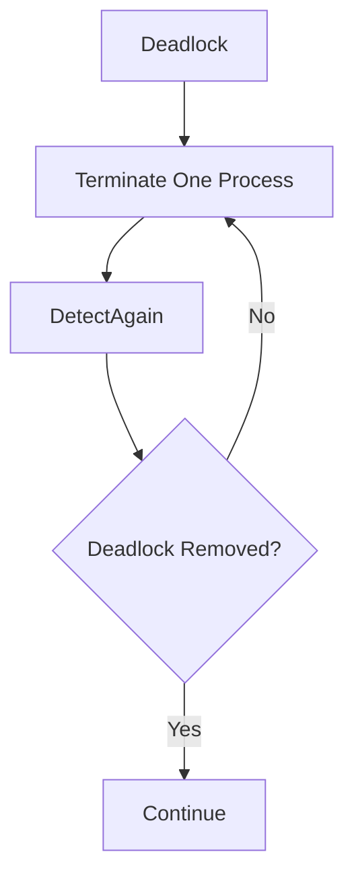

This approach usually wastes less computation.

---

# Choosing the Victim Process

When terminating processes,

the operating system attempts to minimize overall cost.

Factors considered include:

- Process priority
- CPU time already consumed
- Remaining execution time
- Number of resources held
- Number of resources still needed
- Importance of the process
- User interaction
- Rollback cost

The selected process is called the **victim**.

---

# Example

Suppose

```
P1

Executed for 20 seconds

Needs 2 more seconds
```

```
P2

Executed for 2 seconds

Needs 60 more seconds
```

Terminating

```
P2
```

is generally cheaper because less work has been lost.

---

# Recovery Workflow

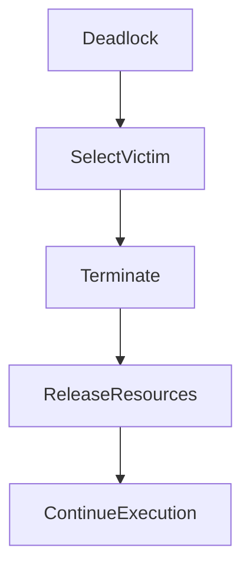

---

# Relationship Between Detection and Recovery

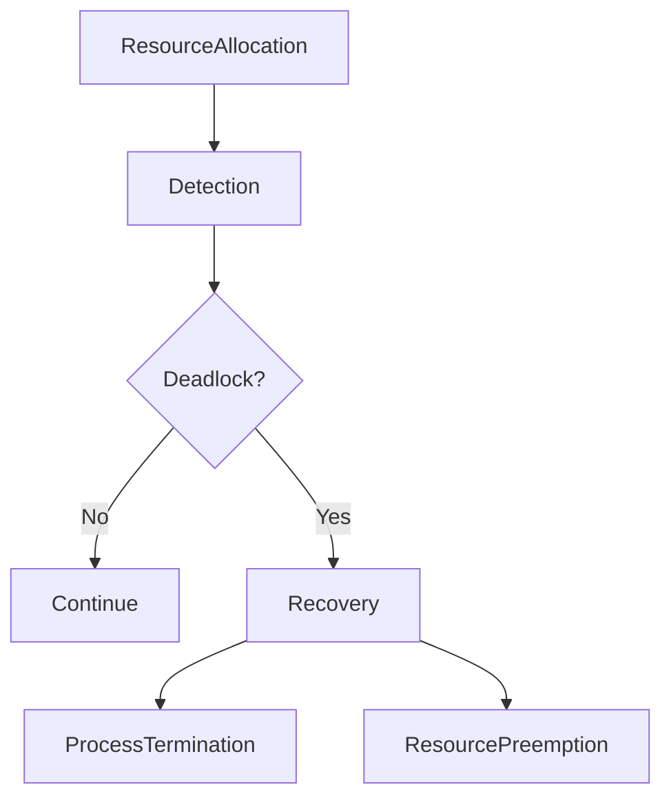

Deadlock detection allows the operating system to allocate resources without restrictive prevention policies. Instead of attempting to eliminate deadlocks entirely, the system periodically analyzes process dependencies. When a deadlock is found, recovery techniques such as process termination or resource preemption are used to restore normal execution.

The next part covers **Resource Preemption**, **Rollback**, **Checkpointing**, **Starvation**, **Livelock**, **Deadlock vs Starvation vs Livelock**, and concludes the Deadlock module.

# Resource Preemption

Instead of terminating processes, the operating system may recover from a deadlock by temporarily taking resources away from one or more processes.

This technique is called **resource preemption**.

The preempted resources are assigned to another process so that execution can continue and the deadlock cycle is broken.

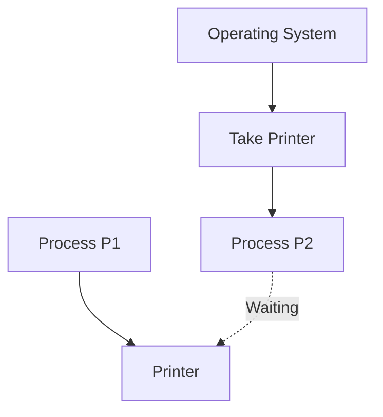

Unlike process termination, resource preemption attempts to preserve completed work by allowing processes to resume later.

---

# Challenges in Resource Preemption

Resource preemption is more difficult than process termination because several questions must be answered.

### Which Resource Should Be Preempted?

The operating system selects the resource whose removal has the lowest overall cost.

---

### Which Process Should Lose the Resource?

The process from which the resource is taken is called the **victim process**.

The victim should ideally be the process whose interruption causes the least amount of wasted work.

---

### Can Every Resource Be Preempted?

No.

Some resources cannot safely be taken away.

Examples include:

- Printer currently printing
- File currently being updated
- Network transmission
- Hardware device operations

Preempting such resources may corrupt data.

---

# Victim Selection

Choosing the correct victim is one of the most important decisions during deadlock recovery.

The operating system attempts to minimize the recovery cost.

Typical factors include:

- Process priority
- Execution time already completed
- Remaining execution time
- Number of resources currently held
- Number of additional resources required
- User importance
- Process type (interactive or batch)
- Rollback cost

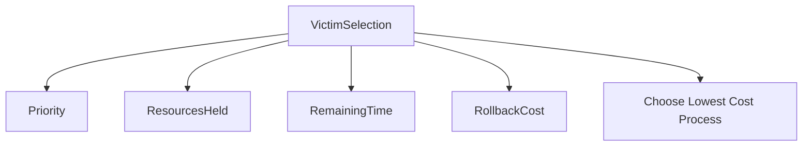

---

# Example

Suppose

```
P1

Executed 50 minutes

Needs 2 more minutes
```

```
P2

Executed 2 minutes

Needs 30 more minutes
```

Terminating or rolling back **P2** is usually preferable because much less computation is lost.

---

# Rollback

Instead of restarting a process from the beginning, the operating system may restore it to a previously saved state.

This technique is called **rollback**.

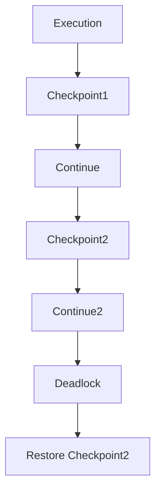

The process resumes from its last checkpoint instead of starting over.

---

# Checkpointing

A checkpoint is a saved snapshot of a process.

It usually stores:

- Program Counter
- CPU Registers
- Memory State
- Open Files
- Resource Information

When recovery is required, the operating system restores the saved checkpoint.

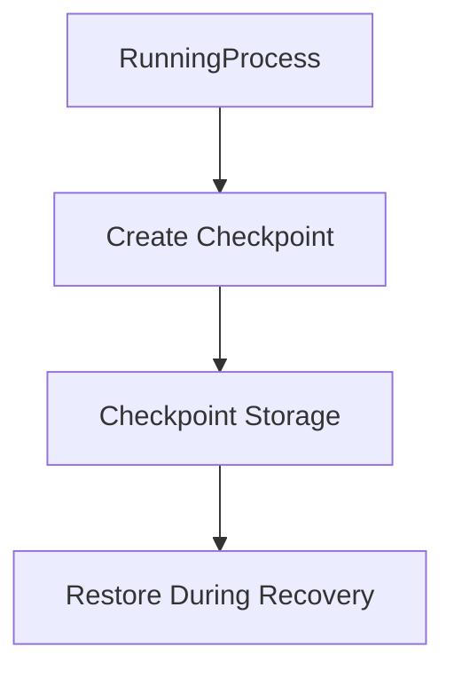

Checkpointing is commonly used in:

- Databases
- Cloud Computing
- Distributed Systems
- Virtual Machines
- Scientific Computing

---

# Starvation During Recovery

Improper victim selection may cause starvation.

Suppose the operating system always chooses the same low-priority process as the victim.

That process may repeatedly lose its resources or be restarted.

It may never complete.

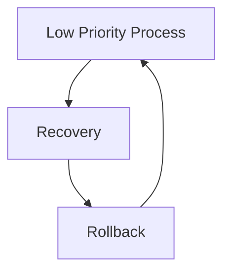

To prevent starvation, operating systems often maintain a recovery count or gradually increase the priority of repeatedly selected victims.

---

# Livelock

A livelock occurs when processes remain active and continuously change their state, but no useful work is completed.

Unlike deadlock, processes are **not blocked**.

Instead, they repeatedly react to one another.

---

## Example

Imagine two people walking toward each other in a hallway.

Both move to the left.

Both then move to the right.

They continue adjusting their positions but never actually pass each other.


The processes remain active but make no progress.

---

# Deadlock vs Livelock

| Deadlock | Livelock |
|-----------|----------|
| Processes are blocked | Processes remain active |
| No state changes occur | States continuously change |
| No progress | No useful progress |
| Waiting forever | Constant retries |

---

# Deadlock vs Starvation

| Deadlock | Starvation |
|-----------|-------------|
| Processes wait for each other | One process waits indefinitely |
| Circular dependency exists | No circular dependency required |
| Multiple processes affected | Usually one process affected |
| Resources never released | Resources continue to be allocated to others |

---

# Starvation vs Livelock

| Starvation | Livelock |
|-------------|----------|
| Waiting process rarely executes | Processes continuously execute |
| Other processes make progress | Nobody makes useful progress |
| Caused by unfair scheduling | Caused by repeated reactions |

---

# Deadlock vs Starvation vs Livelock

| Feature | Deadlock | Starvation | Livelock |
|----------|----------|------------|----------|
| Processes Blocked | Yes | Sometimes | No |
| Processes Running | No | Usually Others | Yes |
| Progress | None | One process blocked | None |
| Circular Wait | Yes | No | No |
| CPU Usage | Low | Normal | High |

---

# Deadlock Handling Comparison

| Technique | Prevents Deadlock | Runtime Overhead | Resource Utilization |
|------------|------------------|------------------|----------------------|
| Prevention | Yes | Low | Low |
| Avoidance | Yes | Medium | Good |
| Detection & Recovery | No | High | Very Good |
| Ignore (Ostrich Algorithm) | No | None | Excellent |

---

# The Ostrich Algorithm

Some operating systems simply ignore deadlocks.

This approach is known as the **Ostrich Algorithm**.

The assumption is that deadlocks occur very rarely.

Handling them continuously would cost more than occasionally restarting the system.

This approach is followed by many general-purpose operating systems for certain resource types.

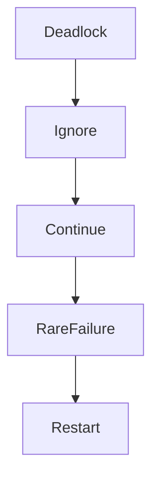

---

# Complete Deadlock Lifecycle

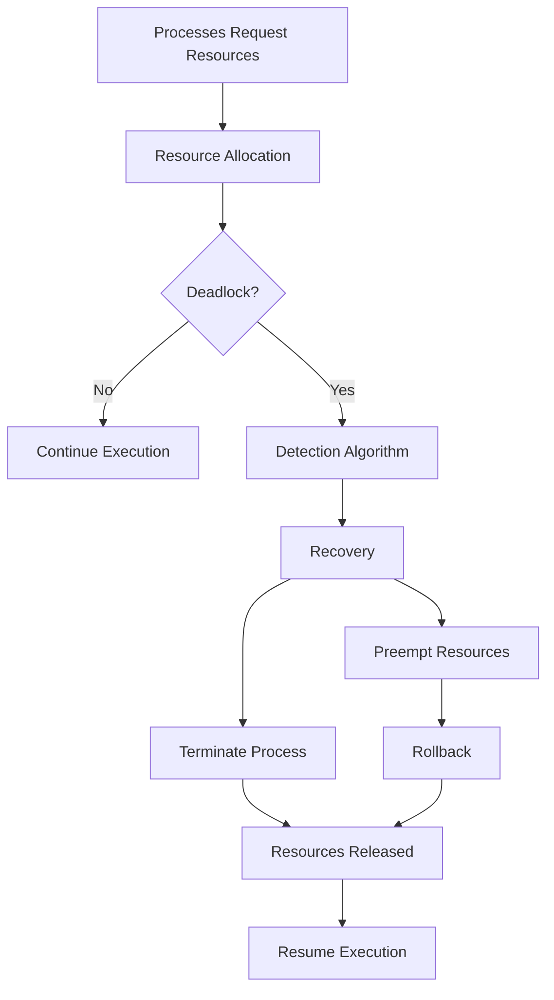

---

# Summary

```mermaid
graph TD

Deadlock

--> Prevention

Deadlock

--> Avoidance

Deadlock

--> Detection

Detection --> Recovery

Recovery --> Termination

Recovery --> Preemption

Preemption --> Rollback

Rollback --> Continue
```

Deadlock recovery begins after the operating system detects a circular dependency among processes. Recovery may involve terminating one or more processes, preempting resources, or rolling processes back to previously saved checkpoints. The operating system carefully selects recovery strategies to minimize lost computation while avoiding starvation. Understanding detection, recovery, starvation, and livelock completes the study of deadlocks and prepares us for the next major operating-system topic: **Multithreading**.
