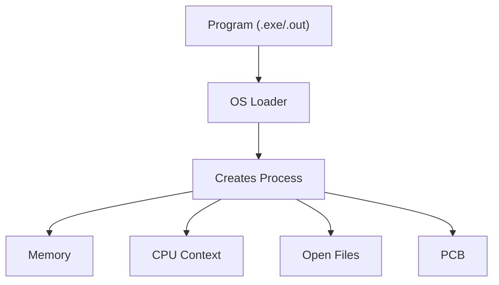
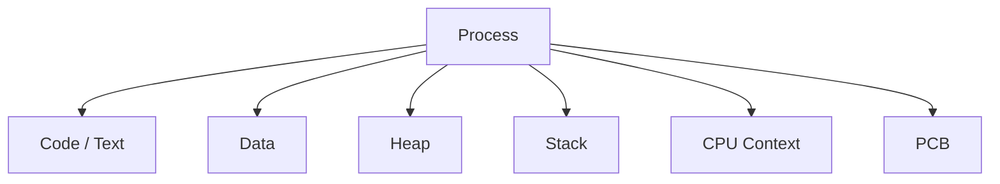
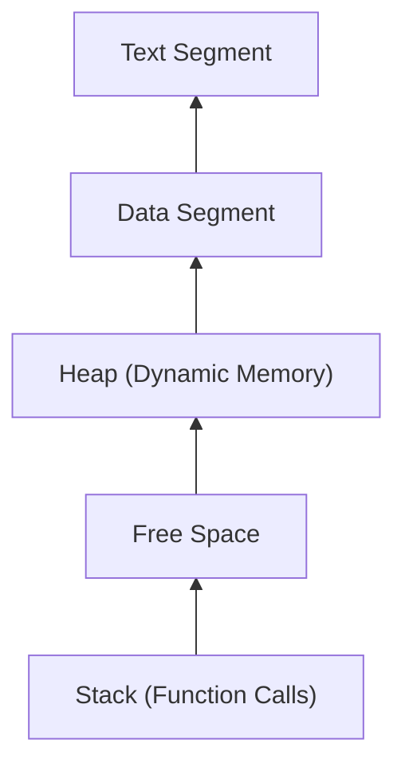
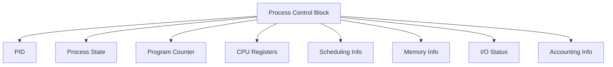
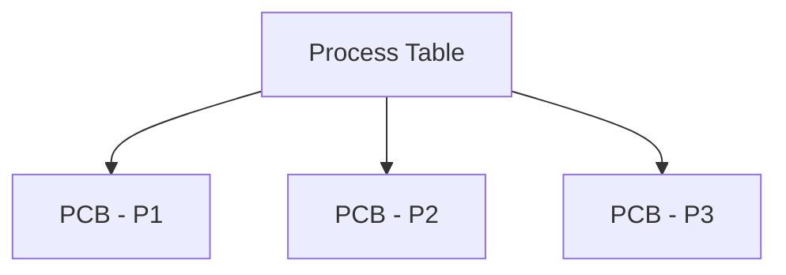
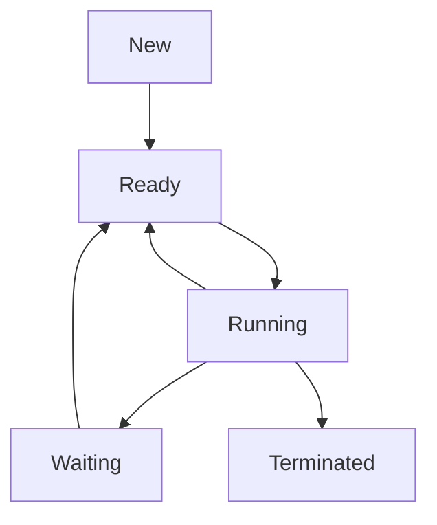
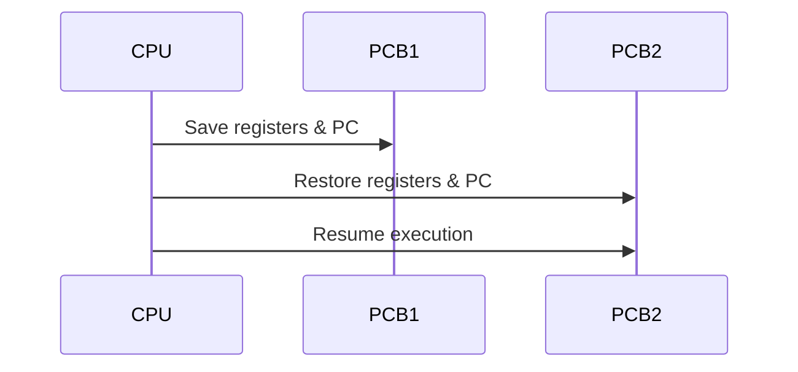

> [!NOTE]
> A **process** is an executing instance of a program. It is the basic unit of execution managed by an operating system.

---

# 1. 📖 Introduction

Modern operating systems such as Windows, Linux, Android and macOS execute hundreds of applications at the same time. Although it appears that all applications are running simultaneously, a single CPU core can execute only one instruction stream at any instant. The operating system rapidly switches between different executing programs, creating the illusion of parallel execution.

To manage every executing application independently, the operating system introduces the concept of a **process**.

A process is much more than program code. It includes the executable instructions, allocated memory, CPU register values, stack, heap, open files, security information and many other resources required during execution.

> [!IMPORTANT]
> A program is passive. A process is active.

---

# 2. ❓ Why Do We Need Processes?

Imagine an operating system without processes.

If every application shared the same memory and CPU state:

- One application could overwrite another application's memory.
- The OS would not know which application owns which files.
- CPU scheduling would be impossible.
- Multitasking could not exist.
- A single crash could bring down the whole system.

Processes solve these problems by providing an isolated execution environment.

Each process has:

- Its own virtual address space
- Execution state
- System resources
- Scheduling information

This isolation improves reliability, security and multitasking.

---

# 3. 🚀 Program vs Process

## What is a Program?

A **program** is a passive collection of instructions stored on secondary storage. It does nothing until it is loaded into memory.

Examples include:

- chrome.exe
- java
- python
- notepad.exe

## What is a Process?

A **process** is a program that is currently executing.

When you launch an application, the operating system:

1. Loads the executable into memory.
2. Allocates stack and heap memory.
3. Creates a Process Control Block (PCB).
4. Assigns a Process ID (PID).
5. Schedules the process for execution.

### Comparison

| Program | Process |
|----------|----------|
| Passive | Active |
| Stored on Disk | Loaded in Memory |
| No execution state | Has execution state |
| No resources | Owns memory, files, CPU context |
| Static | Dynamic |

> [!TIP]
> One program can create multiple processes.

---

# 4. 📦 Components of a Process

A process consists of several logical components.

### Code (Text) Section

Stores executable machine instructions.

### Data Section

Stores global and static variables.

### Heap

The heap is used for dynamic memory allocation during execution. Memory obtained using `malloc()` in C or `new` in Java/C++ comes from the heap.

### Stack

The stack stores function calls, local variables, parameters and return addresses. Every function invocation creates a new stack frame.

### CPU Context

Contains the current values of CPU registers including the Program Counter and Stack Pointer.

---

# 5. 🧠 Process Memory Layout

A typical process memory layout looks like this:

| Segment | Description |
|----------|-------------|
| Text | Executable instructions |
| Data | Global and static variables |
| Heap | Dynamically allocated memory |
| Stack | Local variables and function calls |

> [!NOTE]
> In most architectures, the heap grows upward while the stack grows downward.

---

# 6. 📝 Process Control Block (PCB)

The **Process Control Block (PCB)** is a kernel data structure maintained for every process.

Whenever the operating system needs to pause, resume or terminate a process, it consults the PCB.

### Process ID (PID)

A unique integer assigned by the operating system to identify the process.

### Process State

Indicates whether the process is New, Ready, Running, Waiting or Terminated.

### Program Counter

Stores the address of the next instruction to execute when the process resumes.

### CPU Registers

CPU registers store the temporary execution state of a process. During a context switch, these register values are saved into the PCB so execution can resume later from exactly the same point.

### Scheduling Information

Stores information used by the CPU scheduler, including process priority, queue pointers and scheduling parameters.

### Memory Management Information

Contains references to page tables, segment tables or other memory mapping structures required by the Memory Management Unit (MMU).

### I/O Status Information

Tracks the resources currently owned by the process, such as open files, network sockets, allocated devices and pending I/O requests.

### Accounting Information

Apart from execution details, the operating system also stores accounting-related information for monitoring and resource management.

| Field | Purpose |
|--------|---------|
| CPU Usage | Total CPU time consumed by the process |
| Creation Time | Time when the process was created |
| User ID (UID) | Owner of the process |
| Group ID (GID) | User group associated with the process |
| Memory Usage | Memory consumed by the process |

> [!TIP]
> Accounting information is mainly used for monitoring, auditing and scheduling—not for restoring execution after a context switch.

---

# 7. 📋 Process Table

The operating system maintains a **Process Table**, which is simply a collection of PCBs.

Each active process has exactly one PCB stored in the process table.

---

# 8. 🔄 Process States

A process changes its state throughout its lifetime.

| State | Meaning |
|-------|---------|
| New | Process is being created |
| Ready | Waiting for CPU |
| Running | Currently executing |
| Waiting | Waiting for I/O or an event |
| Terminated | Execution completed |

> [!IMPORTANT]
> A process in the **Waiting** state is waiting for an event, not for the CPU.

---

# 9. 🔀 Context Switching

A context switch occurs when the CPU stops executing one process and starts executing another.

The operating system:

1. Saves the current process context into its PCB.
2. Selects another ready process.
3. Restores the selected process's context.
4. Resumes execution.

> [!WARNING]
> Context switching is pure overhead because the CPU is managing processes rather than executing user code.

---

# 10. 🏗️ Process Creation

A process is created when:

- A user starts an application.
- Another process creates it.
- The operating system starts a background service.

Typical steps:

---

# 11. ❌ Process Termination

A process terminates when:

- It finishes execution.
- It encounters a fatal error.
- It is killed by the operating system or another process.

During termination, the OS releases memory, closes files and removes the PCB.
tasking by saving and restoring process state.
