# ⚙️ Process Scheduling and CPU Scheduling

> [!NOTE]
> **Process scheduling** is the operating system mechanism that decides when processes enter memory, which ready process receives the CPU, and when a running process should be replaced by another process.

---

## 1. 📖 Introduction

In a multiprogramming operating system, several processes may be present in main memory at the same time. However, the number of processes that are ready to execute is usually greater than the number of available CPU cores.

A single CPU core can execute only one process at a particular instant. Therefore, whenever multiple processes are waiting in the ready queue, the operating system must decide which process should execute next.

This decision is called **CPU scheduling**.

Process scheduling is a broader concept. It includes admitting processes into memory, selecting a ready process for CPU execution, suspending processes when memory is limited, and bringing suspended processes back into memory.

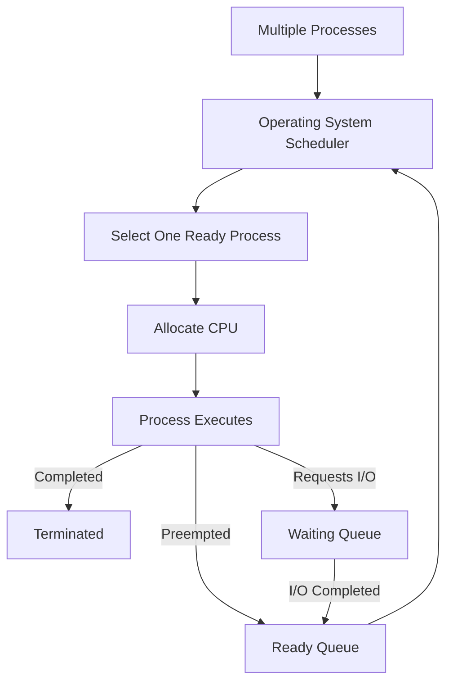

The primary objective of scheduling is not simply to keep the CPU busy. A good scheduler must also provide fast response, high throughput, low waiting time, low turnaround time and reasonable fairness among processes.

> [!IMPORTANT]
> The **scheduler chooses** which process should run. The **dispatcher performs** the actual transfer of CPU control to that process.

---

## 2. ❓ Why Is Process Scheduling Required?

Without process scheduling, the first process that receives the CPU could continue executing for an unlimited amount of time. Other processes would remain waiting even if they were short, important or interactive.

Consider a system running a browser, music player, code editor and file download at the same time. The user expects the browser and editor to respond immediately, while the download continues in the background.

The operating system provides this experience by rapidly sharing CPU time among processes.

Process scheduling is required for several reasons.

First, it improves **CPU utilization**. When one process waits for an I/O operation, another ready process can use the CPU instead of leaving it idle.

Second, it enables **multiprogramming**. Multiple processes remain in memory, and the CPU switches among them depending on their state and scheduling policy.

Third, scheduling improves **responsiveness**. Interactive applications should receive CPU time quickly even when other CPU-intensive programs are running.

Finally, scheduling provides control over **priority and fairness**. Important system processes may receive preference, while mechanisms such as time slicing and aging prevent other processes from waiting indefinitely.

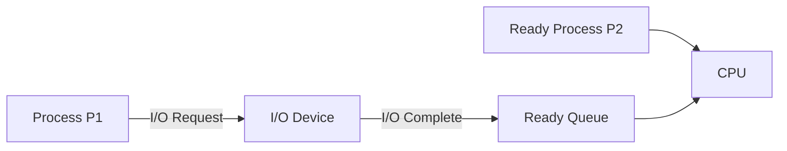

In this example, when `P1` starts waiting for I/O, the CPU does not remain idle. The operating system schedules `P2`.

---

## 3. 🔁 CPU and I/O Burst Cycle

A process usually does not use the CPU continuously from beginning to end. Its execution alternates between **CPU bursts** and **I/O bursts**.

A CPU burst is a period during which the process performs calculations or executes instructions on the processor.

An I/O burst is a period during which the process waits for an operation such as reading a file, receiving network data or accepting keyboard input.

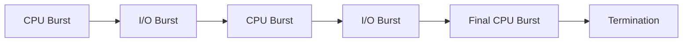

### CPU-Bound Process

A CPU-bound process spends most of its execution time performing computations. It generally has long CPU bursts and relatively few I/O operations.

Examples include video encoding, data compression, scientific calculations and complex simulations.

### I/O-Bound Process

An I/O-bound process performs frequent I/O operations and usually has short CPU bursts.

Examples include text editors, web browsers, database applications and file-copying programs.

A good scheduler maintains a suitable mixture of CPU-bound and I/O-bound processes. If all processes are waiting for I/O, the CPU may remain idle. If too many CPU-bound processes execute together, interactive applications may respond slowly.

---

## 4. 📥 Scheduling Queues

The operating system organizes processes into different queues according to their current state.

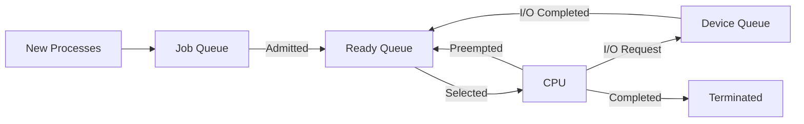

### Job Queue

The job queue contains processes that have been submitted to the system. Some of these processes may still be stored on secondary storage and may not yet have been admitted into main memory.

### Ready Queue

The ready queue contains processes that are present in main memory and are prepared to execute.

A process in the ready queue has all required resources except the CPU.

### Device Queue

A device queue contains processes waiting for a particular I/O device or event.

For example, one queue may contain processes waiting for disk access, while another may contain processes waiting for printer access.

> [!NOTE]
> Queue entries normally contain references to Process Control Blocks rather than copies of the complete process.

---

## 5. 🧭 Types of Process Schedulers

Operating systems may use three major types of schedulers:

1. Long-term scheduler
2. Short-term scheduler
3. Medium-term scheduler

Each scheduler makes decisions at a different level of process management.

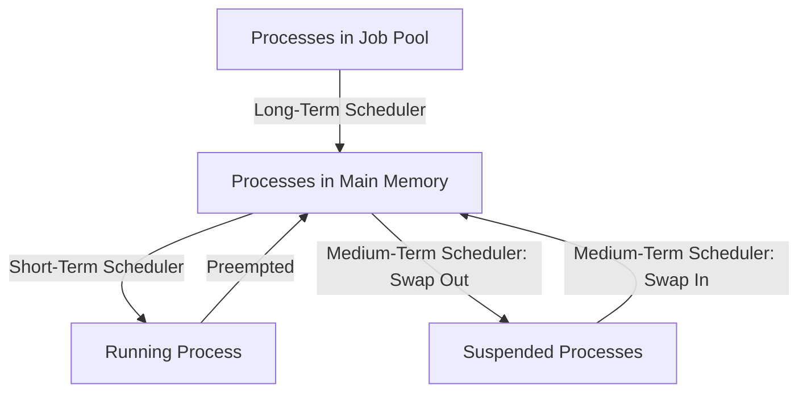

---

## 6. 🗂️ Long-Term Scheduler

The **long-term scheduler**, also called the **job scheduler**, selects processes from the job pool and admits them into main memory.

Its main responsibility is to control the **degree of multiprogramming**, which means the number of processes currently loaded into memory.

If too few processes are admitted, the CPU may become idle whenever those processes perform I/O.

If too many processes are admitted, the system may experience memory pressure, excessive paging and possibly thrashing.

The long-term scheduler also attempts to maintain an appropriate mixture of CPU-bound and I/O-bound processes.


The long-term scheduler runs relatively infrequently. Because it does not make decisions every few milliseconds, it can spend more time evaluating processes.

> [!TIP]
> The long-term scheduler controls **how many processes enter memory**, not which process receives the CPU immediately.

---

## 7. ⚡ Short-Term Scheduler

The **short-term scheduler**, also called the **CPU scheduler**, selects one process from the ready queue and decides which process should execute next.


The short-term scheduler runs very frequently. It may execute whenever:

* A running process terminates.
* A process requests I/O.
* A timer interrupt occurs.
* A higher-priority process becomes ready.
* A process releases the CPU.

Because it executes so frequently, the short-term scheduler must be extremely fast. A slow scheduling decision would introduce significant overhead.

The scheduler applies a CPU scheduling algorithm such as FCFS, SJF, Priority Scheduling or Round Robin.

> [!IMPORTANT]
> The short-term scheduler selects the process. The dispatcher performs the context switch and starts its execution.

---

## 8. 🔄 Medium-Term Scheduler

The **medium-term scheduler** temporarily removes processes from main memory and stores them on secondary storage.

This operation is called **swapping out** or **suspending** a process.

When memory becomes available, the process may be brought back into main memory. This is called **swapping in** or **resuming** the process.


The medium-term scheduler is useful when:

* Main memory is under pressure.
* Too many processes are loaded.
* The system needs to reduce the degree of multiprogramming.
* A process has been inactive for a long period.
* A process is waiting for a slow event.

### Scheduler Comparison

| Property            | Long-Term Scheduler                    | Short-Term Scheduler           | Medium-Term Scheduler          |
| ------------------- | -------------------------------------- | ------------------------------ | ------------------------------ |
| Other name          | Job scheduler                          | CPU scheduler                  | Swapper                        |
| Main task           | Admits jobs into memory                | Selects the next ready process | Suspends and resumes processes |
| Execution frequency | Low                                    | Very high                      | Moderate                       |
| Speed requirement   | Can be slower                          | Must be extremely fast         | Moderate                       |
| Controls            | Degree and mixture of multiprogramming | CPU allocation                 | Memory pressure and suspension |

---

## 9. 🧠 CPU Scheduling

CPU scheduling is the process of selecting one process from the ready queue and allocating the CPU to it.

The selected process changes from the **Ready** state to the **Running** state.

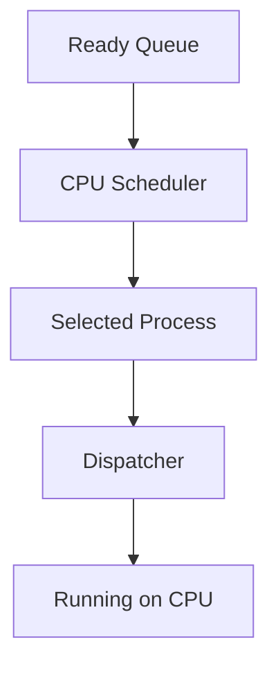

The CPU scheduling algorithm determines how the selection is made.

For example:

* FCFS selects the process that arrived first.
* SJF selects the process with the smallest CPU burst.
* Priority Scheduling selects the highest-priority process.
* Round Robin gives each process a fixed time quantum.

Different algorithms are suitable for different systems. Batch systems may prioritize throughput and turnaround time, while interactive systems prioritize response time.

---

## 10. ⏱️ When Does CPU Scheduling Occur?

A CPU scheduling decision can occur during the following process-state transitions:

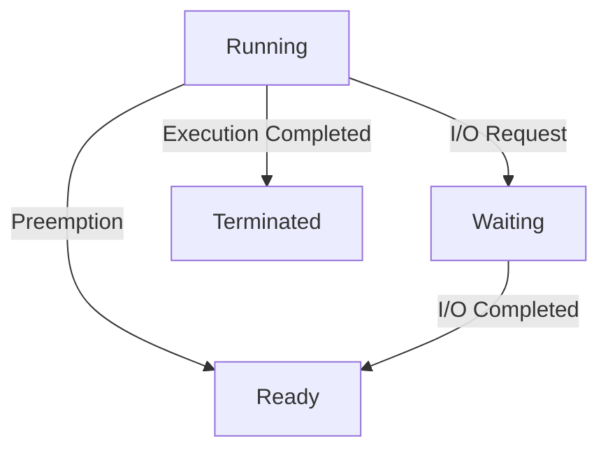

Scheduling may be required when a process moves:

1. From Running to Waiting
2. From Running to Ready
3. From Waiting to Ready
4. From Running to Terminated

When a process moves from Running to Waiting or Running to Terminated, it voluntarily releases the CPU. The scheduler must choose another process.

When a process moves from Running to Ready, the CPU has been forcibly taken away. This occurs in preemptive scheduling.

When a process moves from Waiting to Ready, the arrival of the newly ready process may cause preemption if it has a higher priority.

---

## 11. 📐 CPU Scheduling Terminology

Scheduling numerical problems use several important measurements.

Assume:

* `AT` = Arrival Time
* `BT` = Burst Time
* `CT` = Completion Time
* `TAT` = Turnaround Time
* `WT` = Waiting Time
* `RT` = Response Time

### Arrival Time

Arrival time is the time at which a process enters the ready queue.

### Burst Time

Burst time is the total CPU execution time required by the process.

It does not normally include time spent waiting for I/O.

### Completion Time

Completion time is the time at which the process finishes its execution.

### Turnaround Time

Turnaround time represents the total time between process arrival and process completion.

```text
Turnaround Time = Completion Time - Arrival Time

TAT = CT - AT
```

Turnaround time includes CPU execution time, ready-queue waiting time and any other delays experienced by the process.

### Waiting Time

Waiting time is the total time a process spends waiting in the ready queue.

```text
Waiting Time = Turnaround Time - Burst Time

WT = TAT - BT
```

### Response Time

Response time is the amount of time between process arrival and the first time the process receives the CPU.

```text
Response Time = First Start Time - Arrival Time

RT = First Start Time - AT
```

> [!IMPORTANT]
> Response time is concerned only with the **first CPU allocation**. Waiting time includes all periods spent waiting in the ready queue.

### Example

Suppose a process arrives at time `2`, starts for the first time at time `5`, and completes at time `12`. Its CPU burst time is `6`.

```text
Turnaround Time = 12 - 2 = 10

Waiting Time = 10 - 6 = 4

Response Time = 5 - 2 = 3
```

---

## 12. 📊 CPU Scheduling Criteria

A scheduling algorithm is evaluated using several performance criteria.

| Criterion       | Meaning                                     | Desired Result |
| --------------- | ------------------------------------------- | -------------- |
| CPU Utilization | Percentage of time CPU remains busy         | Maximize       |
| Throughput      | Number of processes completed per unit time | Maximize       |
| Turnaround Time | Time from arrival to completion             | Minimize       |
| Waiting Time    | Time spent in ready queue                   | Minimize       |
| Response Time   | Time until first CPU response               | Minimize       |
| Fairness        | Opportunity for every process to progress   | Improve        |

### CPU Utilization

CPU utilization measures how effectively the processor is being used. A good scheduler avoids leaving the CPU idle when ready processes are available.

### Throughput

Throughput is the number of processes completed in a given period.

A system completing 100 processes per second has higher throughput than one completing 50 similar processes per second.

### Turnaround Time

Turnaround time is particularly important in batch systems, where users care about how long a complete job takes.

### Waiting Time

Waiting time measures the time a process spends in the ready queue. Scheduling algorithms often attempt to reduce average waiting time.

### Response Time

Response time is critical for interactive systems. A user expects an application to react quickly, even if the complete operation takes longer.

### Fairness

A fair scheduler ensures that processes are not postponed indefinitely.

> [!NOTE]
> No single scheduling algorithm is best for every criterion. Improving one measurement may make another worse.

---

## 13. 🔀 Preemptive Scheduling

In **preemptive scheduling**, the operating system can interrupt a running process and allocate the CPU to another process.

The interrupted process is generally moved back to the ready queue. Its execution state is saved so that it can resume later.

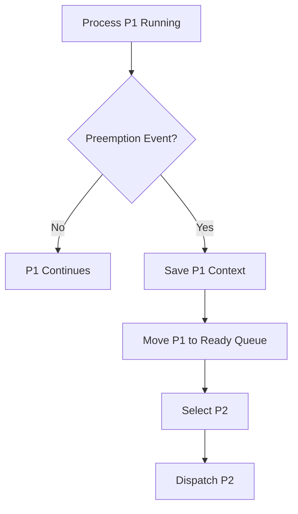

Preemption may occur because:

* The process's time quantum expires.
* A higher-priority process arrives.
* A real-time deadline must be satisfied.
* A hardware timer generates an interrupt.
* The scheduler decides that another process should run.

Preemptive scheduling is widely used in modern interactive operating systems because it prevents a single process from monopolizing the CPU.

### Advantages

Preemptive scheduling provides good responsiveness because short or important processes do not necessarily need to wait for a long-running process to finish.

It supports time-sharing by allocating small CPU intervals to multiple processes.

It also allows the operating system to respond quickly to high-priority events.

### Disadvantages

Preemptive scheduling causes more context switches, which increases overhead.

It is also more complex because a process may be interrupted while modifying shared data. Synchronization mechanisms such as mutexes and semaphores may be required to maintain consistency.

Low-priority processes may also suffer from starvation if higher-priority processes continue arriving.

### Examples

* Round Robin
* Shortest Remaining Time First
* Preemptive Priority Scheduling
* Multilevel Feedback Queue

---

## 14. ⛔ Non-Preemptive Scheduling

In **non-preemptive scheduling**, a process keeps the CPU until it either terminates or moves to the waiting state.

The operating system does not forcibly remove the CPU from the running process.

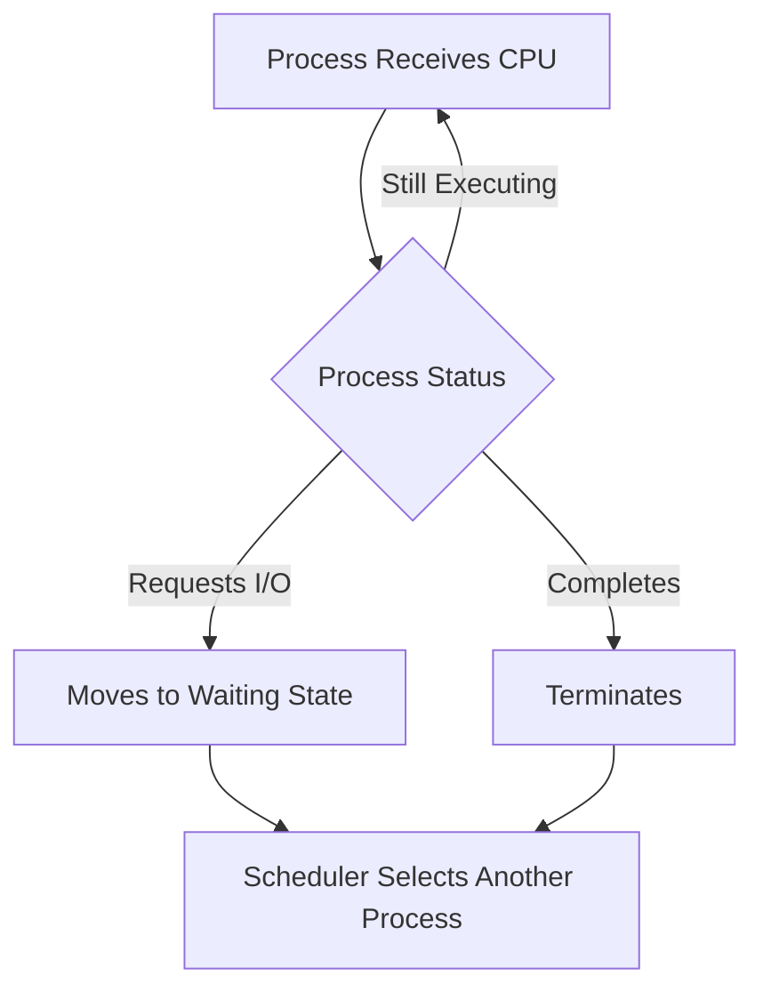

Non-preemptive scheduling is easier to design because execution is not interrupted unexpectedly.

However, a long-running process may delay every process behind it.

### Advantages

Non-preemptive scheduling has fewer context switches and therefore lower overhead.

Its behavior is simpler and more predictable.

It also reduces the risk of a process being interrupted while updating shared data, although synchronization may still be necessary in multiprocessor systems.

### Disadvantages

A long process can hold the CPU for a long time, producing poor response for interactive processes.

Non-preemptive scheduling is generally unsuitable for modern time-sharing systems.

### Examples

* First Come First Serve
* Non-preemptive Shortest Job First
* Non-preemptive Priority Scheduling

---

## 15. ⚖️ Preemptive vs Non-Preemptive Scheduling

| Preemptive Scheduling                  | Non-Preemptive Scheduling                             |
| -------------------------------------- | ----------------------------------------------------- |
| OS can take CPU from a running process | Process releases CPU only after blocking or finishing |
| Provides better response time          | Response may be slow                                  |
| Causes more context switches           | Causes fewer context switches                         |
| Has higher overhead                    | Has lower overhead                                    |
| More complex to implement              | Easier to implement                                   |
| Suitable for interactive systems       | Suitable for simple batch systems                     |
| May cause starvation                   | May cause convoy effect                               |
| Example: Round Robin                   | Example: FCFS                                         |

### Expected Interview Answer

> In preemptive scheduling, the operating system may interrupt a running process and assign the CPU to another process. In non-preemptive scheduling, the running process keeps the CPU until it terminates or blocks. Preemptive scheduling improves responsiveness but produces additional context-switching overhead.

---

# 🧮 CPU Scheduling Algorithms

---

## 16. 🥇 First Come First Serve — FCFS

First Come First Serve is the simplest CPU scheduling algorithm.

Processes are executed in the same order in which they arrive in the ready queue. It follows the FIFO principle.

FCFS is normally non-preemptive. Once a process starts executing, it continues until it terminates or requests I/O.


### Example

Consider the following processes:

| Process | Arrival Time | Burst Time |
| ------- | -----------: | ---------: |
| P1      |            0 |          5 |
| P2      |            1 |          3 |
| P3      |            2 |          1 |

Since `P1` arrives first, it executes first. `P2` and `P3` must wait.

```text
0          5          8      9
|    P1    |    P2    |  P3  |
```

Completion times are:

```text
P1 = 5
P2 = 8
P3 = 9
```

Turnaround times are:

```text
P1 = 5 - 0 = 5
P2 = 8 - 1 = 7
P3 = 9 - 2 = 7
```

Waiting times are:

```text
P1 = 5 - 5 = 0
P2 = 7 - 3 = 4
P3 = 7 - 1 = 6
```

### Convoy Effect

FCFS may cause the **convoy effect**.

The convoy effect occurs when several short processes wait behind one long process.


Even though the short processes require very little CPU time, they cannot execute until the long process releases the CPU.

### Advantages

FCFS is simple to understand and easy to implement using a FIFO queue.

It generally does not cause starvation because processes execute in arrival order.

### Disadvantages

FCFS may produce high average waiting time and poor response time.

Its performance depends heavily on process arrival order.

> [!WARNING]
> FCFS is fair according to arrival order, but it is not necessarily efficient.

---

## 17. 📏 Shortest Job First — SJF

Shortest Job First selects the ready process with the smallest CPU burst time.

The non-preemptive version allows the selected process to continue until it completes or blocks.

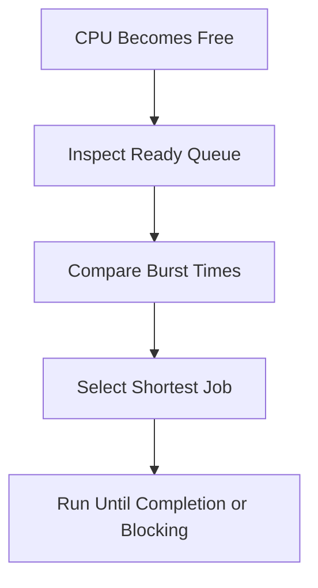

SJF provides the minimum average waiting time when all CPU burst times are known in advance.

The reason is that executing shorter processes first prevents them from waiting behind longer processes.

### Example

| Process | Burst Time |
| ------- | ---------: |
| P1      |          6 |
| P2      |          2 |
| P3      |          8 |
| P4      |          3 |

If all processes arrive together, the execution order is:

```text
P2 → P4 → P1 → P3
```

### Burst-Time Prediction

In real systems, the exact future CPU burst is usually unknown. The operating system may estimate it from previous CPU bursts.

One common prediction formula is:

```text
τ(n+1) = α × t(n) + (1 - α) × τ(n)
```

Where:

* `t(n)` is the actual previous burst.
* `τ(n)` is the previous predicted burst.
* `α` is a value between `0` and `1`.
* `τ(n+1)` is the next predicted burst.

### Advantages

SJF minimizes average waiting time when burst information is accurate.

It gives fast completion to short processes.

### Disadvantages

Exact burst time is difficult to predict.

Long processes may suffer from starvation if shorter processes keep arriving.

---

## 18. ⏳ Shortest Remaining Time First — SRTF

Shortest Remaining Time First is the preemptive version of SJF.

The scheduler always runs the ready process with the smallest remaining CPU time.

If a new process arrives with a burst time shorter than the remaining time of the current process, the current process is preempted.

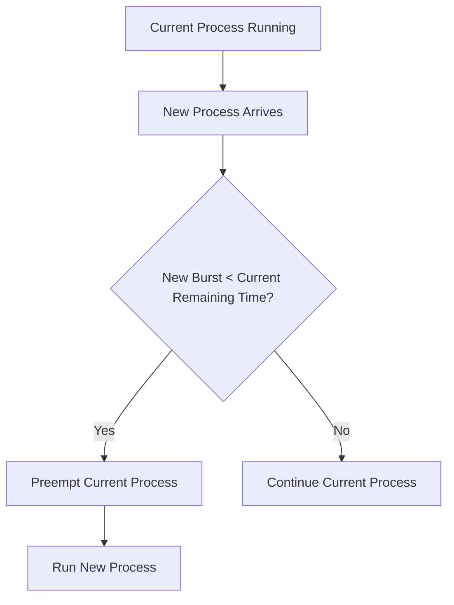

### Example

Suppose `P1` starts at time `0` with burst time `8`.

At time `1`, `P2` arrives with burst time `3`.

At that moment, `P1` has `7` units remaining. Since `P2` needs only `3` units, the scheduler preempts `P1` and executes `P2`.

### Advantages

SRTF provides excellent average waiting and turnaround time for short processes.

It also improves response time compared with non-preemptive SJF.

### Disadvantages

Frequent arrivals may cause many context switches.

Long processes may starve if short processes continue arriving.

The scheduler must continually track remaining execution times.

---

## 19. 🎯 Priority Scheduling

In Priority Scheduling, every process is assigned a priority.

The scheduler selects the ready process with the highest priority.

Priority Scheduling can be either preemptive or non-preemptive.

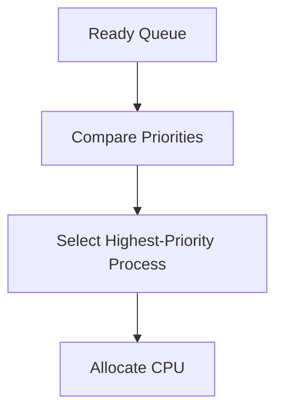

> [!CAUTION]
> Priority numbering is system-dependent. In some systems, a smaller numeric value means higher priority. In others, a larger value means higher priority.

### Preemptive Priority Scheduling

If a newly arrived process has a higher priority than the currently running process, the running process is preempted.

### Non-Preemptive Priority Scheduling

The running process continues until it completes or blocks. The highest-priority process is selected only when the CPU becomes free.

### Starvation Problem

A low-priority process may wait indefinitely if higher-priority processes continue arriving.

This problem is called **starvation** or **indefinite blocking**.

### Aging

Aging gradually improves the priority of a process the longer it waits.

For example, if smaller numbers represent higher priority:

```text
10 → 9 → 8 → 7 → 6 → ... → 1
```

Eventually, the waiting process becomes important enough to execute.

### Advantages

Priority Scheduling allows urgent and important processes to execute first.

It is useful in real-time systems and operating-system workloads.

### Disadvantages

It may cause starvation.

Selecting appropriate priorities can also be difficult.

---

## 20. 🔁 Round Robin Scheduling

Round Robin is a preemptive scheduling algorithm designed for time-sharing systems.

Each process receives a fixed amount of CPU time called a **time quantum** or **time slice**.

If the process does not complete within that quantum, it is preempted and placed at the end of the ready queue.

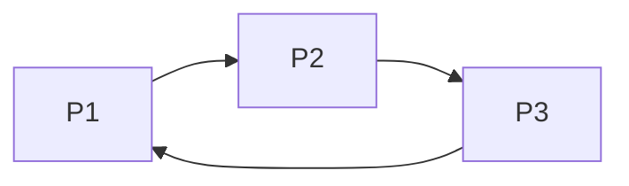

### Workflow

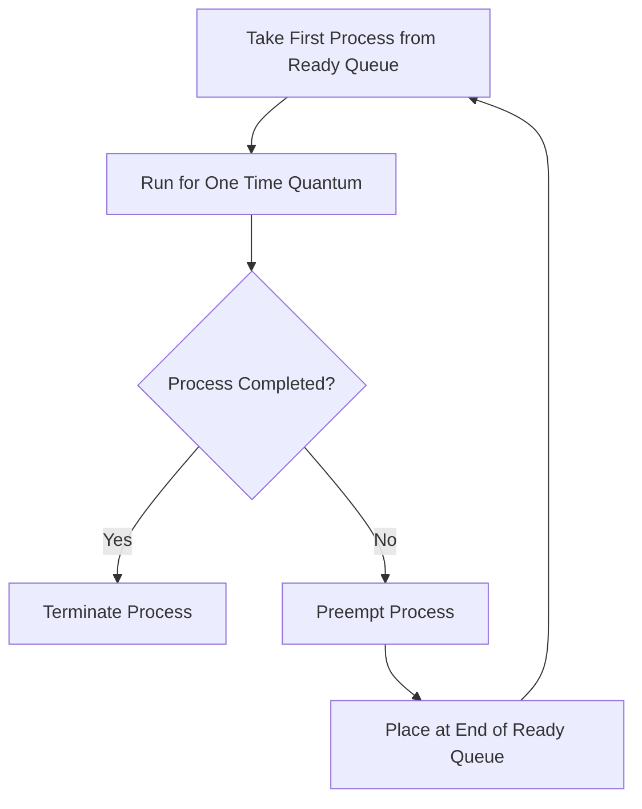

### Effect of Time Quantum

The time quantum has a major effect on Round Robin performance.

If the quantum is extremely large, processes usually complete before being preempted. Round Robin then behaves like FCFS.

If the quantum is extremely small, the system performs many context switches. This improves fairness but wastes CPU time on scheduling overhead.

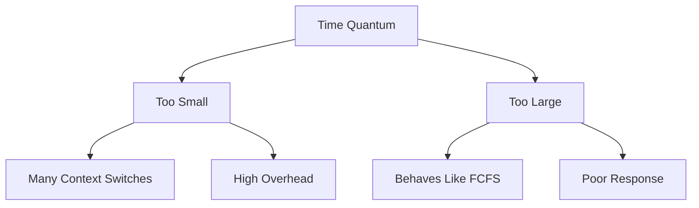

The time quantum should be significantly larger than the context-switch time.

### Example

Suppose all processes arrive at time `0` and the time quantum is `2`.

| Process | Burst Time |
| ------- | ---------: |
| P1      |          5 |
| P2      |          4 |
| P3      |          2 |

The execution order is:

```text
P1(2) → P2(2) → P3(2) → P1(2) → P2(2) → P1(1)
```

### Advantages

Round Robin provides fair CPU sharing.

It gives good response time to interactive processes.

Under ordinary conditions, every ready process eventually receives CPU time.

### Disadvantages

Its performance depends heavily on the selected quantum.

A small quantum creates excessive context-switching overhead.

Its average turnaround time may be worse than SJF.

---

## 21. 🗃️ Multilevel Queue Scheduling

Multilevel Queue Scheduling divides the ready queue into multiple separate queues.

Processes are permanently assigned to a queue based on characteristics such as process type, priority or memory requirements.

Example queues may include:

* System processes
* Interactive processes
* Batch processes
* Background processes

```mermaid
graph TD
    A["Incoming Process"] --> B{"Process Type"}
    B --> C["System Queue"]
    B --> D["Interactive Queue"]
    B --> E["Batch Queue"]
    C --> F["CPU"]
    D --> F
    E --> F
```

Each queue may use its own scheduling algorithm.

For example:

| Queue                 | Possible Algorithm  |
| --------------------- | ------------------- |
| System processes      | Priority Scheduling |
| Interactive processes | Round Robin         |
| Batch processes       | FCFS                |

Scheduling between queues may use fixed priority or time slicing.

With fixed priority, the system queue may always execute before the interactive queue, which executes before the batch queue.

This can cause starvation in lower-priority queues.

> [!IMPORTANT]
> In Multilevel Queue Scheduling, a process normally remains in its assigned queue.

---

## 22. 📶 Multilevel Feedback Queue Scheduling

Multilevel Feedback Queue Scheduling also uses multiple queues, but processes are allowed to move between queues.

It attempts to favor short and interactive processes while still allowing CPU-bound processes to make progress.

```mermaid
graph TD
    A["New Process"] --> Q1["Queue 1: Highest Priority, Small Quantum"]
    Q1 -->|Uses Full Quantum| Q2["Queue 2: Medium Priority, Larger Quantum"]
    Q2 -->|Uses Full Quantum| Q3["Queue 3: Lowest Priority, FCFS"]
    Q3 -->|Aging or Priority Boost| Q1
```

A new process usually begins in the highest-priority queue.

If it uses its entire time quantum, it is treated as CPU-bound and moved to a lower-priority queue.

Processes that frequently release the CPU for I/O remain at higher priority because they are likely interactive.

Aging or periodic priority boosts may move long-waiting processes upward to prevent starvation.

### Advantages

MLFQ adapts dynamically to process behavior.

It provides good response to interactive processes.

It can approximate SJF without knowing future burst times.

### Disadvantages

MLFQ is complex to configure.

Its behavior depends on:

* Number of queues
* Scheduling algorithm per queue
* Time quantum per queue
* Promotion rules
* Demotion rules
* Priority-boost intervals

---

## 23. 📋 Comparison of CPU Scheduling Algorithms

| Algorithm        | Type           | Selection Basis         | Main Advantage                     | Main Limitation              |
| ---------------- | -------------- | ----------------------- | ---------------------------------- | ---------------------------- |
| FCFS             | Non-preemptive | Arrival order           | Simple and starvation-free         | Convoy effect                |
| SJF              | Non-preemptive | Shortest burst          | Minimum average waiting time       | Long-job starvation          |
| SRTF             | Preemptive     | Shortest remaining time | Fast service for short jobs        | High overhead and starvation |
| Priority         | Either         | Process priority        | Important work executes first      | Low-priority starvation      |
| Round Robin      | Preemptive     | Time quantum            | Fair and responsive                | Quantum-dependent            |
| Multilevel Queue | Mixed          | Fixed queue category    | Different policy per process class | Lower-queue starvation       |
| MLFQ             | Preemptive     | Dynamic queue priority  | Adaptive and responsive            | Complex configuration        |

---

## 24. 🧮 How to Solve CPU Scheduling Numericals

CPU scheduling problems become easier when solved systematically.

### Step 1: Prepare the Process Table

Write down the process ID, arrival time, burst time and priority if applicable.

```text
Process | Arrival Time | Burst Time | Priority
```

### Step 2: Identify the Scheduling Policy

Determine whether the algorithm is:

* Preemptive or non-preemptive
* Based on priority or burst time
* Using a time quantum
* Using smaller or larger priority numbers as higher priority

### Step 3: Draw the Gantt Chart

The Gantt chart shows which process executes during every time interval.

For a preemptive algorithm, reconsider the running process whenever a new process arrives.

For Round Robin, reconsider execution whenever a time quantum expires.

### Step 4: Find Completion Time

The completion time is the final point at which each process finishes.

### Step 5: Calculate Turnaround Time

```text
TAT = CT - AT
```

### Step 6: Calculate Waiting Time

```text
WT = TAT - BT
```

### Step 7: Calculate Response Time

```text
RT = First Start Time - AT
```

### Step 8: Calculate Average Values

```text
Average Waiting Time =
Sum of Waiting Times / Number of Processes
```

```text
Average Turnaround Time =
Sum of Turnaround Times / Number of Processes
```

> [!TIP]
> In preemptive scheduling, a process may appear multiple times in the Gantt chart. Its completion time is the end of its final execution interval.
