# Scheduler, Dispatcher, Starvation and Aging

> [!NOTE]
> The scheduler and dispatcher work together to transfer the CPU from one process to another. The scheduler decides which process should execute, while the dispatcher performs the operations required to start or resume the selected process.

---

## Scheduler

A scheduler is an operating-system component responsible for selecting processes and deciding how they should move through different stages of execution.

When multiple processes are ready to execute, the operating system cannot allocate the CPU to all of them simultaneously on a single CPU core. It therefore uses a scheduler to determine which process should run next.

The scheduler makes its decision according to a scheduling algorithm. Depending on the operating system and workload, this algorithm may consider factors such as arrival time, CPU burst time, process priority, remaining execution time or waiting time.

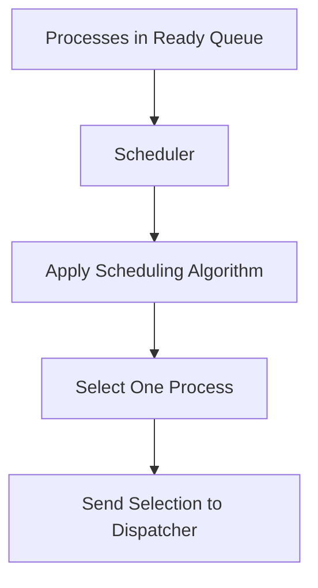

The scheduler does not itself transfer CPU control to the selected process. Its primary responsibility is decision-making.

For example, in Round Robin scheduling, the scheduler selects the next process from the ready queue after the current process's time quantum expires. In Priority Scheduling, the scheduler selects the highest-priority ready process.

---

## Types of Schedulers

Operating systems may use long-term, short-term and medium-term schedulers. Each scheduler works at a different stage of process management.

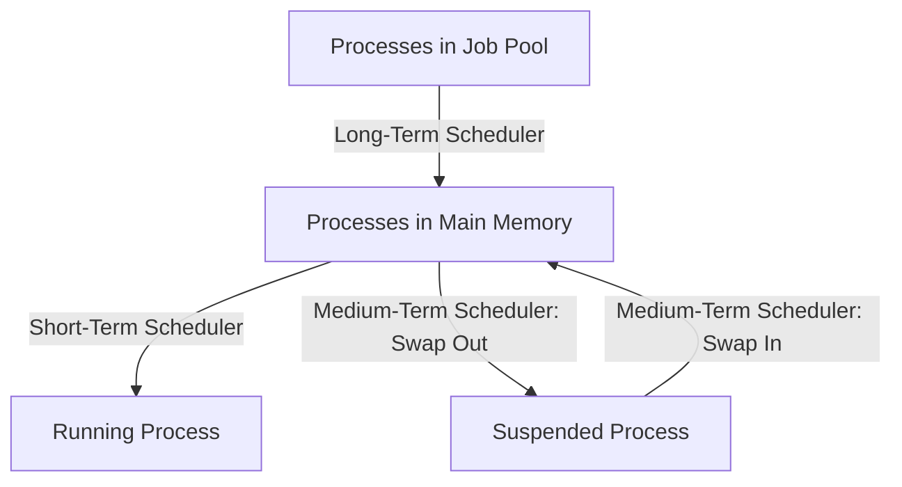

### Long-Term Scheduler

The long-term scheduler selects processes from the job pool and admits them into main memory.

It controls the degree of multiprogramming, which represents the number of processes currently present in memory.

The long-term scheduler runs relatively infrequently because processes are not continuously admitted into the system. It can therefore spend more time making each decision.

Its goal is to maintain a suitable combination of CPU-bound and I/O-bound processes.

### Short-Term Scheduler

The short-term scheduler selects one process from the ready queue and allocates the CPU to it.

It is also known as the CPU scheduler.

The short-term scheduler runs very frequently. It may execute after a timer interrupt, process termination, I/O request or arrival of a higher-priority process.

Because it runs so frequently, its decision-making must be fast.

### Medium-Term Scheduler

The medium-term scheduler temporarily removes processes from main memory and later brings them back.

Removing a process from memory is called swapping out or suspending the process. Bringing it back into memory is called swapping in or resuming it.

The medium-term scheduler reduces memory pressure and controls the degree of multiprogramming.

---

## Dispatcher

The dispatcher is an operating-system component that transfers CPU control to the process selected by the short-term scheduler.

Once the scheduler has selected a process, the dispatcher performs the low-level operations required to start or resume its execution.

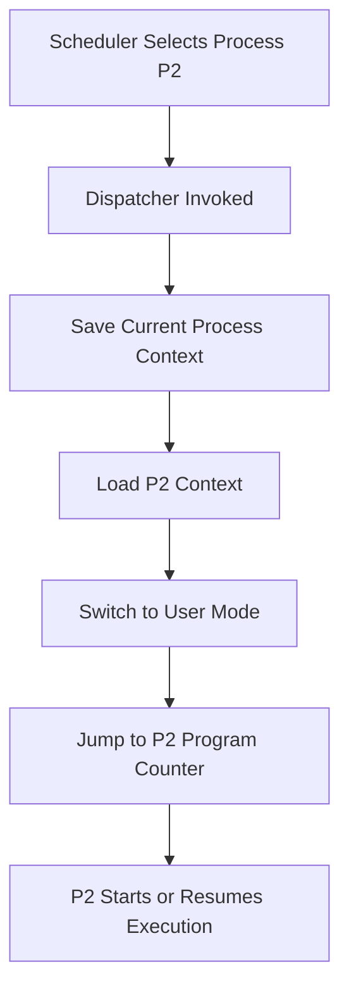

The dispatcher performs three primary operations:

1. It performs the required context switch.
2. It switches the processor from kernel mode to user mode.
3. It transfers execution to the correct instruction in the selected process.

When a process previously executed and was later interrupted, its CPU register values and program counter were saved in its Process Control Block. The dispatcher restores these saved values so that the process can continue from the exact point where it stopped.

---

## Scheduler and Dispatcher Workflow

The scheduler and dispatcher are separate components, but they work together whenever the CPU must be allocated to another process.

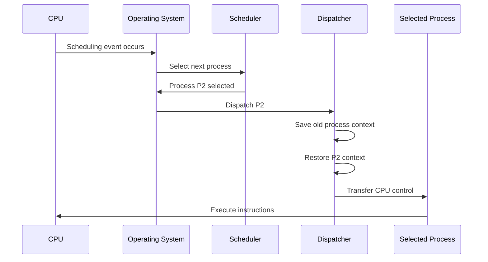

A scheduling event may occur when:

* The running process completes.
* The running process requests an I/O operation.
* Its time quantum expires.
* A higher-priority process becomes ready.
* A hardware interrupt occurs.
* The process voluntarily releases the CPU.

After the event occurs, the scheduler examines the ready queue and chooses a process. The dispatcher then implements that decision.

---

## Scheduler vs Dispatcher

| Scheduler                                 | Dispatcher                                    |
| ----------------------------------------- | --------------------------------------------- |
| Selects which process should execute next | Transfers CPU control to the selected process |
| Performs decision-making                  | Performs the actual handover                  |
| Uses a CPU scheduling algorithm           | Executes context-switch operations            |
| Examines the ready queue                  | Uses saved process context from the PCB       |
| Runs before the dispatcher                | Runs after the scheduler selects a process    |
| Focuses on efficiency and fairness        | Focuses on fast transfer of control           |
| Does not directly start process execution | Starts or resumes process execution           |

The scheduler answers the question:

> Which process should run next?

The dispatcher answers the question:

> How should CPU control be transferred to that process?

Consider a railway station. The scheduling authority decides which train should use a platform next. The station controller then changes the signals and allows the selected train to enter the platform.

Similarly, the scheduler makes the selection, and the dispatcher performs the transfer.

---

## Role of the Process Control Block

The dispatcher depends on the Process Control Block to stop and resume processes correctly.

A PCB contains the execution state of a process, including its program counter, stack pointer, CPU register values, process state and memory-management information.

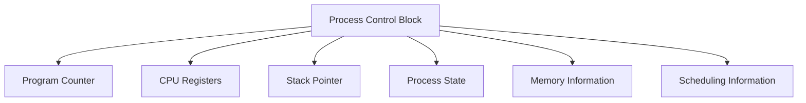

When the CPU switches from process `P1` to process `P2`, the operating system saves the current execution state of `P1` in its PCB.

The dispatcher then reads the saved execution state of `P2` from its PCB and restores it into the processor.


Without the PCB, the operating system would not know where a suspended process should resume.

---

## Dispatch Latency

Dispatch latency is the time required by the dispatcher to stop one process and start another process.

It measures the delay between selecting a process and beginning its execution.


Dispatch latency may include the time required to:

* Save the current process's CPU registers.
* Update the current process's PCB.
* Restore the selected process's registers.
* Switch memory address spaces.
* update memory-management information.
* Switch from kernel mode to user mode.
* Transfer control to the selected instruction.

A dispatcher should be as fast as possible because dispatching is operating-system overhead. During this time, the CPU is performing process-management work rather than executing instructions belonging to a user process.

Dispatch latency is particularly important in real-time systems. A real-time process may need to begin execution within a strict time limit after an event occurs.

---

## Context Switch and Dispatch Latency

A context switch is the operation of saving the state of one process and restoring the state of another.

Dispatch latency is the total time required to perform the dispatching operation.

| Context Switch                                 | Dispatch Latency                                     |
| ---------------------------------------------- | ---------------------------------------------------- |
| Describes an operation                         | Describes a time delay                               |
| Saves one process context and restores another | Measures how long the complete transfer takes        |
| Uses the PCB of both processes                 | Includes context switching and control-transfer work |
| Represents what the OS performs                | Represents the overhead caused by dispatching        |

A context switch is usually an important part of dispatch latency, but dispatch latency may also include address-space switching, mode switching and transferring execution to the selected process.

---

## Mode Switch and Context Switch

A mode switch occurs when the processor changes between user mode and kernel mode.

A context switch occurs when the processor changes from executing one process or thread to executing another.

These operations are related but are not identical.

A process may execute a system call and enter kernel mode. After the system call completes, the same process may return to user mode. This involves mode switches but does not necessarily involve a process context switch.

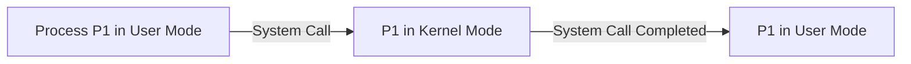

During a process context switch, the operating system normally enters kernel mode, saves the current process state and restores another process state.

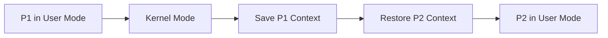

Therefore, a context switch normally involves mode-switching activity, but every mode switch does not cause a context switch.

---

## Starvation

Starvation occurs when a process waits for CPU time or another resource for an indefinite period because other processes are continuously preferred.

The process is ready and capable of executing, but the scheduling policy repeatedly selects other processes.

Starvation is also called indefinite blocking or indefinite postponement.

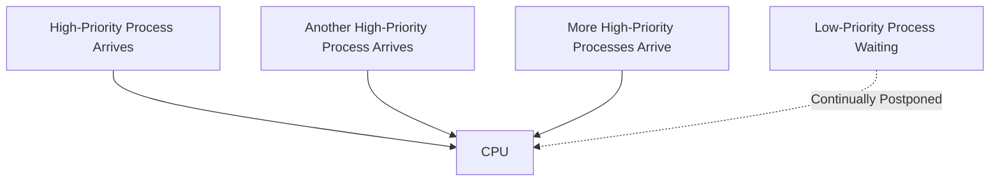

Suppose a priority scheduling algorithm always selects the highest-priority process.

A low-priority process is waiting in the ready queue. Before it can execute, a higher-priority process arrives and receives the CPU. When that process completes, another higher-priority process arrives.

If higher-priority processes continue arriving, the low-priority process may remain in the ready queue indefinitely.

The system continues making progress, and other processes continue executing. However, the starving process receives no opportunity to proceed.

---

## Causes of Starvation

Starvation is usually caused by an unfair scheduling or resource-allocation policy.

### Strict Priority Scheduling

In strict priority scheduling, the scheduler always selects the highest-priority ready process.

If higher-priority processes continue arriving, lower-priority processes may never execute.

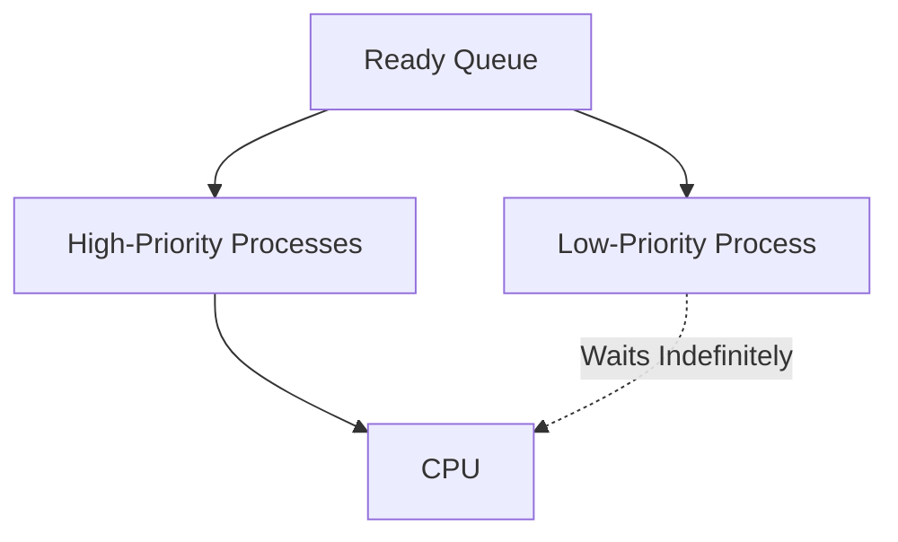

### Shortest Job First

Shortest Job First selects the process with the smallest CPU burst.

A long process may wait indefinitely if shorter processes continue arriving before it receives the CPU.

### Shortest Remaining Time First

SRTF is the preemptive version of SJF. A long-running process can repeatedly be preempted when shorter processes arrive.

### Multilevel Queue Scheduling

In Multilevel Queue Scheduling, processes are placed in separate queues.

If the operating system always serves higher-priority queues first, processes in lower-priority queues may starve.

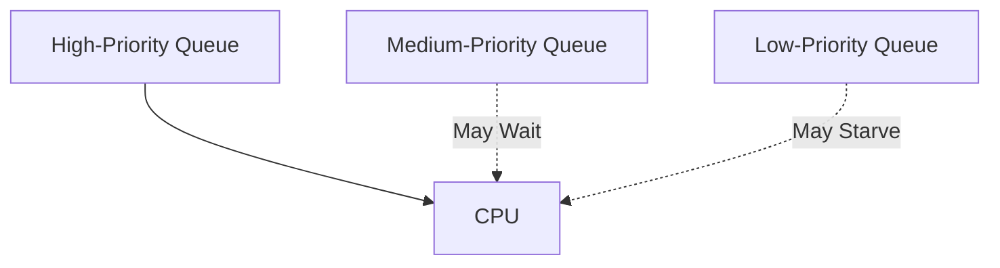

### Unfair Synchronization Mechanisms

Starvation can also occur when processes compete for locks or shared resources.

For example, a lock implementation may repeatedly allow newly arriving processes to acquire the lock before a process that has already waited for a long time.

---

## Starvation Example

Assume that smaller priority values represent higher priorities.

| Process | Arrival Time | Priority | Burst Time |
| ------- | -----------: | -------: | ---------: |
| P1      |            0 |       10 |          4 |
| P2      |            1 |        1 |          3 |
| P3      |            2 |        1 |          2 |
| P4      |            4 |        2 |          3 |
| P5      |            6 |        1 |          2 |

`P1` has the lowest priority because its priority value is `10`.

Whenever the scheduler prepares to select `P1`, another process with a higher priority becomes ready. If this pattern continues, `P1` may never execute.

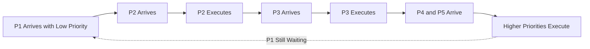

The problem is not that the CPU is unavailable. The CPU is continuously being used, but the scheduling policy repeatedly denies `P1` access.

---

## Starvation and CPU Utilization

A system can have high CPU utilization and still suffer from starvation.

CPU utilization only measures whether the CPU remains busy. It does not measure whether CPU time is distributed fairly among processes.

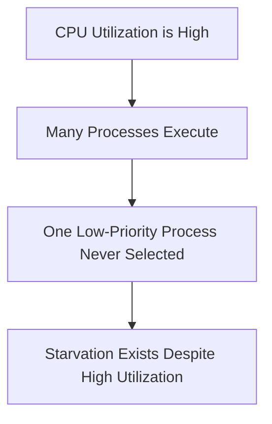

Therefore, a scheduling algorithm should be evaluated using fairness in addition to performance measurements such as throughput and CPU utilization.

---

## Aging

Aging is a scheduling technique used to prevent starvation.

In aging, the priority of a waiting process is gradually improved as its waiting time increases.

The longer the process remains in the ready queue, the more likely it becomes that the scheduler will select it.

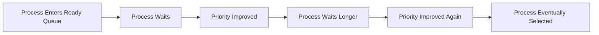

Suppose smaller numbers represent higher priority.

A process enters the ready queue with priority `10`. After every fixed time interval, the operating system decreases its priority value.

```text
10 → 9 → 8 → 7 → 6 → 5 → 4 → 3 → 2 → 1
```

As the value decreases, the effective priority of the process increases.

Eventually, it becomes a high-priority process and receives the CPU.

> [!IMPORTANT]
> Aging does not immediately make a low-priority process the highest-priority process. It gradually improves priority according to waiting time.

---

## How Aging Works

The operating system periodically examines waiting processes and updates their effective priority.

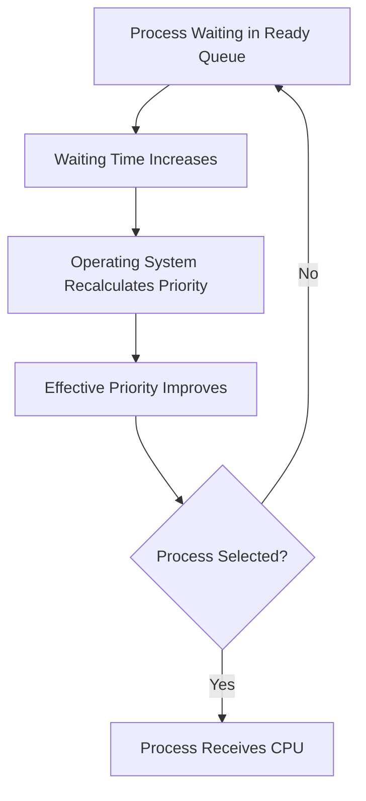

The exact aging rule depends on the operating system.

A simple policy might increase priority after every ten seconds of waiting.

Another policy might calculate a dynamic priority using both the original priority and waiting time.

```text
Effective Priority = Base Priority + Waiting-Time Adjustment
```

If smaller numbers represent higher priority, the adjustment may be subtracted instead.

```text
Effective Priority = Base Priority - Waiting-Time Adjustment
```

The goal is not to use one specific mathematical formula. The goal is to ensure that the priority of a process improves as its waiting time increases.

---

## Aging Example

Assume a scheduling system where smaller values represent higher priority.

A process `P1` enters the ready queue with priority `8`.

The operating system improves its priority by one level after every five units of waiting time.

| Waiting Time | Effective Priority |
| -----------: | -----------------: |
|            0 |                  8 |
|            5 |                  7 |
|           10 |                  6 |
|           15 |                  5 |
|           20 |                  4 |
|           25 |                  3 |
|           30 |                  2 |
|           35 |                  1 |

Even if new high-priority processes continue arriving, `P1` eventually reaches a sufficiently high priority to be selected.


---

## Aging in Priority Scheduling

Priority scheduling is the most common situation in which aging is applied.

Without aging, a process's priority may remain permanently low.

With aging, the priority becomes dynamic and depends partly on waiting time.

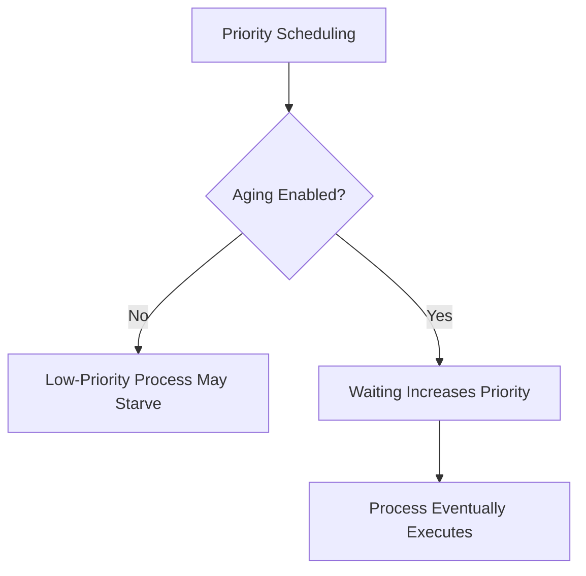

Aging allows the scheduler to preserve priority-based behavior for recently arrived processes while still providing long-term fairness.

---

## Aging in Multilevel Feedback Queues

Aging can also be implemented in a Multilevel Feedback Queue.

Processes in lower-priority queues may be promoted to higher-priority queues after waiting for a long period.

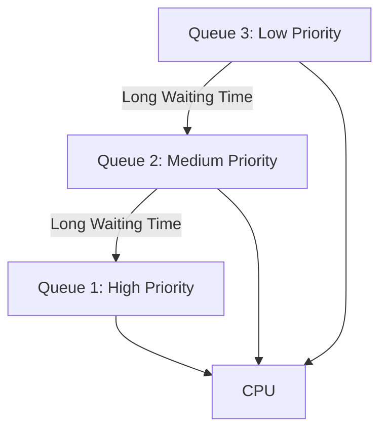

Another strategy is a periodic priority boost.

After a fixed interval, the operating system moves all ready processes back to the highest-priority queue.

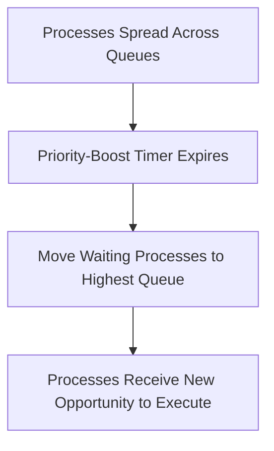

This prevents CPU-bound processes from remaining permanently trapped in low-priority queues.

---

## Starvation vs Aging

| Starvation                                        | Aging                                                   |
| ------------------------------------------------- | ------------------------------------------------------- |
| A scheduling or allocation problem                | A technique for solving starvation                      |
| A process waits indefinitely                      | Waiting gradually improves priority                     |
| Caused by repeated preference for other processes | Introduces preference for long-waiting processes        |
| Reduces fairness                                  | Improves fairness                                       |
| Common in strict Priority Scheduling              | Commonly added to Priority Scheduling                   |
| Can leave a ready process without CPU time        | Ensures a waiting process eventually becomes selectable |

Starvation describes what goes wrong. Aging describes one way the operating system can correct it.

---

## Starvation vs Deadlock

Starvation and deadlock can both cause a process to wait indefinitely, but they occur for different reasons.

In starvation, the process could theoretically proceed, but the scheduling or allocation policy repeatedly gives preference to other processes.

In deadlock, processes cannot proceed because each process waits for a resource held by another process in the same deadlocked group.

| Starvation                                        | Deadlock                                              |
| ------------------------------------------------- | ----------------------------------------------------- |
| Caused by unfair scheduling or allocation         | Caused by circular resource dependency                |
| Other processes continue making progress          | Deadlocked processes cannot make progress             |
| Required resource may repeatedly become available | Required resources remain held within the cycle       |
| Aging or fair scheduling may solve it             | Requires prevention, avoidance, detection or recovery |
| No circular wait is required                      | Circular wait is one of the necessary conditions      |

```mermaid
graph TD
    subgraph Starvation
        A["Low-Priority Process"] -. "Repeatedly Denied CPU" .-> B["CPU"]
        C["Other Processes"] --> B
    end

    subgraph Deadlock
        P1["P1 Holds R1 and Waits for R2"] --> P2["P2 Holds R2 and Waits for R1"]
        P2 --> P1
    end
```

---

## Starvation vs Livelock

In starvation, a process waits because other processes are repeatedly preferred.

In livelock, processes are active and continue changing their state, but they make no useful progress.

Consider two people meeting in a narrow hallway. Both move left to avoid each other, then both move right, and continue repeating the same actions. They remain active but neither moves forward.

```mermaid
graph LR
    A["Process P1 Changes Action"] --> B["Process P2 Reacts"]
    B --> C["P1 Reacts Again"]
    C --> D["P2 Reacts Again"]
    D --> A
```

| Starvation                                | Livelock                                           |
| ----------------------------------------- | -------------------------------------------------- |
| Process may remain inactive while waiting | Processes remain active                            |
| Other processes receive the resource      | Processes repeatedly react to each other           |
| Caused by unfair preference               | Caused by repeated state changes without progress  |
| Aging may help                            | Requires coordination or randomized retry behavior |

---

## Starvation vs Convoy Effect

Starvation and the convoy effect both involve process delays, but they are different problems.

The convoy effect commonly occurs in FCFS scheduling when several short processes wait behind one long process.

Those short processes eventually execute after the long process completes.

In starvation, there may be no upper limit on the waiting time. The process may never execute.

| Starvation                                        | Convoy Effect                                  |
| ------------------------------------------------- | ---------------------------------------------- |
| Waiting may be indefinite                         | Waiting is long but generally finite           |
| Often occurs in Priority Scheduling or SJF        | Commonly occurs in FCFS                        |
| Caused by repeated preference for other processes | Caused by arrival ordering                     |
| Aging may prevent it                              | A different scheduling algorithm may reduce it |
| Process may never execute                         | Process executes after earlier work finishes   |

```mermaid
graph TD
    subgraph Convoy Effect
        L["Long Process"] --> S1["Short Process 1"]
        S1 --> S2["Short Process 2"]
        S2 --> S3["Short Process 3"]
    end

    subgraph Starvation
        LP["Low-Priority Process"]
        HP1["High-Priority Process 1"] --> CPU["CPU"]
        HP2["High-Priority Process 2"] --> CPU
        LP -. "May Never Execute" .-> CPU
    end
```

---

## Bounded Waiting

Bounded waiting is a fairness condition stating that there must be a limit on how many times other processes may enter or receive a resource after a process has requested it.

Suppose process `P1` requests the CPU or a lock. A bounded-waiting policy guarantees that only a limited number of other processes can be served before `P1`.

```mermaid
graph LR
    A["P1 Requests Resource"] --> B["Limited Number of Other Processes Proceed"]
    B --> C["P1 Must Receive Resource"]
```

Aging helps establish bounded waiting in priority-based scheduling because a process's priority continuously improves as it waits.

Without such a mechanism, no upper limit may exist on its waiting time.

---

## Fairness in Scheduling

Fairness means that every eligible process receives a reasonable opportunity to execute.

Fairness does not necessarily mean that every process receives exactly the same amount of CPU time.

A scheduler may intentionally provide different CPU shares according to:

* Process priority
* Real-time deadlines
* User or group allocation
* Workload type
* Resource entitlement
* Interactive requirements

A fair priority scheduler can still execute important processes first, but it must prevent lower-priority processes from waiting indefinitely.

```mermaid
graph TD
    A["Scheduling Policy"] --> B["Respect Priorities"]
    A --> C["Provide Fast Response"]
    A --> D["Prevent Indefinite Waiting"]
    B --> E["Balanced Scheduler"]
    C --> E
    D --> E
```

Aging balances priority and fairness. Recently arrived high-priority processes may still execute first, but long-waiting processes gradually become competitive.

---

## Methods to Prevent Starvation

Aging is one of the most common techniques for preventing starvation, but it is not the only option.

### Fair Time Slicing

In Round Robin scheduling, every ready process receives a fixed time quantum. A process that does not finish is returned to the end of the queue.

```mermaid
graph LR
    P1["P1"] --> P2["P2"]
    P2 --> P3["P3"]
    P3 --> P1
```

As long as processes remain in the same fair ready queue, each process eventually receives CPU time.

### Periodic Priority Boosting

The operating system periodically raises the priority of waiting processes or moves them to the highest-priority queue.

This prevents long-running or CPU-bound processes from remaining in low-priority queues forever.

### Fair Resource Queues

Locks, semaphores and devices can maintain FIFO waiting queues.

A process that requests a resource earlier receives it before later requesters, reducing unfair bypassing.

### Bounded Waiting

A synchronization or scheduling policy can guarantee that a process waits for only a bounded number of turns.

### Resource Quotas

The system can limit how much CPU time, memory or I/O capacity one process or user consumes. This prevents one workload from continuously denying resources to others.

---

## Complete Scheduler and Dispatcher Flow

The complete execution flow combines scheduling, fairness evaluation and dispatching.

```mermaid
graph TD
    A["Scheduling Event Occurs"] --> B["Operating System Enters Kernel Mode"]
    B --> C["Save Current Process State"]
    C --> D["Update Process State and Queue"]
    D --> E["Short-Term Scheduler Examines Ready Queue"]
    E --> F["Apply CPU Scheduling Algorithm"]
    F --> G{"Long-Waiting Process?"}
    G -->|Yes| H["Apply Aging or Fairness Policy"]
    H --> I["Select Next Process"]
    G -->|No| I
    I --> J["Dispatcher Restores Selected Context"]
    J --> K["Switch to User Mode"]
    K --> L["Transfer Control to Selected Process"]
    L --> M["Selected Process Executes"]
```

The scheduler determines which process should receive the CPU. It may take waiting time, priority and fairness into account.

After a process is selected, the dispatcher restores its execution context and transfers CPU control to it.
