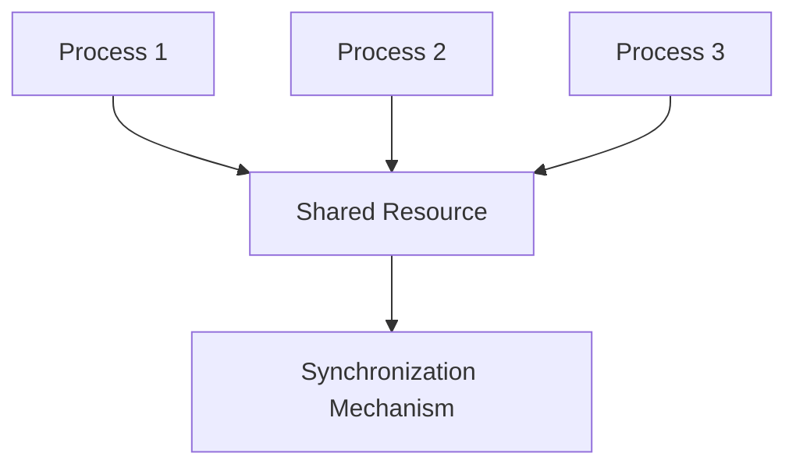
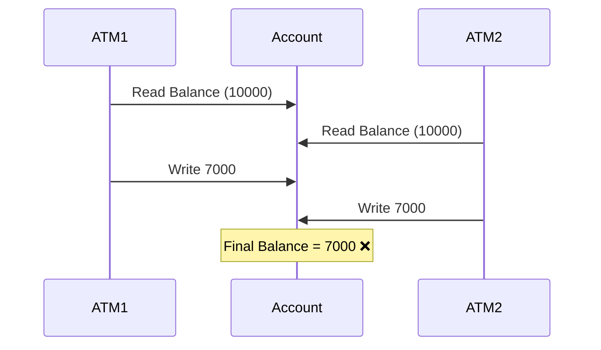
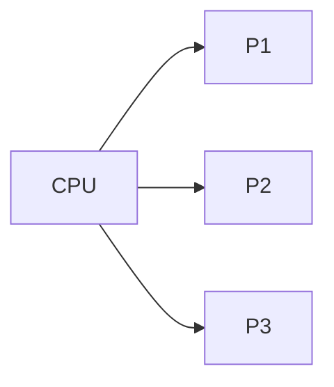
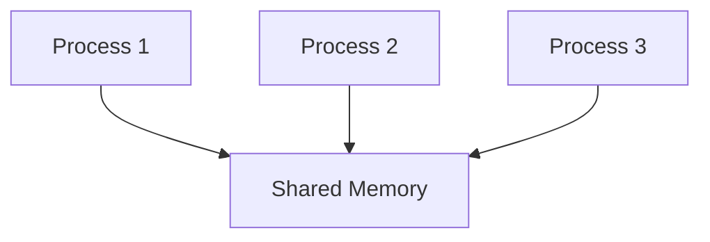
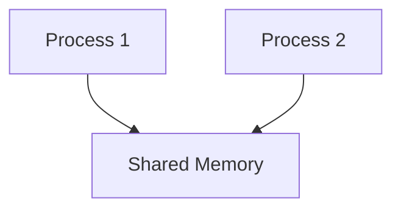
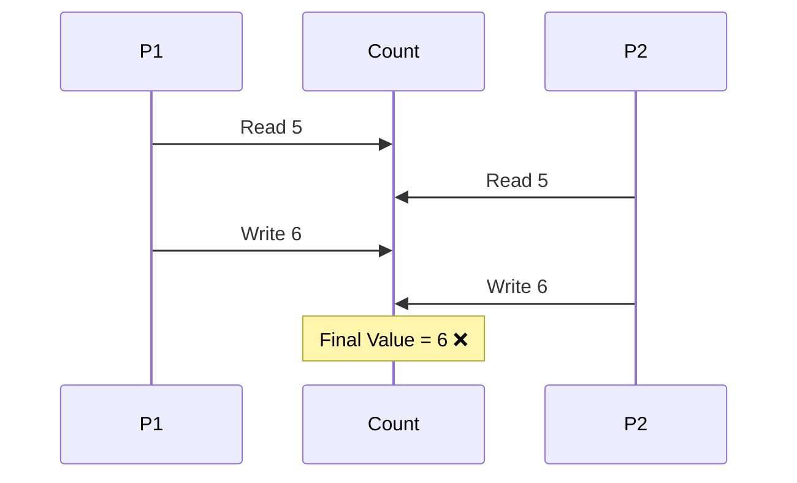
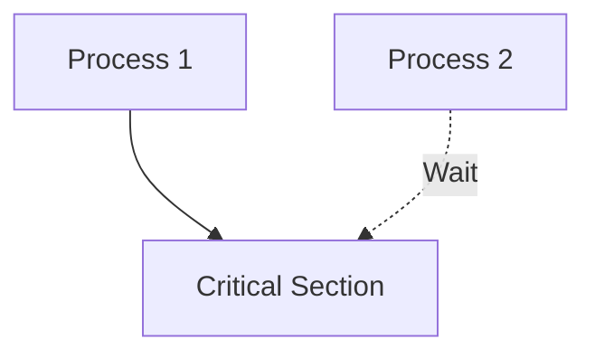
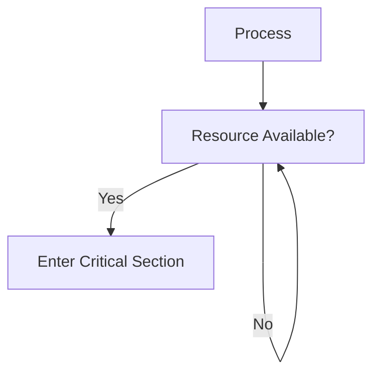
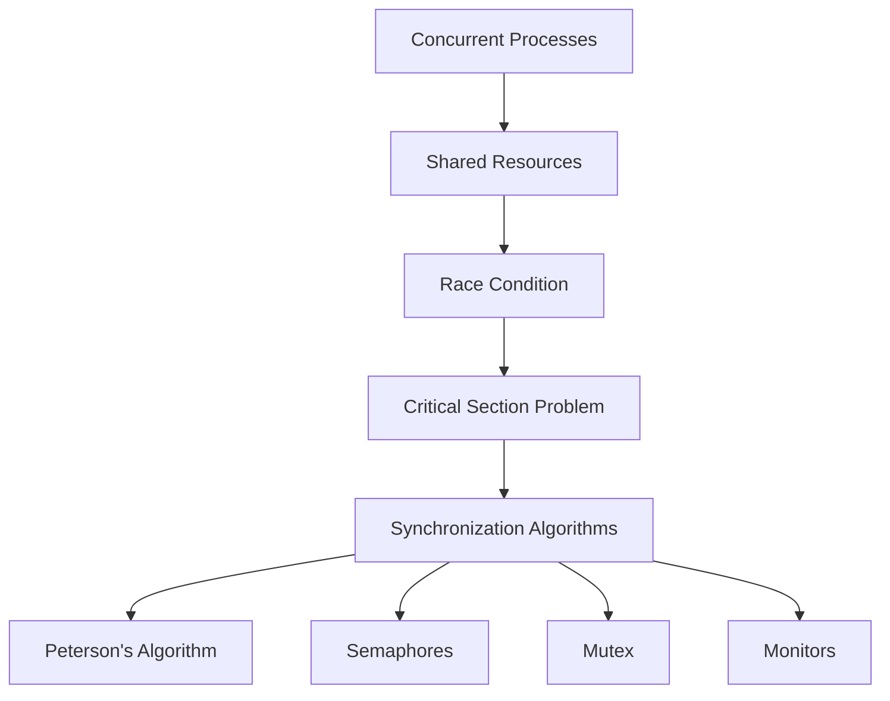

> [!NOTE]
> Process synchronization is the mechanism used by an operating system to coordinate multiple processes or threads so that they can safely access shared resources without causing inconsistencies or unexpected behavior.

---

## Process Synchronization

Modern operating systems are designed to support multiprogramming and multitasking. Multiple processes and threads often execute concurrently, and many of them may need to access the same resource such as a file, memory location, printer, database record, or network socket.

If multiple processes access shared resources simultaneously without proper coordination, the final result may become unpredictable because the execution order of instructions depends on CPU scheduling.

Process synchronization ensures that shared resources are accessed in a controlled manner so that the correctness of the program is preserved regardless of the execution order.

Synchronization is therefore not about making programs faster. Instead, it ensures **correctness, consistency, and reliability** when multiple execution units operate concurrently.



Without synchronization, multiple processes may overwrite each other's work, produce incorrect results, or leave shared data in an inconsistent state.

---

## Why Synchronization Is Needed

Consider a banking application where two ATM machines attempt to withdraw money from the same account simultaneously.

The account balance is ₹10,000.

Both transactions attempt to withdraw ₹3,000.

Each ATM performs the following operations:

1. Read the current balance.
2. Subtract ₹3,000.
3. Store the updated balance.

Suppose both ATMs read the balance before either updates it.

```
ATM 1 reads ₹10,000
ATM 2 reads ₹10,000

ATM 1 stores ₹7,000
ATM 2 stores ₹7,000
```

The final balance becomes ₹7,000.

However, two withdrawals totaling ₹6,000 have occurred.

The correct balance should be ₹4,000.

The error occurs because both transactions operated on the same shared data without synchronization.



Proper synchronization ensures that only one transaction updates the balance at a time.

---

## Concurrent Execution

Two processes are said to execute concurrently if their execution overlaps in time.

On a multicore processor, two processes may actually execute simultaneously.

On a single-core processor, concurrency is achieved through rapid context switching.

Although only one instruction executes at a time on a single-core CPU, the operating system switches between processes so quickly that they appear to run simultaneously.



Because the scheduler may interrupt a process at almost any instruction, the execution order cannot be predicted.

Synchronization mechanisms ensure that this unpredictability does not produce incorrect results.

---

## Shared Resources

A shared resource is any resource that can be accessed by multiple processes or threads.

Common examples include:

- Shared variables
- Shared memory
- Files
- Database records
- Printers
- Network sockets
- Message queues



Whenever multiple execution units can modify the same resource, synchronization is generally required.

Read-only shared resources usually do not require synchronization because they cannot be modified.

---

## Inter Process Communication (IPC)

Processes are normally isolated from one another. Each process has its own virtual address space and cannot directly access another process's memory.

However, many applications require processes to exchange information.

The mechanisms that allow processes to communicate are collectively known as **Inter Process Communication (IPC)**.

IPC allows processes to:

- Exchange data
- Coordinate execution
- Share resources
- Notify each other about events


IPC is generally classified into two major categories.

### Shared Memory

In shared-memory communication, multiple processes are allowed to access a common region of memory.

Instead of copying data between processes, all participating processes directly read and write the shared memory.

Since multiple processes may update the same memory simultaneously, synchronization becomes necessary.



Shared memory is extremely fast because data copying is minimized.

However, synchronization is entirely the responsibility of the programmer or operating system.

---

### Message Passing

In message passing, processes communicate by explicitly sending and receiving messages.

Instead of sharing memory, the operating system transfers data from one process to another.


Because processes do not directly modify shared memory, message passing generally requires less synchronization than shared-memory communication.

However, message passing involves additional communication overhead because data must be copied between processes.

---

## Shared Memory vs Message Passing

| Shared Memory | Message Passing |
|---|---|
| Processes share a common memory region | Processes exchange messages |
| Faster communication | Slower due to copying |
| Requires explicit synchronization | Synchronization is simpler |
| Suitable for processes on the same machine | Suitable for local and distributed systems |
| Higher performance | Easier to design safely |

---

## Race Condition

A race condition occurs when multiple processes or threads access shared data simultaneously and the final result depends on the order in which their instructions execute.

The execution order is determined by the CPU scheduler and therefore cannot be predicted.

Because different execution orders produce different outputs, the program becomes unreliable.

Consider the following shared variable.

```cpp
count = 5;
```

Two processes execute:

```
Process P1

count = count + 1
```

```
Process P2

count = count + 1
```

Suppose both processes read the value `5`.

```
P1 reads 5

P2 reads 5

P1 writes 6

P2 writes 6
```

The final value becomes `6`.

The expected value is `7`.



The problem occurs because both processes modify the same data concurrently.

Race conditions are among the most common synchronization problems in operating systems and concurrent programming.

---

## Critical Section

The critical section is the part of a program where shared resources are accessed or modified.

Since only one process should modify a shared resource at a time, execution inside the critical section must be carefully controlled.

A typical process is divided into four regions.


### Entry Section

The process requests permission to enter the critical section.

If another process is already inside, it waits.

---

### Critical Section

The process accesses or modifies shared resources.

Only one process should execute this section at a time.

---

### Exit Section

The process releases the shared resource so that another waiting process may enter.

---

### Remainder Section

The remaining part of the program that does not access shared resources.

Processes may execute this section concurrently.

---

## Critical Section Problem

The critical section problem asks:

> **How can multiple processes safely share resources while ensuring correctness?**

The operating system or synchronization algorithm must ensure that two processes never execute the same critical section simultaneously.



The objective is to design synchronization algorithms that satisfy certain correctness requirements.

---

## Requirements of a Correct Critical Section Solution

A correct synchronization solution must satisfy three conditions.

### Mutual Exclusion

If one process is executing inside the critical section, no other process may enter it.


Only one process may own the shared resource at any instant.

---

### Progress

If no process is inside the critical section and one or more processes wish to enter it, one of those waiting processes must eventually be allowed to proceed.

The operating system should not postpone the decision indefinitely.

---

### Bounded Waiting

After a process requests entry into the critical section, there must be a limit on how many times other processes may enter before it receives permission.

This requirement prevents starvation.


A process should never wait forever while other processes continuously enter the critical section.

---

## Busy Waiting

Some synchronization algorithms repeatedly check whether a resource has become available.

During this period, the process continuously consumes CPU time even though it is not performing useful work.

This behavior is called **busy waiting** or **spinning**.



Busy waiting wastes CPU cycles and is generally avoided whenever possible.

However, it is acceptable for very short waiting periods, especially on multiprocessor systems where spinlocks are commonly used.

---

## Relationship Between the Concepts



Process synchronization begins with understanding why race conditions occur. The remainder of this section studies different algorithms and operating-system mechanisms that solve the critical section problem while satisfying mutual exclusion, progress and bounded waiting.
