# Synchronization Solutions

> [!NOTE]
> Software synchronization algorithms were developed before modern hardware synchronization instructions became widely available. These algorithms attempt to solve the critical section problem using only shared variables and simple read/write operations. Although they are rarely used in modern operating systems, they are important because they explain the fundamental principles behind mutual exclusion.

---

## Introduction

In the previous chapter, we learned that multiple processes accessing shared resources simultaneously may lead to race conditions. To prevent this, the operating system must ensure that only one process enters the critical section at a time.

Over the years, several synchronization algorithms have been proposed. Early solutions relied entirely on software, while modern systems primarily depend on hardware-supported atomic instructions.

The synchronization solutions discussed in this chapter satisfy the three requirements of the critical section problem:

- Mutual Exclusion
- Progress
- Bounded Waiting

The chapter begins with software algorithms and then moves to hardware-supported techniques.

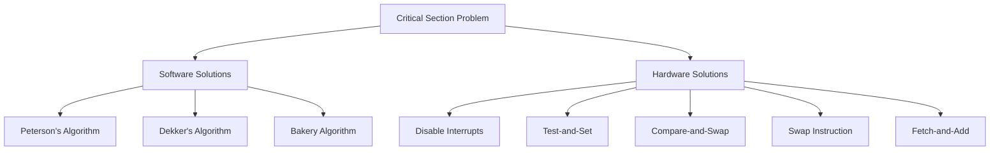

---

# Software Synchronization Algorithms

Software synchronization algorithms solve the critical section problem without requiring any special hardware instructions.

These algorithms use only shared variables and ordinary read/write operations.

Although modern processors provide hardware synchronization primitives, software algorithms remain important because they demonstrate the principles of synchronization.

---

# Peterson's Algorithm

Peterson's Algorithm is one of the simplest software algorithms for solving the critical section problem.

It provides a correct solution for **two processes**.

The algorithm satisfies:

- Mutual Exclusion
- Progress
- Bounded Waiting

It does not require any hardware support.

The algorithm uses two shared variables.

```cpp
bool flag[2];
int turn;
```

### flag[]

Each process has one flag.

```
flag[0]
flag[1]
```

If

```
flag[i] = true
```

then process `Pi` wishes to enter the critical section.

If

```
flag[i] = false
```

then process `Pi` is not interested in entering the critical section.

---

### turn

The variable

```
turn
```

indicates whose turn it is to enter the critical section if both processes want to enter simultaneously.

---

## Working

Suppose Process 0 wants to enter the critical section.

It first informs the other process that it is interested.

```
flag[0] = true;
```

Then it politely gives priority to Process 1.

```
turn = 1;
```

If Process 1 also wants to enter, Process 0 waits until

- Process 1 leaves the critical section, or
- The turn changes.

The waiting condition is

```cpp
while(flag[1] && turn == 1);
```

When the loop ends, Process 0 enters the critical section.

After completing its work, it resets

```
flag[0] = false;
```

allowing Process 1 to proceed.

---

## Peterson Algorithm

```cpp
Process P0

flag[0] = true;
turn = 1;

while(flag[1] && turn == 1);

Critical Section

flag[0] = false;
```

```cpp
Process P1

flag[1] = true;
turn = 0;

while(flag[0] && turn == 0);

Critical Section

flag[1] = false;
```

---

## Workflow

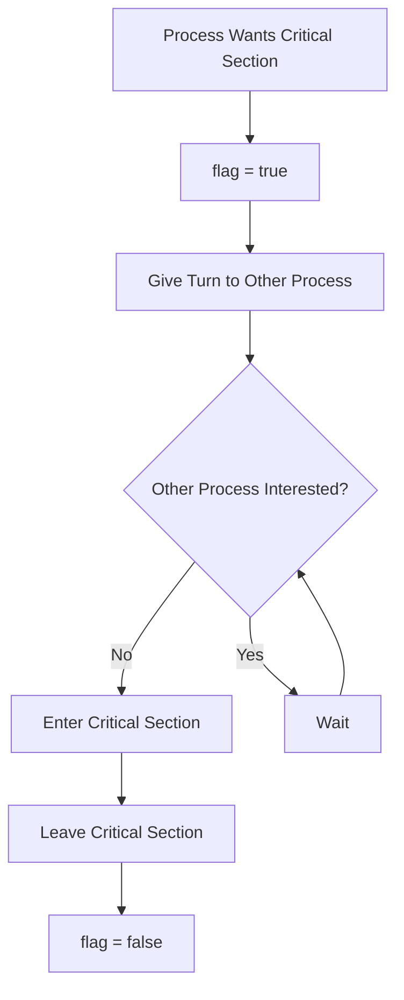

---

## Why Does It Work?

Suppose both processes try to enter simultaneously.

```
P0

flag[0] = true

turn = 1
```

```
P1

flag[1] = true

turn = 0
```

Only one value can remain in `turn`.

If

```
turn = 0
```

then Process 1 waits.

If

```
turn = 1
```

then Process 0 waits.

Therefore only one process enters the critical section.

---

## Advantages

Peterson's Algorithm is simple and mathematically correct.

It satisfies all three requirements of the critical section problem.

It requires no hardware synchronization support.

It demonstrates the concepts of busy waiting and mutual exclusion very clearly.

---

## Limitations

It works only for two processes.

It uses busy waiting, causing CPU cycles to be wasted while a process waits.

Modern processors perform instruction reordering and caching, making Peterson's Algorithm unreliable without memory barriers.

Therefore it is mainly used for teaching operating-system concepts rather than practical synchronization.

---

# Dekker's Algorithm

Dekker's Algorithm was one of the earliest correct solutions to the critical section problem.

Like Peterson's Algorithm, it works only for two processes.

It also satisfies:

- Mutual Exclusion
- Progress
- Bounded Waiting

Unlike Peterson's Algorithm, Dekker's Algorithm was developed before Peterson's work and is considerably more complex.

---

## Shared Variables

```
flag[2]

turn
```

The purpose of these variables is similar to Peterson's Algorithm.

The flags indicate interest in entering the critical section.

The turn variable resolves conflicts when both processes compete simultaneously.

---

## Basic Idea

Suppose both processes want to enter.

Each process raises its own flag.

If both flags become true simultaneously, the algorithm examines the turn variable.

The process whose turn it is enters the critical section.

The other process temporarily withdraws its request and waits.

Once the first process exits, it changes the turn variable, allowing the waiting process to continue.

---

## Workflow

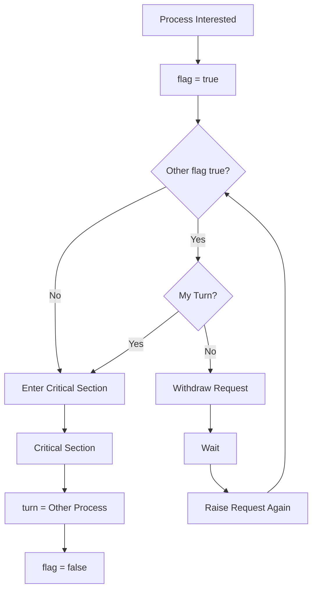

---

## Why Peterson Is Preferred

Although Dekker's Algorithm is correct, its logic is significantly more complicated.

Peterson's Algorithm achieves the same objectives using much simpler code.

Therefore Peterson's Algorithm is usually taught first and is considered the standard software solution for two-process synchronization.

---

## Advantages

Provides mutual exclusion.

Does not require hardware instructions.

Prevents starvation.

Works correctly for two processes.

---

## Limitations

Works only for two processes.

Contains complicated logic.

Uses busy waiting.

Not suitable for modern multicore systems.

---

# Lamport's Bakery Algorithm

Peterson's and Dekker's Algorithms solve synchronization for only two processes.

The Bakery Algorithm extends the idea to **multiple processes**.

It was proposed by Leslie Lamport.

The algorithm is inspired by the token system used in bakeries.

Customers entering a bakery receive numbered tokens.

The customer holding the smallest number receives service first.

Processes follow exactly the same idea.

---

## Shared Variables

```
choosing[n]

number[n]
```

```
choosing[i]
```

indicates that process `Pi` is currently choosing its number.

```
number[i]
```

stores the token number assigned to the process.

---

## Working

When a process wants to enter the critical section,

it first selects the next available token.

```
number[i]

=

max(number[]) + 1
```

It then waits until

- Every process with a smaller token finishes.
- If two processes have the same token, the smaller process ID wins.

After leaving the critical section,

```
number[i] = 0
```

indicating that the process no longer wishes to enter.

---

## Workflow

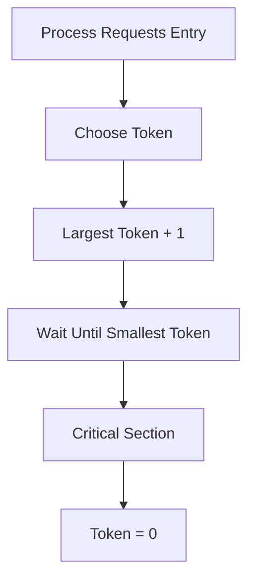

---

## Example

Suppose

```
P1

Token = 4
```

```
P2

Token = 2
```

```
P3

Token = 6
```

Execution order becomes

```
P2

↓

P1

↓

P3
```

If

```
P1 = 5

P2 = 5
```

then

the smaller Process ID executes first.

---

## Advantages

Works for multiple processes.

Provides fairness.

Prevents starvation.

Guarantees mutual exclusion.

---

## Limitations

Uses busy waiting.

Requires every process to inspect every other process.

Performance decreases as the number of processes increases.

Modern operating systems rarely implement it directly because hardware synchronization primitives are much more efficient.

---

# Comparison of Software Algorithms

| Algorithm | Processes Supported | Busy Waiting | Fairness | Complexity |
|------------|-------------------|-------------|----------|------------|
| Peterson | 2 | Yes | Good | Low |
| Dekker | 2 | Yes | Good | High |
| Bakery | Multiple | Yes | Excellent | Medium |

---

The software algorithms discussed above demonstrate that the critical section problem can be solved using only shared variables. However, these algorithms rely on busy waiting and become inefficient as systems grow larger.

Modern operating systems therefore rely on **hardware-supported synchronization instructions**, which provide atomic operations directly at the processor level. These hardware mechanisms form the foundation for mutexes, semaphores, and many synchronization primitives used in contemporary operating systems.

# Hardware-Based Synchronization

Software algorithms such as Peterson's and Lamport's Bakery Algorithm demonstrate that mutual exclusion can be achieved using only shared variables. However, these algorithms rely on busy waiting and require processes to repeatedly check shared variables. As the number of processors and concurrent processes increases, these algorithms become inefficient.

Modern processors therefore provide **atomic hardware instructions** that allow synchronization to be implemented safely and efficiently.

An **atomic operation** is an operation that executes completely without interruption. No other processor or thread can observe the operation in an intermediate state.

These instructions form the foundation for synchronization mechanisms such as spinlocks, mutexes, semaphores, monitors and many kernel synchronization primitives.

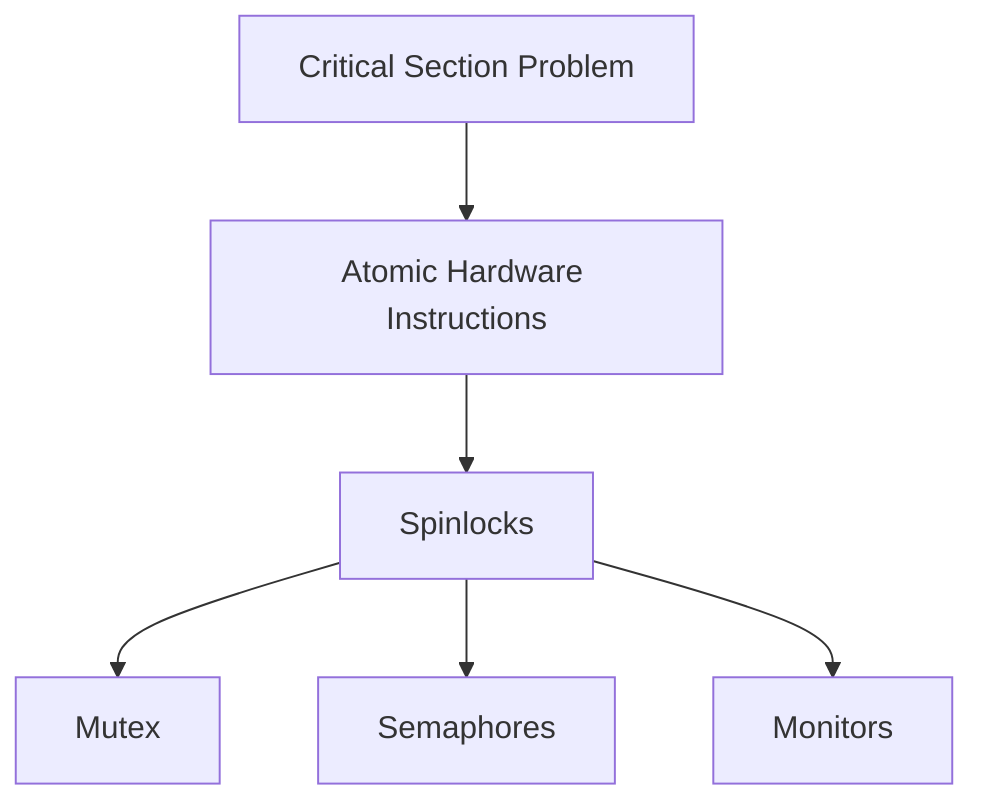

---

# Atomic Operations

An operation is called **atomic** if it appears to execute as one indivisible step.

Suppose two processes attempt to increment the same variable.

```
counter++
```

Internally, this statement is not a single instruction.

It usually consists of three operations.

```
Read counter

↓

Increment

↓

Store counter
```

If another process modifies the variable between these operations, the final value becomes incorrect.

Atomic instructions ensure that no other processor can interfere until the operation completes.

---

# Disable Interrupts

One of the earliest synchronization techniques was to disable CPU interrupts before entering the critical section.

If interrupts are disabled, the operating system cannot perform a context switch.

Therefore the currently running process continues executing until interrupts are enabled again.

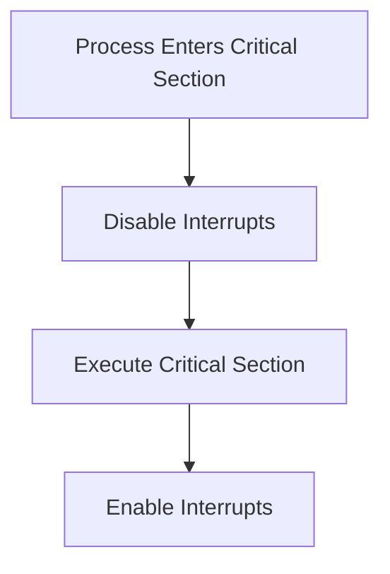

---

## Working

```
Disable Interrupts

Critical Section

Enable Interrupts
```

Since the processor cannot be interrupted, another process cannot execute simultaneously.

---

## Advantages

Very simple.

Provides mutual exclusion.

No busy waiting is required because context switching cannot occur.

---

## Limitations

This technique works only on a single processor.

On multicore systems, disabling interrupts on one processor does not stop other processors.

Interrupts should remain disabled only for a very short period because device interrupts and timer interrupts are delayed.

Allowing user programs to disable interrupts would be dangerous because one process could monopolize the CPU.

For these reasons, disabling interrupts is generally reserved for very small sections of operating-system kernel code.

---

# Test-and-Set Instruction

Modern processors provide an atomic instruction called **Test-and-Set**.

It performs two operations atomically.

1. Reads the current value.
2. Sets the value.

Because these two operations occur as one indivisible instruction, race conditions cannot occur during the operation.

---

## Algorithm

Suppose

```
lock = false
```

A process executes

```cpp
while(TestAndSet(lock));
```

If the lock was free,

```
false
```

is returned.

The instruction immediately changes the lock to

```
true
```

The process enters the critical section.

If another process executes the instruction,

it receives

```
true
```

and continues waiting.

---

## Workflow

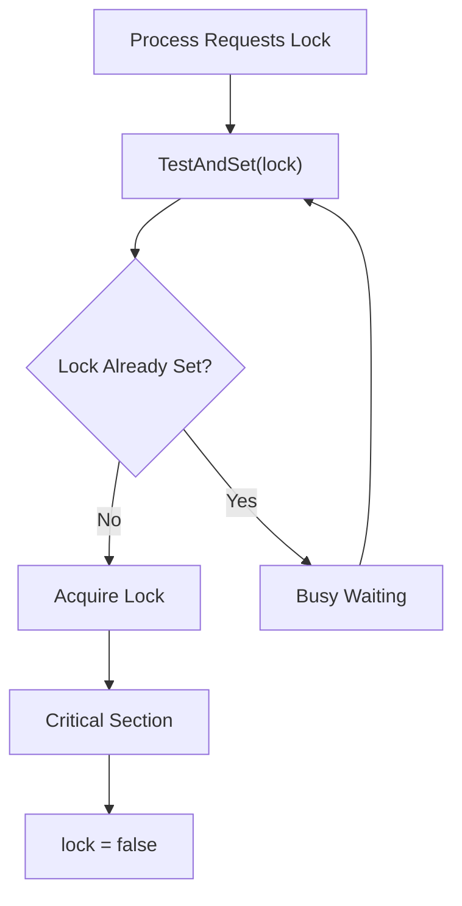

---

## Example

Initially

```
lock = false
```

Process P1 executes

```
TestAndSet(lock)
```

Return value

```
false
```

Lock becomes

```
true
```

P1 enters the critical section.

Now Process P2 executes

```
TestAndSet(lock)
```

Return value

```
true
```

Therefore P2 waits.

---

## Advantages

Provides mutual exclusion.

Supported directly by hardware.

Works correctly on multiprocessor systems.

Simple to implement.

---

## Limitations

Busy waiting wastes CPU cycles.

Processes repeatedly execute the instruction until the lock becomes available.

Starvation is possible because waiting order is not guaranteed.

---

# Compare-and-Swap (CAS)

Compare-and-Swap is another atomic hardware instruction.

Instead of simply testing a lock, CAS compares the current value of a variable with an expected value.

If both values are equal, the variable is updated.

Otherwise nothing changes.

---

## Working

```
CAS(value, expected, newValue)
```

Suppose

```
lock = 0
```

Process executes

```
CAS(lock,0,1)
```

Current value

```
0
```

Expected value

```
0
```

They match.

The processor changes

```
lock

↓

1
```

If another process executes the same instruction,

Current value

```
1
```

Expected value

```
0
```

The values differ.

The update fails.

---

## Workflow

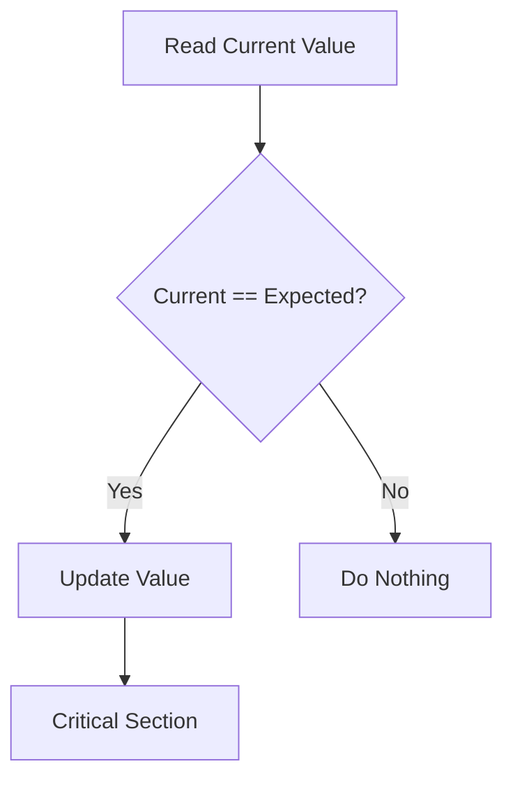

---

## Advantages

Atomic.

Very fast.

Works on multiprocessor systems.

Forms the basis of many lock-free data structures.

---

## Limitations

Busy waiting may still occur.

Repeated CAS failures may reduce performance under heavy contention.

---

# Swap Instruction

The Swap instruction atomically exchanges the values of two variables.

Suppose

```
lock = false
```

```
key = true
```

Executing

```
Swap(lock,key)
```

produces

```
lock = true

key = false
```

Since the exchange is atomic, no race condition occurs.

---

## Workflow

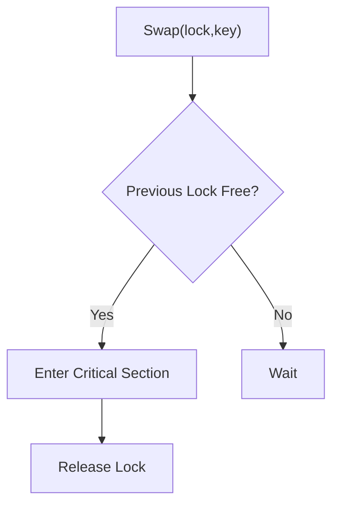

---

# Fetch-and-Add

Fetch-and-Add atomically returns the current value of a variable and increments it.

Suppose

```
counter = 5
```

Executing

```
FetchAndAdd(counter)
```

returns

```
5
```

while

```
counter

↓

6
```

The read and increment occur together.

No other processor can interfere.

---

## Applications

Ticket locks.

Reference counters.

Producer-consumer queues.

Thread synchronization.

---

# Spinlock

A spinlock is a lock implemented using atomic instructions such as Test-and-Set or Compare-and-Swap.

Instead of sleeping, the waiting process repeatedly checks whether the lock has become free.

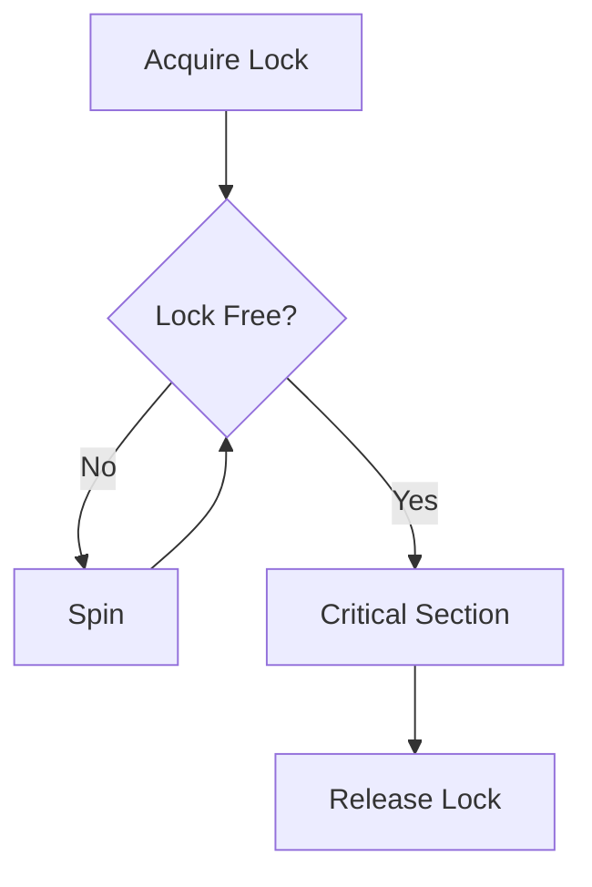

---

## Why Called a Spinlock?

The waiting process continuously executes a loop.

```
while(lock == busy);
```

The CPU repeatedly executes this loop.

It appears to "spin" until the lock becomes available.

---

## Advantages

Very fast when waiting time is extremely short.

No context-switch overhead.

Widely used inside operating-system kernels.

Efficient on multiprocessor systems when the lock is held briefly.

---

## Limitations

Busy waiting wastes CPU time.

Poor choice for long critical sections.

Should never be held for long durations.

---

# Ticket Lock

A ticket lock is a fair version of a spinlock.

Every arriving process receives a ticket number.

Processes execute strictly in ticket order.

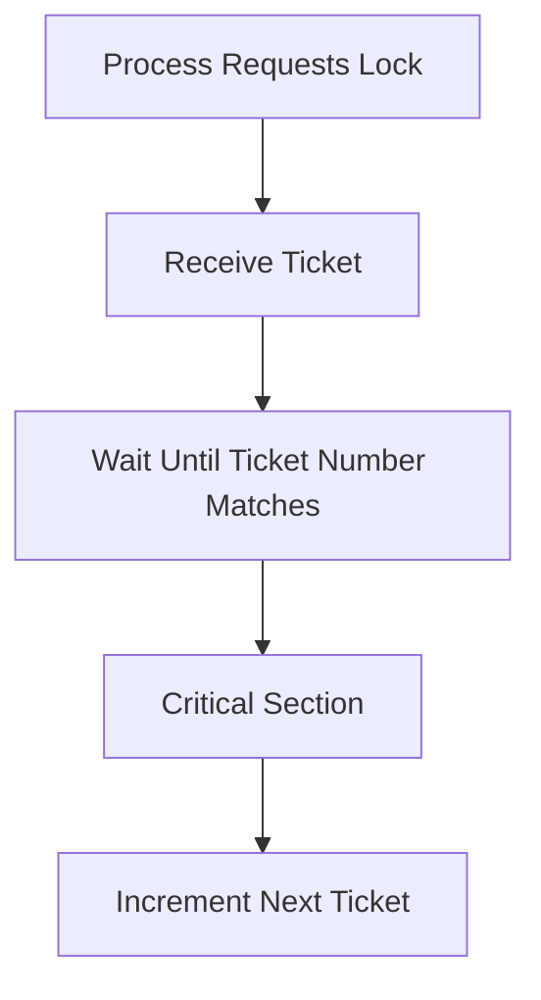

Unlike Test-and-Set locks, ticket locks prevent starvation because every process eventually receives its turn.

---

# Hardware Instructions Comparison

| Instruction | Atomic | Busy Waiting | Multiprocessor Support | Fairness |
|-------------|--------|-------------|------------------------|----------|
| Disable Interrupts | Yes | No | Poor | Good |
| Test-and-Set | Yes | Yes | Yes | Poor |
| Compare-and-Swap | Yes | Yes | Yes | Better |
| Swap | Yes | Yes | Yes | Moderate |
| Fetch-and-Add | Yes | Yes | Yes | Good |

---

# Relationship Between Hardware Synchronization Mechanisms

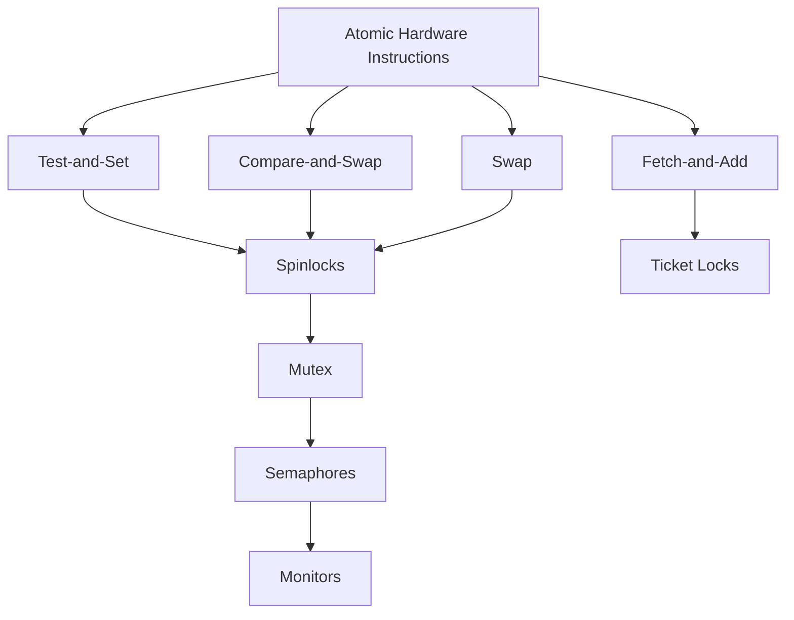

Hardware synchronization instructions provide the low-level building blocks required by modern operating systems. Rather than allowing user programs to directly manipulate atomic instructions, operating systems use them internally to implement higher-level synchronization primitives such as mutexes, semaphores and monitors. These abstractions are easier to use, reduce programming errors and provide better control over concurrent execution.
