> [!NOTE]
> Synchronization algorithms such as Peterson's Algorithm solve the critical section problem theoretically, but they are not practical for modern operating systems. Modern systems instead use synchronization primitives such as semaphores, mutexes and monitors, which are built using atomic hardware instructions.

---

# Introduction

As operating systems evolved, software synchronization algorithms became insufficient for real-world systems. They were limited to a small number of processes, relied heavily on busy waiting and were difficult to scale on multicore processors.

Modern operating systems therefore provide synchronization primitives that simplify concurrent programming while ensuring correct access to shared resources.

These primitives are implemented inside the operating system kernel using atomic hardware instructions such as Test-and-Set or Compare-and-Swap.

The programmer no longer needs to implement synchronization manually using shared variables. Instead, the operating system provides high-level mechanisms that guarantee mutual exclusion and coordination.

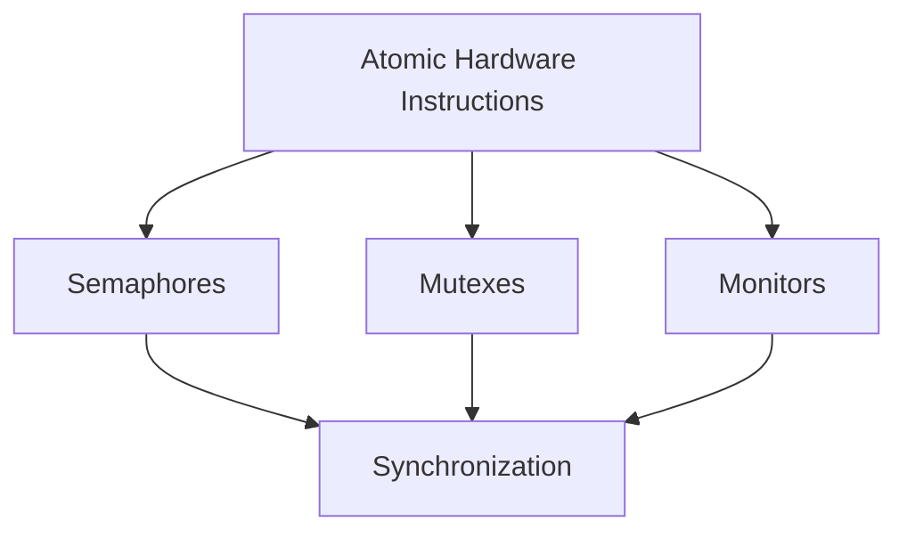

---

# Semaphore

A semaphore is a synchronization primitive used to coordinate multiple processes or threads that need access to shared resources.

The concept of semaphores was introduced by the Dutch computer scientist **Edsger W. Dijkstra**.

Unlike an ordinary variable, a semaphore can be modified only through two atomic operations.

- wait()
- signal()

These operations ensure that race conditions cannot occur while updating the semaphore value.

A semaphore itself does not represent the resource.

Instead, it represents the **availability of the resource**.

Suppose a printer can serve only one process at a time.

Initially,

```
semaphore = 1
```

If a process starts printing,

```
wait()
```

reduces the value to

```
0
```

Another process attempting to print cannot continue until

```
signal()
```

is executed.

---

# Why Do We Need Semaphores?

Consider a shared printer.

Three processes attempt to print simultaneously.

Without synchronization,

all three may send data simultaneously.

The printer output becomes corrupted.

With a semaphore,

only one process prints while the others wait.

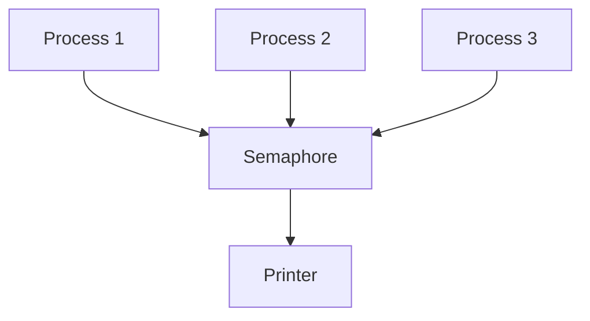

The semaphore controls access to the printer.

---

# Semaphore Value

A semaphore stores an integer.

```
Semaphore = Integer
```

The value generally represents the number of available instances of a resource.

Suppose

```
Semaphore = 3
```

Three identical printers are available.

Three processes may enter simultaneously.

The fourth process waits.

---

# wait() Operation

The wait operation is also called

```
P()

down()

acquire()
```

Its purpose is to request a resource.

If the resource is available,

the process continues.

Otherwise,

the process waits.

The operation decreases the semaphore value.

```cpp
wait(S)
{
    while(S <= 0);

    S--;
}
```

The above implementation is conceptually correct but uses busy waiting.

Modern operating systems instead block the waiting process instead of repeatedly checking the semaphore.

---

## Workflow

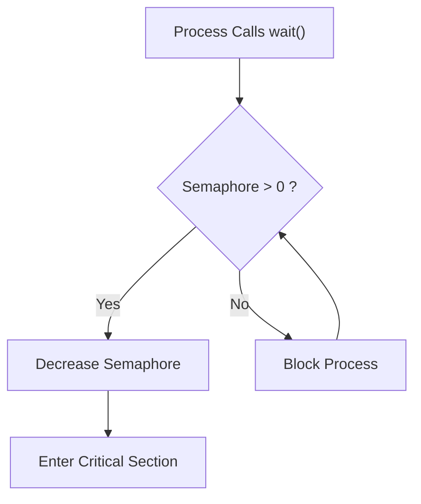

---

# signal() Operation

The signal operation is also called

```
V()

up()

release()
```

Its purpose is to release a previously acquired resource.

The semaphore value increases.

If another process is waiting,

one waiting process is awakened.

```cpp
signal(S)
{
    S++;
}
```

---

## Workflow

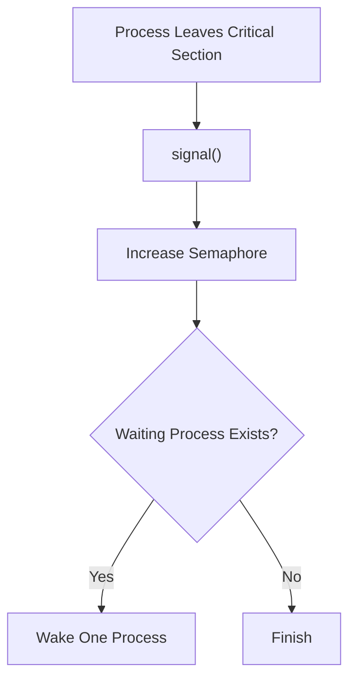

---

# Complete Semaphore Workflow

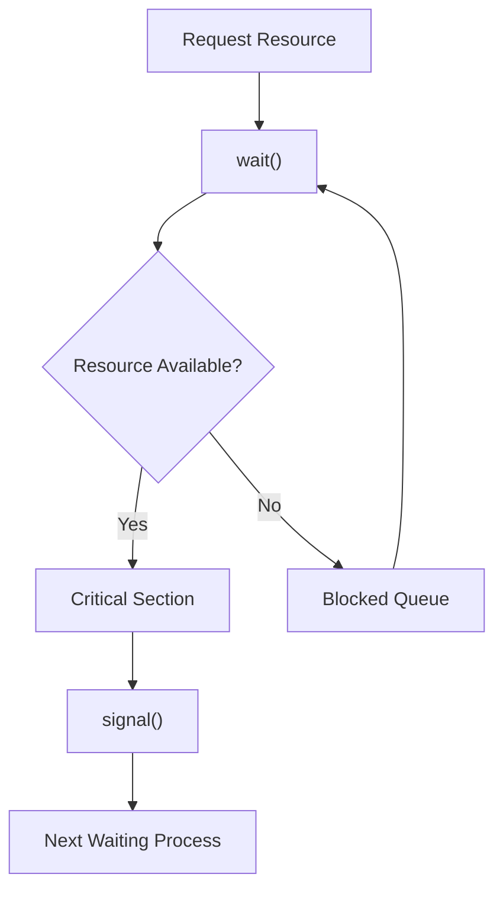

---

# Binary Semaphore

A binary semaphore can have only two values.

```
0

or

1
```

It behaves similarly to a lock.

```
1

↓

Resource Available
```

```
0

↓

Resource Occupied
```

Only one process can enter the critical section.

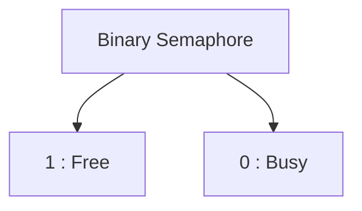

Suppose

```
Semaphore = 1
```

Process P1 executes

```
wait()
```

Semaphore becomes

```
0
```

P1 enters the critical section.

P2 now executes

```
wait()
```

Since

```
Semaphore = 0
```

P2 waits.

When P1 finishes,

```
signal()
```

changes the semaphore back to

```
1
```

allowing P2 to continue.

Binary semaphores are mainly used for mutual exclusion.

---

# Counting Semaphore

Unlike binary semaphores,

counting semaphores can store any non-negative integer.

The value represents the number of available identical resources.

Suppose

```
Semaphore = 5
```

Five database connections are available.

Five processes may access the database simultaneously.

The sixth process waits.

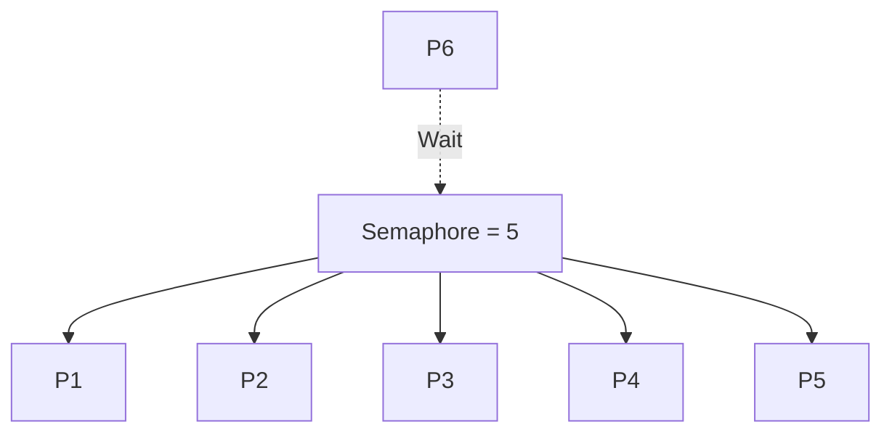

Counting semaphores are commonly used to manage

- Database connection pools
- Thread pools
- Network connections
- Resource pools
- Producer-consumer buffers

---

# Binary vs Counting Semaphore

| Binary Semaphore | Counting Semaphore |
|-----------------|--------------------|
| Values are 0 or 1 | Value can be any non-negative integer |
| Controls one resource | Controls multiple identical resources |
| Used for mutual exclusion | Used for resource management |
| Similar to a lock | Similar to a resource counter |

---

# Busy Waiting Semaphore

The simplest semaphore implementation repeatedly checks whether the semaphore has become positive.

```cpp
while(S <= 0);
```

The process continuously executes this loop.

The CPU remains busy.

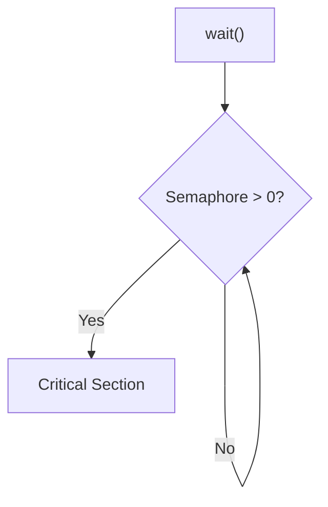

Busy waiting wastes processor time.

It is acceptable only when the expected waiting time is extremely short.

Spinlocks use this approach.

---

# Blocking Semaphore

Modern operating systems avoid busy waiting.

Instead of repeatedly checking the semaphore,

the operating system moves the waiting process into a waiting queue.

The blocked process does not consume CPU time.

When another process executes

```
signal()
```

the operating system wakes one waiting process.

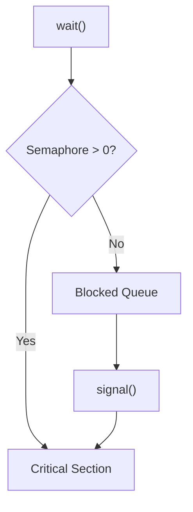

Blocking semaphores are considerably more efficient than busy waiting for long waiting periods because blocked processes do not waste CPU cycles.

---

# Internal Structure of a Semaphore

A semaphore maintained by the operating system typically contains two components.

```
Semaphore Value
```

and

```
Waiting Queue
```

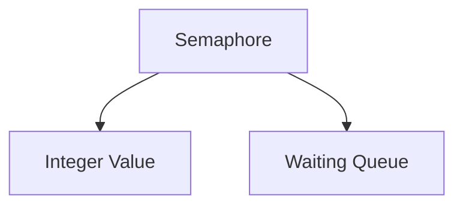

When a process executes

```
wait()
```

and the semaphore value is not positive,

the operating system inserts the process into the waiting queue.

When another process performs

```
signal()
```

one waiting process is removed from the queue and allowed to continue execution.

---

The next part of this file will cover:

- Mutex
- Recursive Mutex
- Mutex vs Binary Semaphore
- Monitors
- Condition Variables
- Priority Inversion
- Priority Inheritance
- Complete comparison between Semaphore, Mutex and Monitor

# Mutex

A **Mutex (Mutual Exclusion)** is a synchronization primitive that ensures that only one process or thread can access a critical section at any given time.

Unlike a semaphore, a mutex has the concept of **ownership**. The thread that locks a mutex becomes its owner, and only that same thread is allowed to unlock it.

A mutex therefore represents **exclusive ownership of a resource**, whereas a semaphore represents the **availability of a resource**.

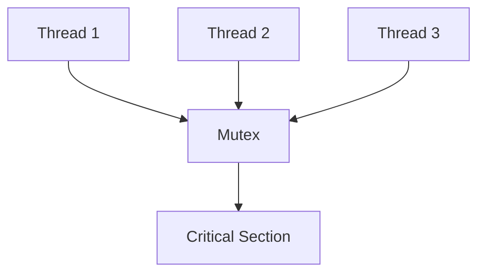

Suppose a thread wants to modify a shared linked list.

Before modifying the list, it locks the mutex.

```
lock(mutex)
```

If another thread attempts to lock the same mutex, it is blocked until the current owner unlocks it.

After completing its work, the thread releases the mutex.

```
unlock(mutex)
```

---

# Locking a Mutex

The typical workflow of a mutex is straightforward.

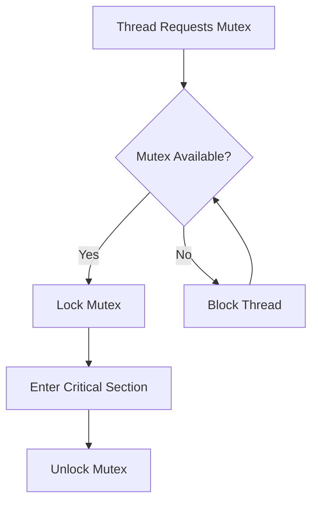

Only one thread can own the mutex at any instant.

---

# Ownership

Ownership is the most important property that distinguishes a mutex from a semaphore.

Consider two threads.

```
Thread A

lock(mutex)
```

Now Thread A owns the mutex.

If Thread B executes

```
unlock(mutex)
```

the operating system rejects the request because Thread B is not the owner.

Only Thread A can execute

```
unlock(mutex)
```

This ownership rule prevents accidental release of synchronization primitives by unrelated threads.

---

# Recursive Mutex

Normally, if a thread attempts to lock the same mutex twice, it blocks itself, producing a deadlock.

A recursive mutex avoids this problem.

The operating system maintains a lock count.

Suppose

```
Thread A

lock()

lock()
```

The lock count becomes

```
2
```

Thread A must execute

```
unlock()

unlock()
```

before another thread may acquire the mutex.

Recursive mutexes are useful in recursive functions and nested function calls that require synchronization.

---

# Semaphore vs Mutex

Although binary semaphores and mutexes appear similar, they serve different purposes.

A binary semaphore controls access to a resource but has no concept of ownership.

A mutex always belongs to exactly one thread.

| Mutex | Semaphore |
|--------|-----------|
| Ownership exists | No ownership |
| Only owner unlocks | Any thread may signal |
| Used for mutual exclusion | Used for synchronization and resource management |
| Represents a lock | Represents available resources |
| Simpler usage | More flexible |

Consider a printer.

If only one thread should print at a time,

a mutex is appropriate.

Suppose instead there are

```
5
```

identical printers.

A counting semaphore initialized to

```
5
```

allows five threads to print simultaneously.

---

# Mutex Workflow

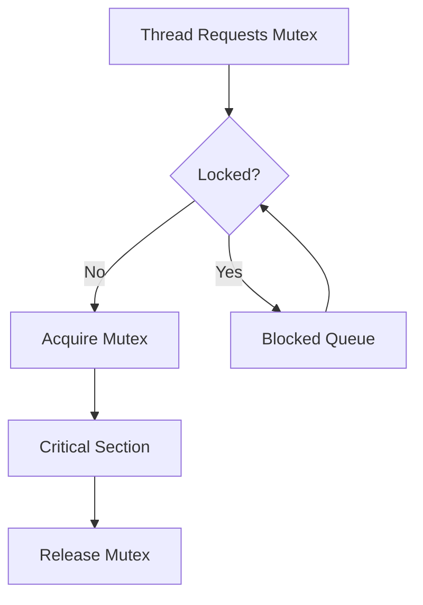

---

# Monitor

A monitor is a high-level synchronization construct that combines shared data and synchronization operations into a single unit.

Unlike semaphores and mutexes, programmers do not manually perform locking and unlocking.

The programming language or operating system automatically guarantees mutual exclusion.

Only one thread can execute inside a monitor at any time.

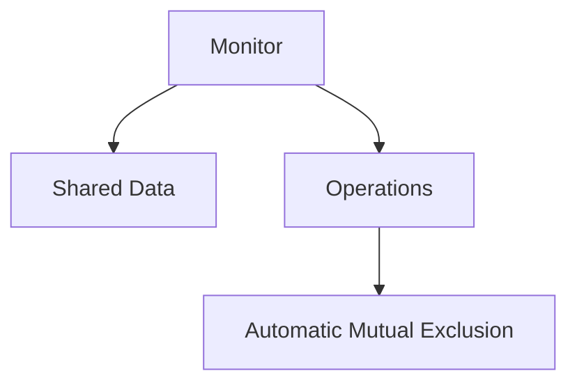

The programmer simply calls monitor functions.

The monitor handles synchronization internally.

---

# Why Monitors Were Introduced

Semaphores are powerful but easy to misuse.

Examples include:

- Forgetting to execute signal().
- Executing signal() twice.
- Calling wait() in the wrong place.
- Unlocking the wrong semaphore.

Such mistakes often produce deadlocks.

Monitors eliminate these problems by placing synchronization inside the programming language.

The programmer interacts only with monitor procedures.

---

# Monitor Workflow

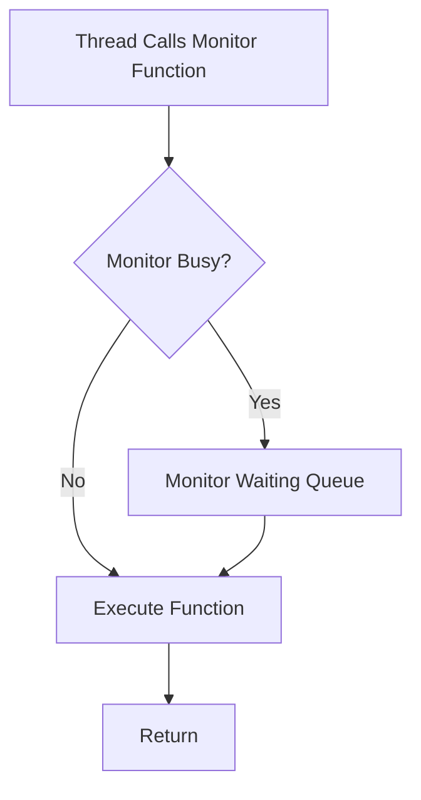

Only one thread executes inside the monitor.

Other threads wait outside until the monitor becomes available.

---

# Monitor Components

A monitor typically contains

- Shared data
- Procedures
- Condition variables

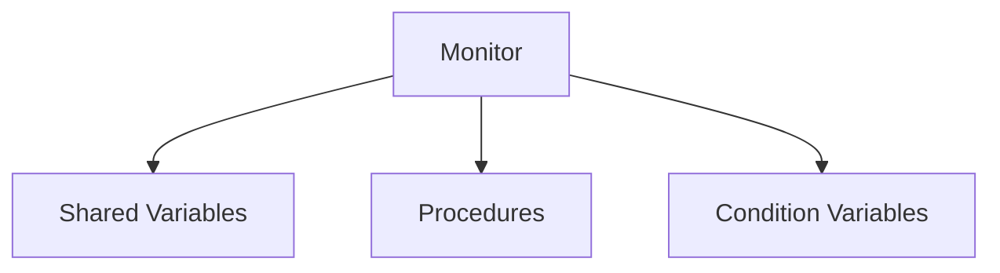

Shared variables cannot be accessed directly from outside the monitor.

Instead,

every operation occurs through monitor procedures.

This improves encapsulation and prevents accidental modification.

---

# Condition Variables

Condition variables allow threads inside a monitor to wait for particular conditions.

Unlike semaphores,

condition variables do not maintain a count.

They simply allow threads to sleep and later be awakened.

Two operations are commonly provided.

```
wait()
```

```
signal()
```

---

## wait()

The calling thread temporarily releases the monitor and enters the condition queue.

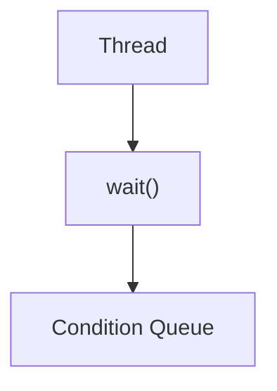

---

## signal()

The signal operation wakes one waiting thread.

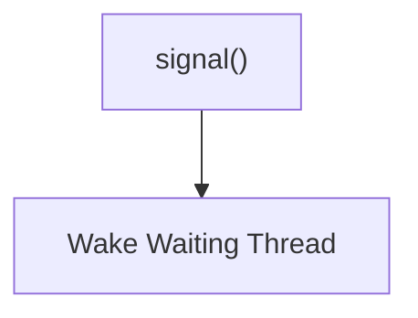

If no thread is waiting,

the signal operation usually has no effect.

---

# Monitor Example

Suppose a producer inserts data into a shared buffer.

If the buffer becomes full,

the producer executes

```
wait()
```

The producer sleeps.

Later,

a consumer removes an item.

The consumer executes

```
signal()
```

The waiting producer wakes and continues execution.

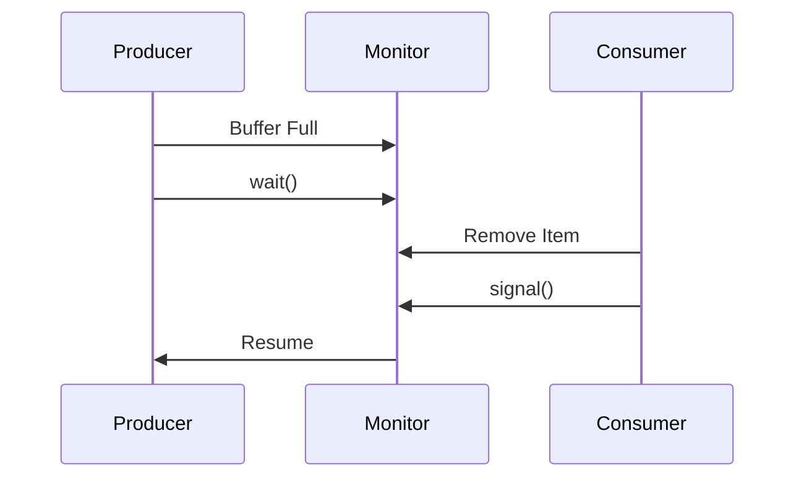

---

# Priority Inversion

Priority inversion occurs when a high-priority process waits for a resource held by a lower-priority process.

Suppose

```
High Priority

↓

Waiting
```

because

```
Low Priority

↓

Owns Mutex
```

Now a medium-priority process starts executing.

Since it has higher priority than the low-priority process,

the low-priority process never receives CPU time to release the mutex.

As a result,

the high-priority process also remains blocked.

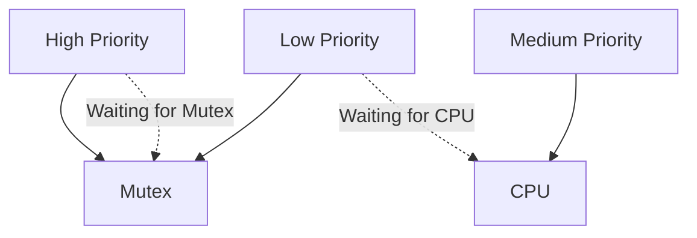

The medium-priority process unintentionally delays the highest-priority process.

---

# Priority Inheritance

Priority inheritance solves priority inversion.

Suppose

Low Priority

owns a mutex needed by

High Priority.

The operating system temporarily raises the priority of the low-priority thread.

```mermaid
graph TD

Low["Low Priority"]

High["High Priority"]

Low --> Boost["Priority Boost"]

Boost --> CPU

CPU --> Release["Release Mutex"]

Release --> High
```

The boosted thread quickly completes the critical section and releases the mutex.

Its priority then returns to its original value.

Priority inheritance is widely used in real-time operating systems.

---

# Linux Mutex

Modern Linux kernels implement mutexes using atomic instructions together with waiting queues.

The workflow is generally:

```mermaid
graph TD

A["lock()"]

A --> B{"Mutex Free?"}

B -->|Yes| C["Acquire Immediately"]

B -->|No| D["Sleep in Wait Queue"]

D --> E["unlock()"]

E --> F["Wake Waiting Thread"]
```

Unlike spinlocks,

Linux mutexes block waiting threads instead of consuming CPU time.

This makes them suitable for long critical sections.

---

# Spinlock vs Mutex

| Spinlock | Mutex |
|-----------|-------|
| Busy waiting | Blocking |
| No context switch | Context switch possible |
| Very fast for short waits | Better for long waits |
| Kernel synchronization | User and kernel synchronization |
| Wastes CPU while waiting | Does not waste CPU |

Spinlocks are appropriate when the expected waiting time is extremely short.

Mutexes are preferable when waiting may be longer.

---

# Semaphore vs Mutex vs Monitor

| Feature | Semaphore | Mutex | Monitor |
|----------|-----------|-------|----------|
| Ownership | No | Yes | Automatic |
| Resource Count | Yes | No | No |
| Mutual Exclusion | Yes | Yes | Yes |
| Synchronization | Yes | Limited | Yes |
| Programmer Handles Locking | Yes | Yes | No |
| Waiting Queue | Yes | Yes | Yes |
| Automatic Unlocking | No | No | Managed by Monitor |

---

# Relationship Between Synchronization Primitives

```mermaid
graph TD

Atomic["Atomic Hardware Instructions"]

Atomic --> Spinlock["Spinlock"]

Spinlock --> Mutex["Mutex"]

Atomic --> Semaphore["Semaphore"]

Mutex --> Monitor["Monitor"]

Monitor --> Condition["Condition Variables"]
```

Atomic hardware instructions provide the low-level mechanisms required for synchronization. Spinlocks are built directly on these instructions. Mutexes extend the idea by introducing ownership and blocking. Semaphores provide generalized synchronization for multiple resources, while monitors offer a higher-level abstraction by combining shared data and synchronization into a single construct. Together, these primitives form the basis of synchronization in modern operating systems and concurrent programming.
