> [!NOTE]
> Classical synchronization problems are standard problems used to understand how synchronization primitives such as semaphores, mutexes and monitors solve real-world concurrency issues. Although the problems are hypothetical, they model situations commonly encountered in operating systems, databases and distributed systems.

---

# Introduction

Synchronization primitives such as semaphores and mutexes provide mechanisms to coordinate concurrent execution. However, understanding when and how to use these primitives can be difficult.

To explain these concepts, operating systems use a set of classical synchronization problems.

Each problem represents a different type of resource-sharing scenario.

These problems demonstrate:

- Mutual exclusion
- Process coordination
- Resource allocation
- Deadlock avoidance
- Starvation prevention

The four classical synchronization problems are:

- Producer-Consumer Problem
- Readers-Writers Problem
- Dining Philosophers Problem
- Sleeping Barber Problem

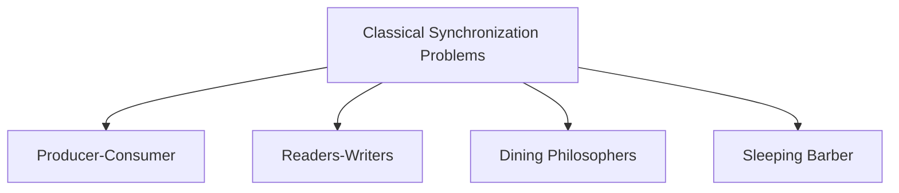

---

# Producer-Consumer Problem

The Producer-Consumer Problem is also known as the **Bounded Buffer Problem**.

It models situations where one or more processes produce data while one or more processes consume that data.

Examples include:

- Keyboard generating keystrokes
- Printer spooler
- Video streaming
- Network packet processing
- Database transaction queues

The producer inserts items into a shared buffer.

The consumer removes items from the same buffer.


---

# Why Synchronization Is Needed

Suppose the buffer size is five.

If the producer continues inserting items after the buffer becomes full,

existing data may be overwritten.

Similarly,

if the consumer attempts to remove data from an empty buffer,

invalid data may be read.

Synchronization ensures:

- Producer waits when buffer is full.
- Consumer waits when buffer is empty.
- Producer and consumer do not modify the buffer simultaneously.

---

# Bounded Buffer

A bounded buffer has limited capacity.

Suppose

```
Buffer Size = 5
```

Only five items may exist simultaneously.


When the buffer becomes full,

the producer waits.

When the buffer becomes empty,

the consumer waits.

---

# Semaphore Solution

Three semaphores are commonly used.

```
mutex = 1
```

Protects the critical section.

```
empty = N
```

Number of empty slots.

```
full = 0
```

Number of occupied slots.

Initially,

```
Buffer Size = N

All slots empty

No occupied slots
```

---

## Producer Algorithm

```cpp
wait(empty);

wait(mutex);

Insert Item

signal(mutex);

signal(full);
```

---

### Explanation

The producer first checks whether an empty slot exists.

If no slot is available,

it waits.

Once an empty slot exists,

it locks the buffer using

```
mutex
```

The producer inserts the item.

After insertion,

it unlocks the buffer

and increases

```
full
```

indicating that one more item is available.

---

## Consumer Algorithm

```cpp
wait(full);

wait(mutex);

Remove Item

signal(mutex);

signal(empty);
```

---

### Explanation

The consumer first checks whether any item exists.

If the buffer is empty,

it waits.

Otherwise,

it locks the buffer,

removes one item,

releases the lock,

and increases

```
empty
```

to indicate one more free slot.

---

# Workflow

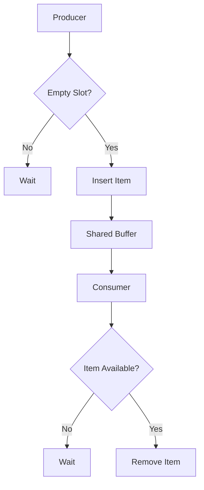

---

# Example

Buffer size

```
3
```

Initially

```
empty = 3

full = 0
```

Producer inserts first item.

```
empty = 2

full = 1
```

Producer inserts second item.

```
empty = 1

full = 2
```

Consumer removes one item.

```
empty = 2

full = 1
```

Synchronization ensures consistency throughout execution.

---

# Applications

Producer-Consumer synchronization appears in many operating-system components.

Examples include:

- Printer spooling
- Disk request queues
- Job scheduling
- Audio streaming
- Video buffering
- Network packet queues
- Logging systems

---

# Readers-Writers Problem

Many applications contain shared data that is read frequently but modified only occasionally.

Examples include:

- Library databases
- Student records
- Banking information
- File systems
- Configuration files

Several users may read the same information simultaneously.

However,

a writer updating the data requires exclusive access.

This gives rise to the Readers-Writers Problem.

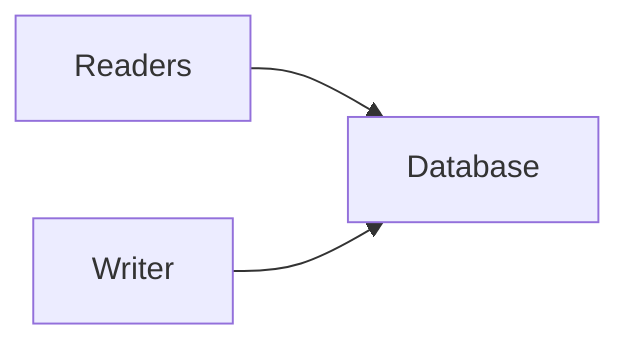

---

# Requirements

The synchronization algorithm must satisfy two conditions.

Multiple readers should be allowed simultaneously.

Only one writer should update the data.

Furthermore,

no reader should access the data while a writer is modifying it.

---

# Reader Workflow

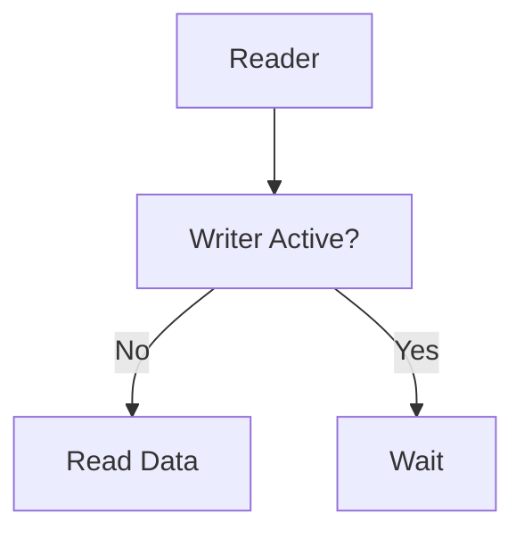

---

# Writer Workflow

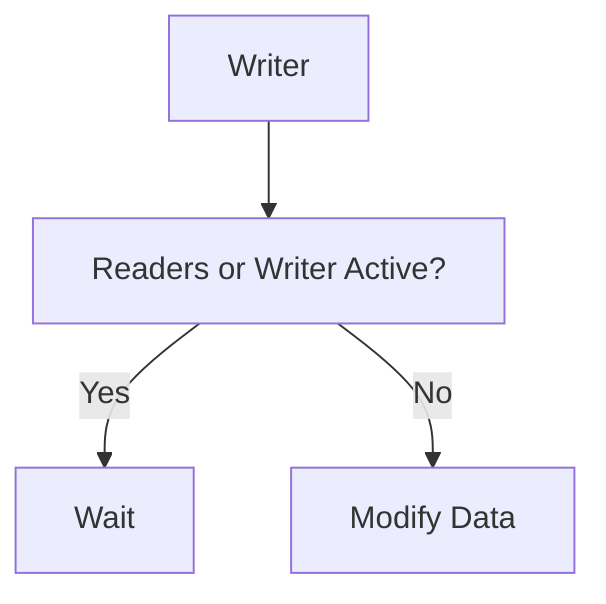

---

# First Readers-Writers Problem

The first readers-writers problem gives preference to readers.

If readers continuously arrive,

they may continue reading together.

A writer must wait until all readers finish.

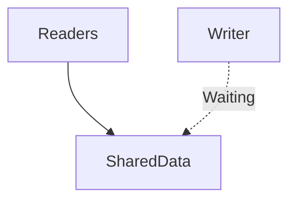

---

# Semaphore Solution

Two shared variables are commonly used.

```
readCount
```

stores the number of active readers.

```
mutex
```

protects

```
readCount
```

Another semaphore

```
rw_mutex
```

protects the shared resource.

Initially

```
readCount = 0

mutex = 1

rw_mutex = 1
```

---

## Reader

```cpp
wait(mutex);

readCount++;

if(readCount == 1)

wait(rw_mutex);

signal(mutex);

Read Data

wait(mutex);

readCount--;

if(readCount == 0)

signal(rw_mutex);

signal(mutex);
```

---

### Explanation

The first arriving reader locks the database.

Subsequent readers simply increase

```
readCount
```

and read simultaneously.

When the last reader leaves,

it releases

```
rw_mutex
```

allowing writers to proceed.

---

## Writer

```cpp
wait(rw_mutex);

Write Data

signal(rw_mutex);
```

The writer receives exclusive access.

No readers or other writers may access the database while writing.

---

# Example

Suppose

Readers

```
R1

R2

R3
```

arrive.

```
readCount = 3
```

All three readers execute simultaneously.

Now Writer

```
W1
```

arrives.

```
W1
```

must wait until

```
readCount

↓

0
```

Only then may the writer begin updating the database.

---

# Writer Starvation

The first readers-writers solution may starve writers.

Suppose readers continuously arrive.

Every new reader joins the existing group.

The writer never receives an opportunity to write.

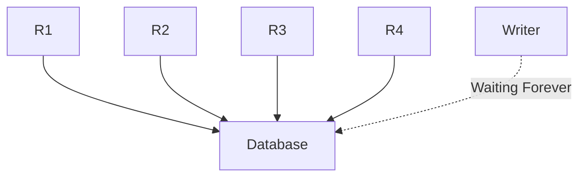

---

# Second Readers-Writers Problem

The second readers-writers problem gives preference to writers.

If a writer is waiting,

new readers are not allowed to enter.

Existing readers complete their work,

after which the waiting writer executes.

This prevents writer starvation.

---

# Reader Preference vs Writer Preference

| Reader Preference | Writer Preference |
|-------------------|-------------------|
| Readers execute immediately | Waiting writers get priority |
| Writer may starve | Readers may wait longer |
| Better read performance | Better write fairness |
| Suitable for read-heavy systems | Suitable for write-intensive systems |

---

# Real-World Applications

Readers-Writers synchronization appears in numerous systems.

Examples include:

- Database Management Systems
- Cache Servers
- Search Engines
- Operating-System File Systems
- Configuration Services
- Shared Memory Databases

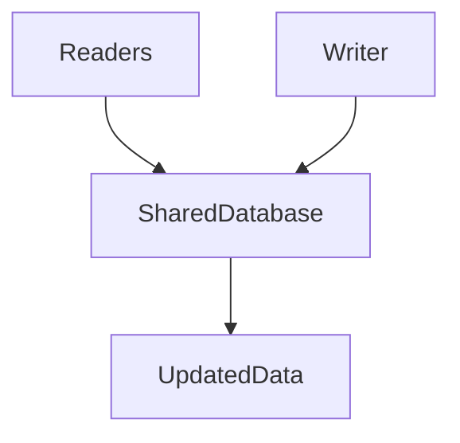

---

# Relationship Between Producer-Consumer and Readers-Writers

Although both problems involve synchronization, they solve different issues.

| Producer-Consumer | Readers-Writers |
|-------------------|-----------------|
| Shared buffer | Shared data |
| Producer inserts | Writer updates |
| Consumer removes | Reader reads |
| Synchronizes data flow | Synchronizes concurrent access |
| Prevents buffer overflow/underflow | Prevents inconsistent reads and writes |

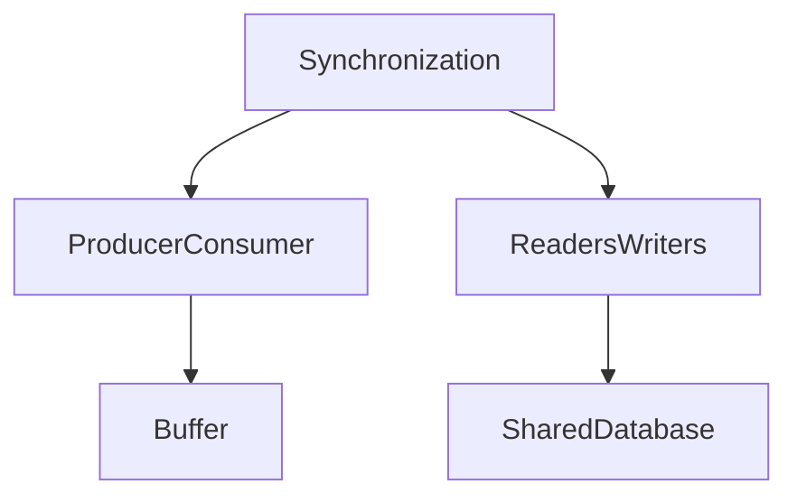

The Producer-Consumer problem focuses on coordinating the production and consumption of data within a bounded buffer, while the Readers-Writers problem focuses on allowing maximum concurrency during reading without compromising correctness during updates.

# Dining Philosophers Problem

The Dining Philosophers Problem is one of the most famous synchronization problems in operating systems.

It was proposed by **Edsger W. Dijkstra** to illustrate problems related to resource allocation, deadlock and starvation.

The problem demonstrates that even if every process follows a logical sequence of operations, the system as a whole may still stop making progress because of improper resource sharing.

---

## Problem Statement

Imagine five philosophers sitting around a circular table.

Between every two philosophers lies one fork.

Each philosopher repeatedly performs two activities:

- Thinking
- Eating

A philosopher does not require any resource while thinking.

However, to eat, the philosopher must hold **both the left fork and the right fork**.

Since each fork is shared between two neighboring philosophers, synchronization is required.

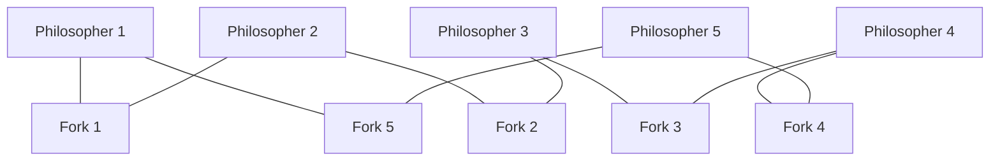

---

# Why Synchronization Is Needed

Suppose every philosopher performs the following sequence.

```
Pick Left Fork

↓

Pick Right Fork

↓

Eat

↓

Release Both Forks
```

Initially every philosopher successfully picks up the left fork.

Now every philosopher waits for the right fork.

But the right fork is already held by the neighboring philosopher.

As a result,

no philosopher can continue.

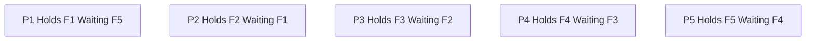

Every philosopher waits forever.

The system has entered a **deadlock**.

---

# Semaphore Solution

Each fork is represented by a binary semaphore.

```
fork[5]
```

Initially

```
fork[i] = 1
```

A philosopher performs

```cpp
wait(leftFork);

wait(rightFork);

Eat

signal(rightFork);

signal(leftFork);
```

Although semaphores provide mutual exclusion,

this solution alone does **not** prevent deadlock.

---

# Deadlock-Free Solution

One common solution is to allow at most four philosophers to attempt eating simultaneously.

A semaphore called

```
room
```

is initialized as

```
4
```

Every philosopher first enters the room.

```cpp
wait(room);

wait(leftFork);

wait(rightFork);

Eat

signal(rightFork);

signal(leftFork);

signal(room);
```

Since one philosopher always remains outside,

at least one philosopher can obtain both forks and eventually release them.

Deadlock is avoided.

---

# Resource Hierarchy Solution

Another solution assigns every fork a unique number.

Each philosopher always picks the lower-numbered fork first.

Example

```
Fork 1

↓

Fork 2

↓

Fork 3

↓

Fork 4

↓

Fork 5
```

Every philosopher follows the same ordering.

Circular waiting becomes impossible.

Deadlock cannot occur.


---

# Butler Solution

A butler controls entry into the dining area.

A philosopher must first obtain permission from the butler before attempting to pick up forks.

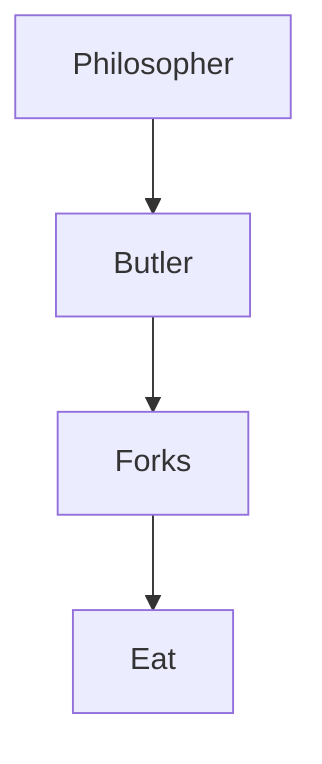

The butler limits competition and prevents deadlock.

---

# Monitor Solution

Modern programming languages often solve the dining philosophers problem using monitors.

Each philosopher requests forks through monitor procedures.

The monitor ensures that neighboring philosophers never eat simultaneously.

```mermaid
graph TD

Philosopher

--> Monitor

Monitor

--> Fork Allocation

Fork Allocation

--> Eating
```

The programmer no longer manually locks each fork.

---

# Applications

Although philosophers and forks are imaginary,

the same problem appears whenever multiple processes compete for multiple shared resources.

Examples include

- Database row locking
- Network resource allocation
- Memory allocation
- Distributed transactions
- Cloud resource scheduling

---

# Sleeping Barber Problem

The Sleeping Barber Problem models synchronization between service providers and customers.

It demonstrates waiting queues, resource management and process coordination.

---

## Problem Statement

A barber shop contains

- One barber
- One barber chair
- Several waiting chairs

If no customers exist,

the barber sleeps.

When a customer arrives,

the customer wakes the barber.

If the barber is busy,

the customer waits in a waiting chair.

If every waiting chair is occupied,

the customer leaves.

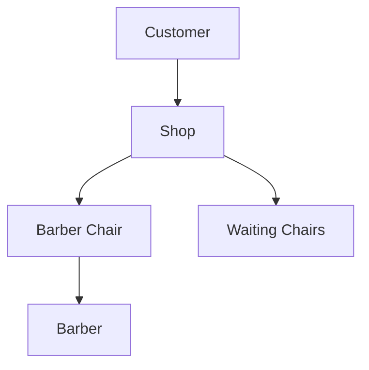

---

# Synchronization Requirements

The synchronization algorithm must ensure

- Only one customer occupies the barber chair.
- Customers wait when necessary.
- The barber sleeps when no customers exist.
- Customers leave if the waiting room is full.

---

# Workflow

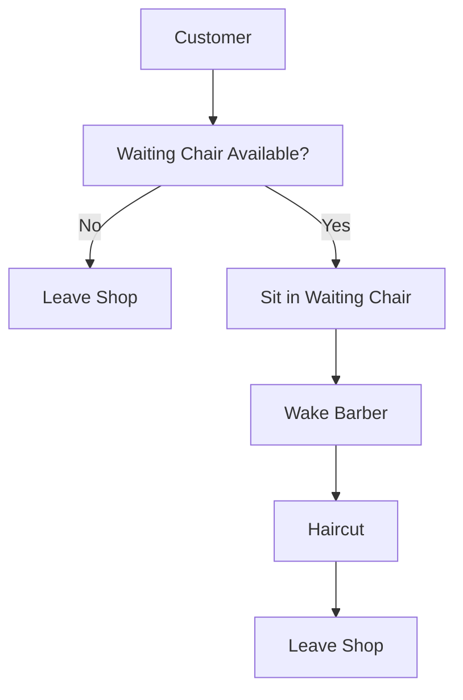

---

# Semaphore Solution

Three semaphores are commonly used.

```
customers
```

Number of waiting customers.

```
barber
```

Barber availability.

```
mutex
```

Protects the waiting-chair count.

Initially

```
customers = 0

barber = 0

mutex = 1
```

---

## Barber

```cpp
while(true)
{
    wait(customers);

    wait(mutex);

    waiting--;

    signal(barber);

    signal(mutex);

    Cut Hair;
}
```

---

## Customer

```cpp
wait(mutex);

if(waiting < chairs)
{
    waiting++;

    signal(customers);

    signal(mutex);

    wait(barber);

    Get Haircut;
}
else
{
    signal(mutex);

    Leave Shop;
}
```

---

# Workflow

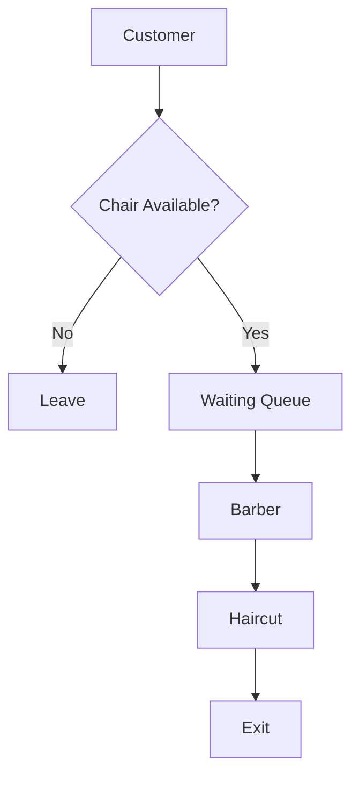

---

# Example

Suppose

```
Waiting Chairs = 3
```

Initially,

no customers exist.

The barber sleeps.

Customer 1 arrives.

The barber wakes immediately.

Customer 2 arrives.

The barber is busy.

Customer 2 waits.

Customers continue arriving until every waiting chair becomes occupied.

The next arriving customer leaves because no waiting chair remains.

---

# Applications

The sleeping barber problem models many real systems.

Examples include

- Printer scheduling
- Call centers
- Database connection pools
- CPU thread pools
- Customer support systems
- Hospital waiting rooms

---

# Comparison of Classical Synchronization Problems

| Problem | Shared Resource | Main Issue | Typical Solution |
|----------|----------------|------------|------------------|
| Producer-Consumer | Shared Buffer | Buffer Overflow / Underflow | Semaphores |
| Readers-Writers | Shared Database | Concurrent Reads and Writes | Read-Write Locks |
| Dining Philosophers | Forks | Deadlock | Resource Ordering / Semaphores / Monitors |
| Sleeping Barber | Barber Chair | Waiting Queue Management | Semaphores |

---

# Relationship Between Classical Synchronization Problems

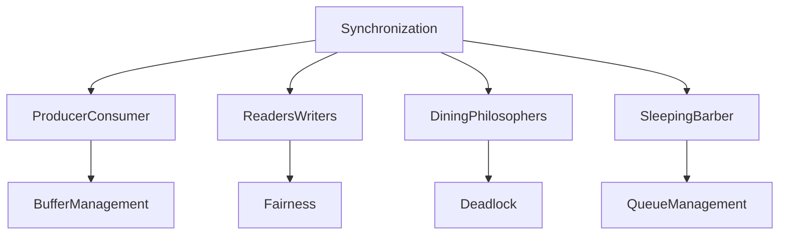

Each classical synchronization problem demonstrates a different aspect of concurrent execution. The Producer-Consumer problem focuses on coordinating data flow through a bounded buffer. The Readers-Writers problem maximizes concurrent reading while preserving exclusive updates. The Dining Philosophers problem illustrates how improper resource allocation can lead to deadlock, while the Sleeping Barber problem demonstrates synchronization between service providers and waiting clients using queues and semaphores.

These problems form the foundation for understanding more advanced operating-system topics such as deadlocks, resource allocation, scheduling fairness and concurrent system design.
